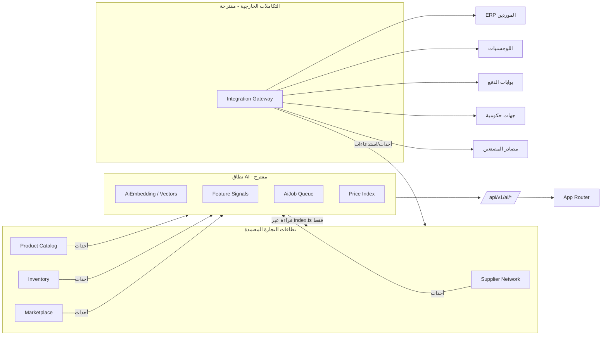
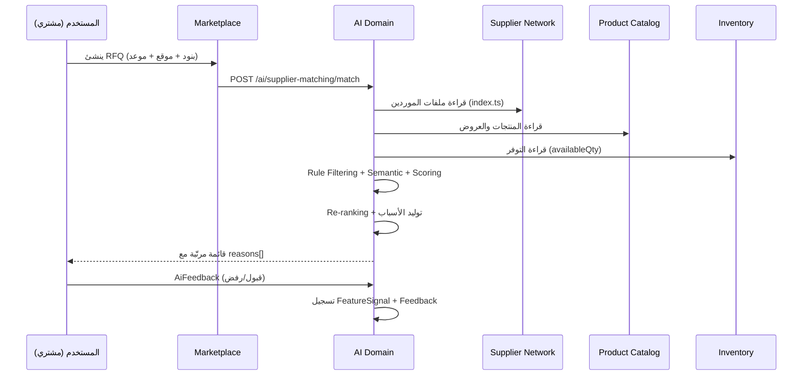
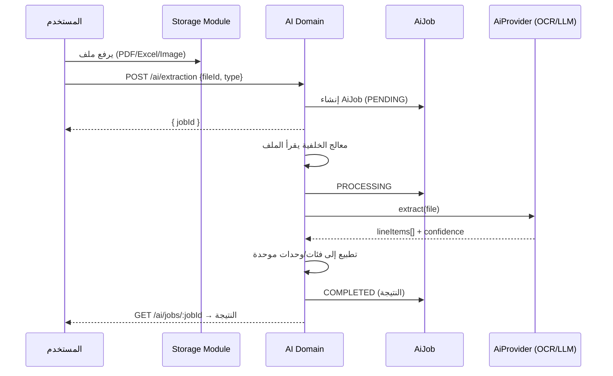
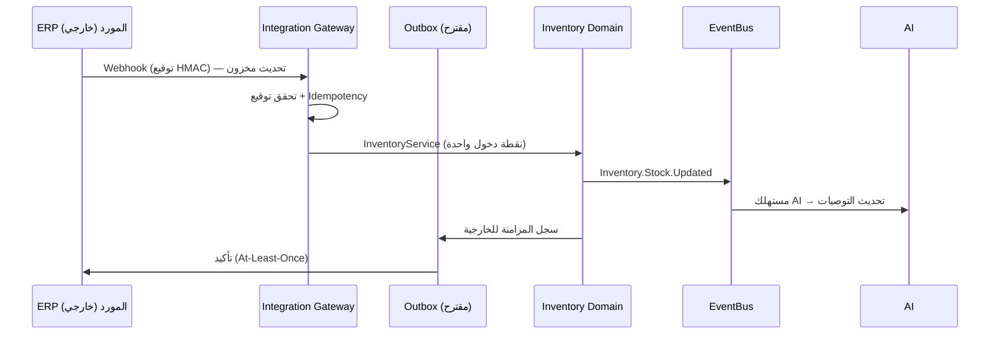
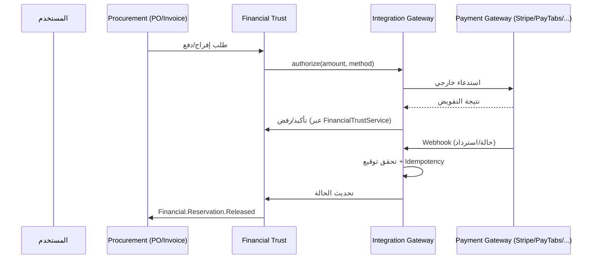
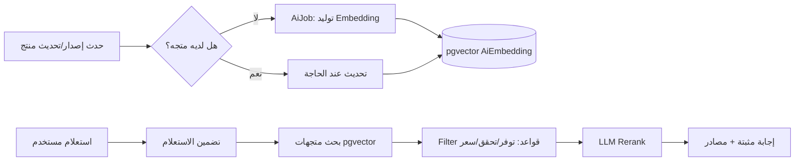

# 04 — Data Flow Diagrams (مخططات تدفق البيانات)

> **المسار:** AI & Integration Layer
> **الدور:** Programmer 4
> **الحالة:** 📝 مقترح قيد الدراسة
> **التاريخ:** 2026-07-31

> جميع المخططات التالية بصيغة Mermaid — وصفية فقط، وتمثل **مقترحات** لا قرارات معتمدة.

---

## 1. مخطط تدفق النظام العام (Context Flow)

---

## 2. مسار مطابقة الموردين الذكية (AI Supplier Matching)

---

## 3. مسار استخراج المواد من الملفات (Material Extraction)

---

## 4. مسار المزامنة عبر بوابة التكاملات (ERP → Inventory)

---

## 5. مسار بوابات الدفع (خلف Financial Trust)

> ملاحظة: لا تغيير على ADR-017 — Gateway تتكامل *خلف* Financial Trust.

---

## 6. مخطط انسياب البيانات → المتجهات → البحث (RAG)

---

## 7. ملخص تدفقات البيانات الهامة للاعتماد

| المخطط | القرار المقترح | مرجع |
|--------|----------------|------|
| §2 | AI يقرأ عبر `index.ts` ويستهلك الأحداث | ADR-022 |
| §3 | المعالجة غير متزامنة عبر `AiJob` | ADR-024 |
| §4 | Gateway + Outbox لضمان At-Least-Once | ADR-023 |
| §5 | الدفع خلف Financial Trust (لا كسر ADR-017) | ADR-023 |
| §6 | pgvector للبحث المتجهي | ADR-024 |
