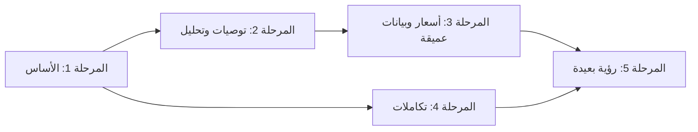

# 06 — Future AI Roadmap (خارطة طريق الذكاء الاصطناعي)

> **المسار:** AI & Integration Layer
> **الدور:** Programmer 4
> **الحالة:** 📝 مقترح قيد الدراسة
> **التاريخ:** 2026-07-31

---

## 1. مبدأ الترتيب

- **Sprint التنفيذي** لا يُحدَّد إلا بعد اعتماد هذا الاقتراح واكتمال دراسات Programmer 1/3.
- المراحل مرتبة حسب: **القيمة التجارية** + **الجاهزية** + **الاعتماديات**.

---

## 2. المراحل المقترحة

### 🟢 المرحلة 1 — الأساس (Foundation) — أول Sprint تنفيذي

| الرقم | العمل | الغرض | الاعتماد على |
|-------|-------|-------|--------------|
| 1.1 | اعتماد ADR-022/023/024 + إعداد `modules/ai/` و`modules/integration/` | الأساس الهيكلي | Architecture Review Board |
| 1.2 | نماذج Prisma لنطاق AI + pgvector (بيئة تجريبية) | بنية تخزين المتجهات والوظائف | ADR-024 |
| 1.3 | `AiProviderAdapter` + تسجيل الاستخدام | تجريد المزودين | ADR-022 |
| 1.4 | أول مستهلكي الأحداث (Embedding للـ Product/Offering/Supplier) | بيانات AI الأساسية | ADR-024 |
| 1.5 | **AI Supplier Matching v1 (Hybrid)** | القدرة الأعلى قيمة | ADR-018 |
| 1.6 | **AI Search Assistant v1 (RAG + Fallback)** | تحسين تجربة البحث | ADR-021 |

**مؤشر إنجاز (Definition of Done):**
- PoC مطابقة مورد واحد تعمل بـ reasons.
- 0 أخطاء TypeScript، اختبارات معماريّة جديدة للنطاقين، ولا كسر لأي اختبار قائم.

### 🟡 المرحلة 2 — التوصيات والتحليل (Recommendations & Analysis)

| الرقم | العمل | الغرض |
|-------|-------|-------|
| 2.1 | **AI Product Recommendations v1 (Hybrid + Cold Start)** | توصيات سوقية |
| 2.2 | **BOQ Intelligence v1** (تطبيع بنود + تقدير تكلفة) | جسر المشروع↔السوق |
| 2.3 | **AI Tender Analysis v1** (ملخص + مخاطر) | دعم المستشار/المقاول |
| 2.4 | **Material Extraction v1** (PDF/Excel، ثم Images) | استخراج مواد |

### 🟠 المرحلة 3 — الأسعار والبيانات العميقة

| الرقم | العمل | الغرض |
|-------|-------|-------|
| 3.1 | **AI Pricing Intelligence v1** (Price Index + تنبيهات) | شفافية الأسعار |
| 3.2 | Feature Signals كاملة + **Collaborative** للبدء | تحسين جودة التوصيات |
| 3.3 | AiFeedback loop ولوحات أداء النماذج | تحسين مستمر |
| 3.4 | تحسين RAG (قياس precision، مصادر مثبتة) | مساعد بحث أدق |

### 🔵 المرحلة 4 — تكاملات متقدمة

| الرقم | العمل | الغرض |
|-------|-------|-------|
| 4.1 | Payment Gateway خلف Financial Trust (Stripe + PayTabs/HyperPay Sandbox) | معاملات آمنة |
| 4.2 | Government Verification (سجل تجاري + VAT/ZATCA) | رفع الثقة في الموردين |
| 4.3 | Inventory Sync (Webhook + Polling) عبر Gateway | بيانات لحظية |
| 4.4 | Logistics (Rates + Tracking) | تكامل الشحن |
| 4.5 | ERP Connectors (Odoo → ERPNext → SAP/Oracle) | تكامل الموردين الكبار |
| 4.6 | Manufacturer Data (GS1/GDSN/EDI) | كتالوج عالمي |

### ⚪ المرحلة 5 — مستقبل طويل الأمد (Vision)

| الرقم | الفكرة | وصف |
|-------|--------|-----|
| 5.1 | **AI Procurement Agent** | RFQ ذكي، اقتراح تلقائي، تفاوض مبدئي |
| 5.2 | **Assistant صوتي** | دعم متعدد اللغات عبر الصوت |
| 5.3 | **نماذج محلية/إقليمية** | امتثال خصوصية + خفض تكلفة للمستندات الحساسة |
| 5.4 | **RabbitMQ/Kafka** للخروج من EventEmitter | At-Least-Once عبر Outbox (D-01) |
| 5.5 | **Machine Learning مخصص (Finetune)** | نماذج مخصّصة لقطاع الإنشاءات |
| 5.6 | **تحليلات تنبؤية** | تنبؤ الأسعار/الطلب/مخاطر المشاريع |

---

## 3. خريطة الاعتماديات

---

## 4. المعايير والقيود في كل مرحلة

| المعيار | القيمة |
|---------|--------|
| التوافق العكسي | لا كسر لأي API/test قائم (DoD من Sprint Closures) |
| الحالة البشرية | كل قرار تجاري نهائي بشري (Human-in-the-Loop) |
| الميزانية | Feature Flags لكل قدرة (FF_AI_*) |
| الاختبارات | Unit + Contract + Architecture + E2E (راجع 05 §5) |
| الأداء | معالجة ثقيلة غير متزامنة؛ P95 زمن متوقع < 5s للاستعلامات الخفيفة |

---

## 5. المقترح: شكل Sprint التنفيذي الأول

> **مقترح تجريبي** — يُناقش عند الاعتماد. افتراضياً:
> - Sprint واحد = "AI Foundation" (المرحلة 1 بأكملها) — تقديرياً 2-3 أسابيع.
> - بعدها Sprint لكل قدرة كبرى في المرحلة 2.
> - تُدمج تكاملات المرحلة 4 حسب أولوية الأعمال وقتها.

---

## 6. المؤشرات النهائية

| السؤال | الجواب المقترح |
|--------|----------------|
| متى نبدأ؟ | بعد اعتماد ADR-022/023/024 واكتمال Sprint 5.4 |
| أول قيمة تسليم؟ | AI Supplier Matching + Search Assistant (المرحلة 1) |
| أكبر مخاطرة؟ | جودة بيانات البداية + تكلفة النماذج — تعالج بـ Seed عالي الجودة وFeature Flags |
| كيف نقيس النجاح؟ | Precision@K، Match-to-Conversion، CTR، رضا المستخدمين (AiFeedback) |
