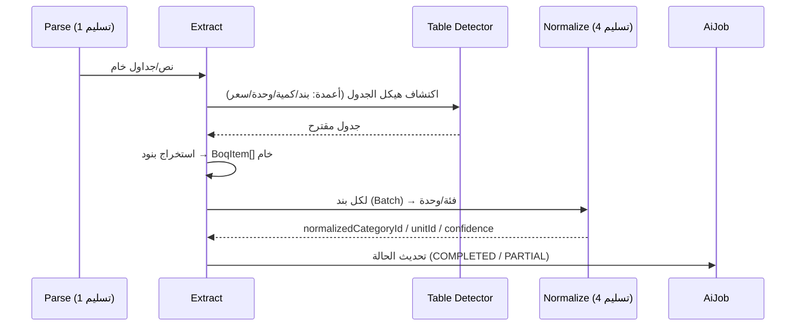

# Sprint AI-1 · Deliverable 3 — BOQ Extraction Flow

> **المسار:** AI & Integration Layer — Sprint AI-1
> **الحالة:** 📝 مواصفة — جاهزة للاعتماد
> **المرجع:** `01-ai-architecture.md` §3.4 (مخرجات `BoqItem`) · `01-document-processing-pipeline.md` (مراحل 4–6) · `02-ocr-strategy.md`
> **يخدم:** لوحة `7.5/7.6 رفع/معاينة BOQ` (via `AiAnalysisPanel`, G4)

---

## 1. الهدف

تحويل **النص/الجداول الخام** (من مرحلة `PARSE`) إلى **بنود BOQ منظمة** `BoqItem` — ثم تطبيعها (تسليم 4) وعرضها للمراجعة البشرية (Human-in-the-Loop).

## 2. تدفق الاستخراج (Sequence)



## 3. هيكل `BoqItem` (مواصفة — يستمر من `01-ai-architecture.md` §3.4)

```typescript
interface BoqItem {
  id: string;                  // محلي داخل المستند
  rowIndex: number;
  rawText: string;             // النص الأصلي للبند (كما جاء)
  itemCode?: string;           // كود البند (إن وُجد في المستند)
  quantity: number | null;
  unit: string | null;         // خام (قبل التطبيع) — مثال: "طن"
  unitId?: string | null;      // بعد التطبيع (تسليم 4)
  categoryId?: string | null;  // بعد التطبيع (MaterialCategory)
  estimatedCost?: number | null;  // يُملأ لاحقاً (Pricing — خارج النطاق)
  confidence: number;          // 0..1
  status: 'CLEAN' | 'LOW_CONFIDENCE' | 'AMBIGUOUS' | 'UNRECOGNIZED';
}
```

| الحالة | المعنى | المعالجة |
|--------|--------|----------|
| `CLEAN` | بند واضح + مطابق | يُعرض طبيعياً |
| `LOW_CONFIDENCE` | ثقة منخفضة (OCR/نص ضبابي) | يُعلَّم للمراجعة |
| `AMBIGUOUS` | أكثر من تفسير معقول | يطلب توضيحاً من المستخدم |
| `UNRECOGNIZED` | لا يمكن فهمه | يُستبعد مع `warnings[]` |

## 4. قواعد الاستخراج (Extraction Rules)

| القاعدة | التفصيل |
|---------|---------|
| **اكتشاف الأعمدة** | أعمدة مرنة: بند/وصف/كمية/وحدة/سعر/ملاحظات — لا تخطيط ثابت |
| **الكميات** | أرقام فارزة (فاصلة/نقطة) وفق الإعداد المحلي — دقة بالعلامة العشرية |
| **الوحدات** | تُحفظ خاماً ثم تُطبع (تسليم 4) — لا تُتجاهل أبداً |
| **البنود الفارغة** | صفوف بلا اسم تُسقط مع `warning` |
| **الفواصل (Sections)** | تُحفظ العناوين بين أقسام BOQ لتحسين التطبيع |
| **لغات متعددة** | نص عربي/إنجليزي/أردي مختلط في نفس الجدول — مدعوم |
| **رأس/تذييل** | يُستبعد من البنود (تواريخ/أرقام صفحات/توقيعات) |

## 5. التفاعل البشري (Human-in-the-Loop) — Governance 08 §6

| السيناريو | سلوك الواجهة (`AiAnalysisPanel`) |
|-----------|-----------------------------------|
| كل البنود `CLEAN` | عرض + زر "اعتماد" |
| وجود `LOW_CONFIDENCE` | تمييز + إجبار مراجعة قبل الاعتماد |
| `AMBIGUOUS` | اختيار المستخدم بين الخيارات المقترحة |
| `UNRECOGNIZED` | زر "إضافة يدوياً" + تسجيل `AiFeedback` |

> **L1/L2 (08 §6):** التطبيع معلوماتي/مساعد — يُعرض للتصحيح، لكن **لا يُستمر للمشتريات إلا بمراجعة بشرية**.

## 6. محاذاة التكلفة (09)

- **Batching:** استدعاء تطبيع واحد لكل دفعة بنود (لا استدعاء لكل بند).
- **Tiering:** البنود الواضحة تُطبع بقواعد/نموذج صغير؛ فقط `AMBIGUOUS` تمر لـ LLM أكبر.
- **Cache:** تطبيع "حديد تسليح 12م" المكرر لا يُعاد.

## 7. أحداث الصدور (G2 — مستهلكون لا كتّاب)

| الحدث | متى |
|-------|-----|
| `AI.Boq.Extracted` | اكتمال استخراج (مع `jobId` + عدد البنود) |
| `AI.Boq.Reviewed` | اعتماد بشري لنتيجة BOQ (Human-in-the-Loop إشارة) |
| `AI.Boq.Failed` | فشل استخراج (للرصد — 09) |

> AI **ينشر أحداثاً** بخصوص عمله الخاص فقط — لا يكتب في نطاقات أخرى (G2).

## 8. قبول التسليم

| # | المعيار |
|---|---------|
| 1 | هيكل `BoqItem` وحالات البند معتمدة |
| 2 | قواعد الاستخراج (أعمدة/كميات/وحدات/فوارز) معتمدة |
| 3 | حلقة المراجعة البشرية (L1/L2) معتمدة مع 08 |
| 4 | Batching/Tiering في الاستخراج معتمد (09) |
| 5 | أحداث الصدور موقعة |
