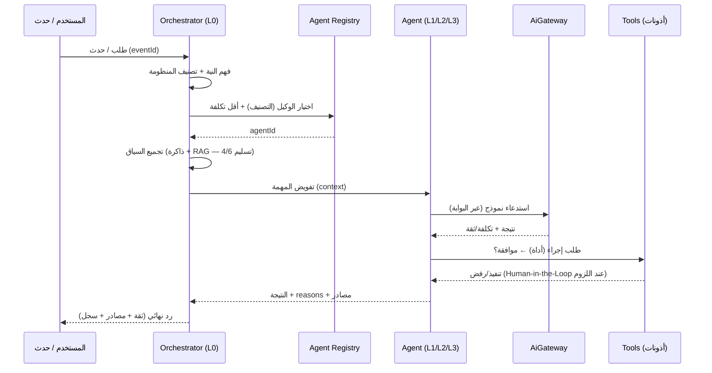

# Sprint AI-2 · Deliverable 2 — Orchestrator Architecture (نواة التنسيق)

> **المسار:** AI & Integration Layer — Sprint AI-2
> **الحالة:** 📝 مواصفة — جاهزة للاعتماد
> **المرجع:** `01-agent-taxonomy.md` (الوكلاء) · `01-ai-gateway-architecture.md` (البوابة) · `02-event-consumption-pattern.md` (أحداث) · `09-ai-cost-management.md`

---

## 1. الدور

نواة النظام (L0) تتلقى **طلباً/حدثاً**، تخطّط المسار، **تختار الوكيل الأوفر قيمة والأقل تكلفة**، تجمّع السياق، تفوّض، وتعيد النتيجة — كل ذلك عبر البوابة (G1/G3/09).

## 2. المبادئ

| المبدأ | المعنى |
|--------|--------|
| **منهجية هرمية** | Orchestrator هو المخطط (Planner)؛ الوكلاء منفّذون (Executors) — لا وكيل يخطط لآخر |
| **أقل تكلفة كافية (09 §2)** | مسارات قواعدية/Retrieval أولاً، ثم LLM — Orchestrator يقرر الطبقة |
| **لا كتابة في Domains (G2)** | كل إجراء عبر أداة موثَّقة بموافقة (تسليم 5) — لا كتابة مباشرة |
| **قابلية الملاحظة** | كل خطوة تخطيط/تنفيذ مسجلة (ADR-009) — تدقيق 08 |
| **Human-in-the-Loop** | الإجراءات عالية التأثير تتوقف لموافقة بشرية (08 §6) |

## 3. الأنماط (Patterns) المختارة

| النمط | الاستخدام | الحالة |
|-------|-----------|--------|
| **Supervisor/Hierarchical** | Orchestrator فوق L1/L2/L3 | ✅ مختار (الأساس) |
| **Router** | توجيه الطلب للوكيل المناسب حسب المنظومة/الشخصية | ✅ ضمن الأساس |
| **Plan-then-Execute** | خطط صريحة للمهام متعددة الخطوات | ✅ للمهام المعقدة |
| **Reactive (Event)** | استيقاظ الوكلاء عند الأحداث (G2) — بدون طلب مباشر | ✅ مكمل |
| **Full Autonomy (Self-loop)** | قرارات متسلسلة بلا رقابة | ❌ غير مسموح (08) |

## 4. تدفق المعالجة (Sequence)



## 5. مكونات الـ Orchestrator (مقترح)

```
modules/ai/agents/
├── orchestrator/
│   ├── intent-classifier.ts      # تصنيف المنظومة/النية (قواعد + نموذج صغير)
│   ├── agent-registry.ts          # سجل الوكلاء (التصنيف + القدرات + التكلفة)
│   ├── planner.ts                 # خطة المهمة (خطوات متسلسلة/متوازية)
│   ├── context-assembler.ts       # ذاكرة + RAG + سياق المنظمة
│   ├── executor.ts                # تنفيذ الخطوات عبر الوكيل
│   ├── supervisor.ts              # مراجعة النتائج + تصعيد/إنهاء
│   └── escalation.ts              # Human-in-the-Loop + fallback
```

## 6. التوجيه (Routing) واختيار الوكيل

| الإشارة | القاعدة |
|---------|---------|
| المنظومة (Career/Learning/Construction/Platform) | من النية + السياق (بوابة المستخدم) |
| الشخصية/الدور | من جلسة المستخدم (RBAC) |
| التكلفة | يُفضَّل وكيل/مسار بمسارات أرخص أولاً (09 §3) |
| التعارض | طلب يخص منظومتين → L2 (وكلاء عمليات) أو تصعيد بشري |
| فشل الوكيل | Fallback: قواعد → وكيل عام أبسط → تصعيد بشري (08) |

## 7. التوافقية (Concurrency) والمهام

- **مهام قصيرة** (استفسار/اقتراح): inline عبر البوابة.
- **مهام ثقيلة** (تحليل مستندات، معالجة دفعات): عبر `AiJob` (نمط AI-1) — غير متزامنة.
- **التوازي**: خطوات مستقلة في الخطة تُنفَّذ بالتوازي (مع حد أقصى) — بدون تعارض كتابة.

## 8. الأمان والتدقيق (08)

- **هوية**: كل خطوة مسجلة بهوية الوكيل + الطلب الأصلي (`requestId`).
- **حدود**: Orchestrator لا يمتلك أدوات كتابة — يفوّض بموافقة (تسليم 5).
- **الإنهاء**: حد أقصى لعدد الخطوات/التكرارات (منع الحلقات/التكلفة) — Kill Switch لكل وكيل.
- **الشفافية**: المستخدم يرى أثر الخطوات (`steps[]`) ومصادرها.

## 9. قبول التسليم

| # | المعيار |
|---|---------|
| 1 | النمط الهرمي (Supervisor/Router/Plan) معتمد |
| 2 | تدفق المعالجة (Sequence) معتمد |
| 3 | قواعد التوجيه واختيار الوكيل معتمدة |
| 4 | قيود التوافقية والإنهاء معتمدة (09) |
| 5 | الأمان/التدقيق (08) معتمد |
