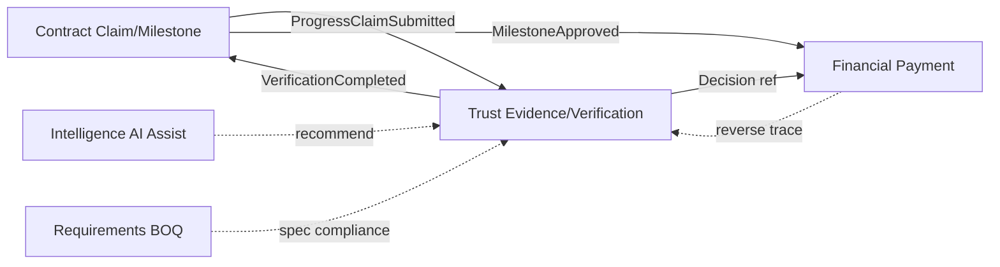

# ADR-028: Trust & Evidence & Verification Architecture

## التاريخ
2026-08-22

## آخر تحديث
2026-08-22 — **Gate 6 Final Approval** (Trust/Financial separation + Waiver + Partial + Integrity)

## الحالة
**✅ FINAL APPROVED / BASELINE — Gate 6 CLOSED**

OAD-028-001 → OAD-028-008 ✅ Approved.

## Phase 2 Rule
❌ No coding · ❌ No migrations · ❌ No UI · ❌ No implementation · ❌ No ADR-029 until ADR-028 approved

---

## السياق

Trust & Evidence domain sits at the **center of the protection chain**:

```
Contract → Milestone → Progress Claim → Evidence → Verification → Approval
  → Payment Instruction → PSP/Bank
```

**ADR-022:** No Evidence → No Release · AI cannot independently authorize financial release  
**ADR-024:** Trust owns Evidence/Verification; Contract owns Claims; Financial owns PaymentInstruction  
**ADR-025:** PaymentInstruction requires VerificationDecision ref + Contract approval + **Financial Policy** (Financial owns payment decision)  
**ADR-027:** Golden chain traceability includes evidence + verification refs

---

## القرار

اعتماد **Trust & Evidence** bounded context كـ **BASELINE** مع:

- Aggregates: **`Evidence`**, **`EvidencePackage`**, **`EvidenceRequirement`**, **`EvidenceWaiver`**, **`VerificationRequest`**, **`VerificationDecision`**
- **Trust ≠ Financial** — VerificationDecision carries verification facts only; Financial Policy owns PaymentInstruction
- **Evidence Source Registry** (extensible — not domain per source type)
- **Verification state machine** — distinct from Evidence lifecycle and Contract Approval
- **Provenance + chain of custody** — immutable capture metadata
- **Trust Signals / Trust Score** — read models derived from evidence history — **never replace Evidence**
- **Golden Chain** bidirectional traceability API

---

## 1. Trust Domain Boundary

### Trust & Evidence — Owns (SoR)

| Entity | Responsibility |
|--------|----------------|
| **Evidence** | Single evidence artifact record |
| **EvidenceSource** | Typed source descriptor (registry entry usage) |
| **EvidencePackage** | Bundle of evidence items for a claim/milestone |
| **EvidenceProvenance** | Immutable capture metadata + chain of custody |
| **EvidenceRequirement** | What evidence is required (template or instance) |
| **VerificationRequest** | Request to verify a package/claim |
| **VerificationWorkflow** | Workflow profile ref for verification steps |
| **VerificationDecision** | Authoritative verification outcome |
| **TrustSignal** | Computed/recorded trust indicator (derived) |
| **TrustScoreSnapshot** | Point-in-time score (derived — not substitute for evidence) |
| **EvidenceWaiver** | Exception governance record (not routine bypass) |
| **IntegrityRecord** | Hash/tamper audit for evidence |

### Reads (does NOT own)

| Domain | Data read |
|--------|-----------|
| Contract | Milestone, ProgressClaim, AcceptanceCriteria |
| Requirements | BOQSnapshot refs, MaterialSpec, Specification |
| Party Network | Org qualification, cert refs |
| Intelligence | AI analysis results (recommendations) |
| Integration | BIM/ERP/IoT external refs |
| Financial | PaymentInstruction status (for reverse trace) |
| Sourcing | Award refs (for golden chain) |

### Does NOT own

| Concern | Owner |
|---------|-------|
| ProgressClaim | Contract |
| Milestone approval (commercial) | Contract |
| PaymentInstruction / payment amount decision | **Financial** |
| Contract terms | Contract |
| File blob storage (optional) | External object store / Integration |
| AI models | Intelligence (orchestration) |

---

## 2. Core Aggregates

### 2.1 Evidence (aggregate root — single artifact)

```
Evidence {
  id, evidenceNumber
  sourceTypeCode              // Evidence Source Registry
  status: DRAFT | ACTIVE | SUPERSEDED | REJECTED | ARCHIVED
            | INVALID | COMPROMISED | DUPLICATE

  // Content refs — ABC may not store blob SoR
  contentRef?                 // external URI / object store key
  mimeType?, fileSize?, thumbnailRef?

  // Provenance (immutable after SUBMITTED — see §3)
  provenance: EvidenceProvenance

  // Linkage
  relatedEntityType: MILESTONE | PROGRESS_CLAIM | CONTRACT | PROCUREMENT_GRN
                    | MATERIAL_INSPECTION | HANDOVER | RETENTION | OTHER
  relatedEntityId
  milestoneId?, claimId?, contractId?, projectId?

  supersedesEvidenceId?
  supersededByEvidenceId?
  duplicateOfEvidenceId?      // canonical ref if status=DUPLICATE

  verificationDecisionId?
  trustSignalRefs[]

  integrity: { hash, algorithm, sealedAt, tamperFlag? }
  version
}
```

### 2.2 EvidencePackage (bundle for verification unit)

```
EvidencePackage {
  id, packageNumber
  verificationRequestId?
  claimId?, milestoneId?, contractId?
  evidenceIds[]               // Evidence aggregate refs
  status: OPEN | COMPLETE | UNDER_REVIEW | CLOSED
  completenessPct?            // computed vs requirements
  submittedAt?, submittedByOrgId?
}
```

### 2.3 EvidenceRequirement (what must be provided)

```
EvidenceRequirement {
  id
  templateRef?                // from evidenceProfile on Contract/Milestone
  milestoneId?, claimId?, contractId?
  sourceTypeCodes[]         // required types from registry
  minCount?, mandatory: boolean
  description, acceptanceCriteriaRef?
  status: REQUIRED | PARTIALLY_MET | MET | WAIVED
  waiverId?                   // ref to EvidenceWaiver if WAIVED
}
```

### 2.3b EvidenceWaiver (exception governance — not routine bypass)

```
EvidenceWaiver {
  id, evidenceRequirementId?, verificationRequestId?
  reason, scope, amountLimit?, expiryAt
  authorityUserId, authorityOrgId, authorityRole
  supportingEvidenceIds[]
  sodCheckPassed: boolean
  status: PROPOSED → APPROVED → ACTIVE → EXPIRED | REVOKED
  postReviewRequired: boolean
  postReviewCompletedAt?, postReviewOutcome?
  auditRef
}
```

**Waiver MUST NOT bypass:** financial limits · segregation of duties · regulatory requirements · safety requirements.  
Exceptional waivers: **explicit + authorized + audited + post-review when policy requires**.

### 2.4 VerificationRequest

```
VerificationRequest {
  id, requestNumber
  evidencePackageId
  claimId, milestoneId, contractId
  status: REQUIRED → REQUESTED → SUBMITTED → SCREENED → UNDER_VERIFICATION
        → VERIFIED | REJECTED | NEEDS_MORE_EVIDENCE
  requestedAt, dueDate?
  assignedVerifierOrgId?, assignedVerifierUserId?
  workflowProfileRef
  aiAnalysisRef?              // Intelligence recommendation — not decision
}
```

### 2.5 VerificationDecision (Trust — **no financial authority**)

```
VerificationDecision {
  id, decisionNumber
  verificationRequestId
  evidencePackageId

  // Trust outcomes ONLY — no payment fields
  verificationStatus: VERIFIED | NOT_VERIFIED | PARTIALLY_VERIFIED
  evidenceSufficient: boolean
  acceptanceCriteriaSatisfied: boolean
  verificationBasis: HUMAN_INSPECTION | THIRD_PARTY | SYSTEM_POLICY | DOCUMENTARY

  verifiedPercentage?         // e.g. 70 of 100 milestone
  verifiedQuantity?
  unverifiedPercentage?       // remainder on HOLD path
  conditions[]?

  decidedByUserId, decidedByOrgId, decidedByRole
  decisionType: HUMAN | SYSTEM_POLICY   // never AI alone
  aiRecommendationRef?
  decidedAt
  immutable: true
  supersedesDecisionId?
}
```

**Trust does NOT set:** `financialReleaseEligible`, payment amount, or release authorization.

**Distinction (critical — Gate 6):**

| Layer | Domain | Decision |
|-------|--------|----------|
| **Evidence** | Trust | Artifact exists |
| **Verification** | Trust | VERIFIED / NOT_VERIFIED / PARTIALLY_VERIFIED |
| **Approval** | Contract | Milestone/claim commercial approval |
| **Payment** | **Financial** | PaymentInstruction amount & release (policy) |

```
Trust Verification
       ↓
Contract Approval
       ↓
Financial Policy
       ↓
PaymentInstruction
```

---

## 3. Evidence Provenance & Chain of Custody

```
EvidenceProvenance {
  evidenceId
  capturedAt                  // IMMUTABLE after seal
  capturedByUserId?, capturedByOrgId?
  submittedAt, submittedByUserId?, submittedByOrgId?
  captureLocation?: { lat, lng, accuracy?, placeRef? }
  originSystem: UPLOAD | MOBILE | IOT | INTEGRATION | THIRD_PARTY | SYSTEM
  sourceDeviceRef?, sourceIntegrationRef?
  chainOfCustody[] {
    event: CAPTURED | TRANSFERRED | SEALED | SUBMITTED | VERIFIED
    actorUserId?, actorOrgId?, timestamp, notes?
  }
  originalHash                // never modified
  revisionCode?               // evidence revision — new Evidence supersedes old
}
```

**Rule:** Original `capturedAt`, `originalHash`, and first custody entry **cannot be altered** — only supersession creates new Evidence record.

---

## 4. Evidence Source Registry (Extensible)

Registry entry — **not** a domain per type:

```
EvidenceSourceType {
  code                        // extensible
  category: DOCUMENT | VISUAL | INSPECTION | SYSTEM | EXTERNAL | ATTESTATION
  requiresContentRef: boolean
  requiresProvenance: boolean
  integrityRequired: boolean
  allowedMimeTypes[]?
  verificationWorkflowDefault?
}
```

### v1 Source Types

| Code | Category |
|------|----------|
| `DOCUMENT` | Document |
| `PHOTO` | Visual |
| `VIDEO` | Visual |
| `INSPECTION_REPORT` | Inspection |
| `TEST_RESULT` | Inspection |
| `CERTIFICATE` | Document |
| `BIM_MODEL_REF` | External |
| `ERP_RECORD` | External |
| `IOT_TELEMETRY` | System |
| `SITE_REPORT` | Document |
| `THIRD_PARTY_VERIFICATION` | External |
| `REGULATORY_RECORD` | External |
| `PAYMENT_FINANCIAL_EVIDENCE` | External |
| `HUMAN_ATTESTATION` | Attestation |
| `SYSTEM_EVENT` | System |

New types = registry entry + optional workflow profile — **no core schema change**.

---

## 5. Verification State Machine

### VerificationRequest lifecycle

```
REQUIRED
  ↓ (ProgressClaimSubmitted / MilestoneDue)
REQUESTED
  ↓ (parties notified)
SUBMITTED                    // EvidencePackage complete enough to start
  ↓
SCREENED                     // completeness / malware / format check
  ↓
UNDER_VERIFICATION           // human and/or AI assist review
  ↓
┌─────────────┬──────────────┬─────────────────────┐
│ VERIFIED    │ REJECTED     │ NEEDS_MORE_EVIDENCE │
└─────────────┴──────────────┴─────────────────────┘
  ↓ (creates VerificationDecision)
VERIFIED | NOT_VERIFIED | PARTIALLY_VERIFIED   (on Decision aggregate)
  ↓
SUPERSEDED                   // new decision replaces — old immutable
```

### Evidence lifecycle (separate SM)

```
DRAFT → ACTIVE → SUPERSEDED | REJECTED | ARCHIVED
              ↘ INVALID | COMPROMISED | DUPLICATE (linked to canonical)
```

### Contract Approval (ADR-024 — separate)

```
ProgressClaim → VerificationDecision VERIFIED/PARTIALLY_VERIFIED
  → Contract ApproveClaim (eligible portion only if partial)
  → MilestoneApproved
```

**Four layers:** Evidence submitted · Verified (Trust) · Approved (Contract) · Paid (Financial Policy)

---

## 6. Verification Authority Matrix

| Actor | MAY | MAY NOT |
|-------|-----|---------|
| **AI (Intelligence)** | Analyze photos/video, detect anomalies, duplicate evidence, qty mismatch, tamper indicators, delay risk, **recommend** verify/reject | Issue VerificationDecision, Approve payment, Release funds |
| **Authorized Verifier** (Consultant/Inspector/PMC per DelegationMatrix) | Create VerificationDecision | Bypass EvidenceRequirement without waiver |
| **Authorized Approver** (Contract) | Approve ProgressClaim after verification | Create payment without VerificationDecision ref |
| **Financial** | Create PaymentInstruction per **Financial Policy** when VerificationDecision ref + Contract approval + policy limits satisfied | Trust does not authorize payment; cannot create instruction without verification ref |
| **System Policy** | Auto-verify **only** pre-configured low-risk categories with explicit policy catalog + audit | Default for milestone payments |

```
AI Analysis → Risk / Recommendation (Intelligence)
       ↓
Authorized Verifier → VerificationDecision (Trust)
       ↓
Authorized Approver → Claim/Milestone Approval (Contract)
       ↓
Financial Policy → PaymentInstruction (Financial)
       ↓
PSP/Bank execution (Integration)
```

---

## 7. Evidence → Milestone Binding

Triggered by Contract events:

```
MilestoneDefined / MilestoneDue
  ↓
Trust: materialize EvidenceRequirement[] from milestone.evidenceProfileRef
        + acceptanceCriteriaRef (Contract)

ProgressClaimSubmitted
  ↓
Trust: open VerificationRequest (status=REQUESTED)
  ↓
Parties submit Evidence → EvidencePackage
  ↓
EvidenceRequirement.status updated (PARTIALLY_MET / MET)
  ↓
VerificationRequest → UNDER_VERIFICATION
  ↓
VerificationDecision (VERIFIED | PARTIALLY_VERIFIED)
  ↓
Event: VerificationCompleted → Contract enables ApproveClaim (eligible portion)
```

```
Milestone
  → AcceptanceCriteria (Contract)
  → RequiredEvidence (Trust — EvidenceRequirement)
  → SubmittedEvidence (Trust — EvidencePackage)
  → Verification (Trust — VerificationRequest + Decision)
  → [Contract Approval]
  → [Financial Payment]
```

---

## 8. No Evidence → No Release (Architectural Invariant)

### Invariant INV-T1 (No Evidence → No Release)

```
∀ PaymentInstruction PI:
  PI.verificationDecisionId MUST NOT be null
  AND VerificationDecision.verificationStatus ∈ { VERIFIED, PARTIALLY_VERIFIED }
  AND VerificationDecision.evidenceSufficient = true
  AND VerificationDecision.acceptanceCriteriaSatisfied = true (or valid EvidenceWaiver)
  AND Contract approval exists for eligible portion
  AND Financial Policy authorizes amount (Financial domain — NOT Trust)
```

**Trust supplies verification facts; Financial owns payment authorization.**

### Enforcement

| Layer | Behavior |
|-------|----------|
| **Financial domain** | Rejects `CreatePaymentInstruction` without valid verification ref |
| **API gateway** | Returns 403/422 + error code `VERIFICATION_REQUIRED` |
| **Audit** | `PaymentBlockedMissingVerification` event — **always logged** |
| **Override** | **None** without new ADR — emergency paths still require verification (may be post-delivery per ADR-024 emergency policy, never skip audit) |

Any bypass attempt: **BLOCKED + AUDITED**.

---

## 9. Evidence Supersession

```
Evidence v1 (ACTIVE)
  ↓ new submission / revision
Evidence v2 (ACTIVE) {
  supersedesEvidenceId: v1
}
Evidence v1 → SUPERSEDED (never deleted)

VerificationDecision v1 → SUPERSEDED when v2 decision issued
```

Historical chain preserved for audit, disputes, golden chain reverse trace.

---

## 9b. Partial Verification & Partial Payment (ADR-024/025 aligned)

**Scenario:** Milestone = 100% claimed · Evidence verifies 70% only.

| Portion | Trust | Contract | Financial |
|---------|-------|----------|-----------|
| **Verified 70%** | `PARTIALLY_VERIFIED`, verifiedPercentage=70 | May approve eligible portion | May release per policy × verified % |
| **Unverified 30%** | Remains NOT verified | **HOLD** on claim remainder | **HOLD** — no PaymentInstruction |

**Rules:**
- Verification **does not compute payment amount** — only verifiedPercentage / verifiedQuantity
- Contract approves **eligible portion** only
- Financial Policy applies milestone value × verified % × approval refs
- Unverified portion stays on HOLD until new evidence + decision

```
Milestone 100% ──► Verification 70% ──► Contract approves 70% ──► Financial pays 70%
                              └── 30% HOLD (Evidence + Verification + Payment blocked)
```

---

## 9c. Evidence Integrity

Every sealed Evidence carries:

| Field | Purpose |
|-------|---------|
| **hash** | Content integrity (SHA-256+) |
| **timestamp** | capturedAt / sealedAt |
| **provenance** | EvidenceProvenance aggregate |
| **source** | sourceTypeCode + originSystem |
| **revision** | revisionCode + supersedes chain |
| **supersession** | supersededByEvidenceId when replaced |

**Tampering detected (hash mismatch or custody breach):**

```
Evidence → status INVALID | COMPROMISED
       → Verification BLOCKED for affected package
       → EvidenceTamperDetected audit event
       → Contract hold + Intelligence alert
```

Verification cannot proceed on COMPROMISED evidence until superseded or waived per policy.

---

## 9d. Duplicate Evidence (retain — never delete)

Duplicate detection (hash match / AI) **does not delete** evidence:

```
Evidence (duplicate) → status DUPLICATE
                     → duplicateOfEvidenceId → canonical Evidence
                     → retained for audit trail
                     → DuplicateEvidenceDetected event
```

Verifier may accept canonical only; duplicate record preserved for dispute/audit.

---

## 10. Trust Signal vs Trust Score vs Evidence

### Baseline rule (Gate 6 — explicit)

> **TrustScore may influence matching, risk assessment, and prioritization — but can NEVER substitute for required Evidence or Verification.**

```
Trusted Supplier  ≠  Verified Milestone
High TrustScore     ≠  Payment eligibility
```

| Concept | Definition | Replaces Evidence? |
|---------|------------|-------------------|
| **Evidence** | Primary artifact proving a fact | — (source of truth for proof) |
| **Verification** | Decision that evidence meets criteria | No |
| **Trust Signal** | Derived indicator (e.g. on-time delivery, NCR rate) | **No** — matching/risk/prioritization only |
| **Trust Score** | Composite number from signals + history | **No** — never sole basis for payment or verification skip |

```
TrustScoreSnapshot {
  orgId, categoryRef?, score, components[], computedAt
  sourceEvidenceIds[]           // traceable derivation
  validUntil?
}
```

Sourcing Matching (ADR-023) **reads** TrustScore — payment **requires** Evidence + Verification.

---

## 11. Golden Question + Golden Chain (First-Class Capability)

### Golden Question

> **"Why was this paid?"**

First-class platform capability — not optional reporting. Every PaymentInstruction must be reversibly traceable.

### Full reverse chain (Gate 6)

```
Payment (execution ref)
  → PaymentInstruction (Financial)
  → Approval (Contract — Milestone/Claim)
  → VerificationDecision (Trust)
  → Evidence[] / EvidencePackage (Trust)
  → ProgressClaim (Contract)
  → Milestone (Contract)
  → Contract
  → Award (Sourcing)
  → SourcingEvent
  → Package (Project Control)
  → BOQSnapshot (Requirements)
  → Requirement
```

### Forward chain

```
Requirement → BOQSnapshot → Package → SourcingEvent → Award → Contract
  → Milestone → ProgressClaim → Evidence → VerificationDecision
  → Approval → PaymentInstruction → Payment
```

### APIs (design — unified traceability)

```
GET /api/v1/traceability/golden-chain/reverse?paymentInstructionId=
GET /api/v1/traceability/golden-chain/reverse?paymentId=
GET /api/v1/traceability/golden-chain/forward?requirementId=
GET /api/v1/traceability/golden-chain/why-paid?paymentInstructionId=   // Golden Question
GET /api/v1/trust/traceability/segment?verificationDecisionId=         // Trust segment only
```

Trust owns evidence/verification segment; orchestrates with ADR-027 Requirements + ADR-025 Financial segments. **GoldenChainQueried** always audited.

---

## 12. Security & Integrity Model

| Control | Implementation |
|---------|----------------|
| **Hash at seal** | SHA-256+ on content; stored in IntegrityRecord |
| **Tamper detection** | Re-hash on access; `tamperFlag` if mismatch |
| **Immutable provenance** | capturedAt/originalHash append-only |
| **Duplicate detection** | Link to canonical; status=DUPLICATE; **never delete** |
| **Access control** | Project/Contract/Milestone scoped + stakeholder read models |
| **Regulator/Bank scope** | Filtered evidence types per read model (ADR-026) |
| **WORM audit** | TrustAuditEntry append-only chain |

---

## 13. Cross-Domain Relationships



| Event from Contract | Trust action |
|---------------------|--------------|
| `ProgressClaimSubmitted` | Create VerificationRequest + EvidenceRequirements |
| `MilestoneDue` | Remind / escalate requirements |
| `RetentionReleaseEligible` | New EvidenceRequirements for retention |

| Event from Trust | Consumer |
|------------------|----------|
| `VerificationCompleted` (VERIFIED) | Contract → enable full ApproveClaim |
| `VerificationCompleted` (PARTIALLY_VERIFIED) | Contract → approve eligible portion; remainder HOLD |
| `VerificationCompleted` (NOT_VERIFIED) | Contract → reject/hold claim |
| `EvidenceTamperDetected` | Verification blocked; Contract hold; Intelligence alert; Audit |
| `DuplicateEvidenceDetected` | Verifier review; canonical link; audit retained |
| `EvidenceWaiverApproved` | Requirement WAIVED per governance; audit + post-review queue |

---

## 14. Domain Events

| Event | Payload highlights |
|-------|-------------------|
| `EvidenceRequirementCreated` | milestoneId, types[] |
| `EvidenceSubmitted` | evidenceId, packageId |
| `EvidencePackageCompleted` | packageId, claimId |
| `EvidenceSuperseded` | oldId, newId |
| `VerificationRequested` | requestId, claimId |
| `VerificationScreeningCompleted` | pass/fail |
| `AIAnalysisAttached` | requestId, recommendationRef |
| `VerificationDecisionRecorded` | decisionId, verificationStatus, verifiedPercentage |
| `VerificationDecisionSuperseded` | oldId, newId |
| `EvidenceTamperDetected` / `EvidenceIntegrityCompromised` | evidenceId, reason |
| `EvidenceMarkedDuplicate` | duplicateId, canonicalId |
| `EvidenceWaiverProposed` / `EvidenceWaiverApproved` / `EvidenceWaiverRevoked` | waiverId, authority, scope |
| `PaymentBlockedMissingVerification` | attemptedPaymentRef, reason |
| `TrustScoreUpdated` | orgId, score |
| `GoldenChainQueried` | audit |

---

## 15. API Boundaries (Design Draft)

### Commands (Trust domain)

```
POST   /api/v1/trust/evidence
POST   /api/v1/trust/evidence/{id}/seal
POST   /api/v1/trust/evidence-packages
POST   /api/v1/trust/evidence-packages/{id}/submit
POST   /api/v1/trust/verification-requests/{id}/start-review
POST   /api/v1/trust/verification-requests/{id}/decide     Human authoritative
POST   /api/v1/trust/evidence-waivers                    Exception governance
POST   /api/v1/trust/evidence-waivers/{id}/approve      SoD + authority check
POST   /api/v1/intelligence/trust/analyze                 AI assist → attach only
```

**Financial domain (separate — owns payment decision):**

```
POST   /api/v1/financial/payment-instructions            Requires verification ref + contract approval + policy
```

### Queries

```
GET    /api/v1/trust/evidence/{id}
GET    /api/v1/trust/evidence-packages/{id}
GET    /api/v1/trust/verification-requests/{id}
GET    /api/v1/trust/milestones/{id}/evidence-status
GET    /api/v1/traceability/golden-chain/reverse
GET    /api/v1/traceability/golden-chain/why-paid
GET    /api/v1/trust/trust-signals/{orgId}
GET    /api/v1/trust/audit-trail?contractId=
GET    /api/v1/trust/evidence-waivers/{id}
```

---

## 16. Acceptance Tests (Gate 6 — 28 scenarios)

| # | Scenario | Expected | Gate 6 |
|---|----------|----------|--------|
| 1 | Valid evidence → verification → contract approval → financial policy → payment | ✅ PaymentInstruction by Financial | ✅ |
| 2 | Missing evidence | ✅ Block at SCREENED/SUBMITTED | ✅ |
| 3 | NOT_VERIFIED decision | ✅ verificationStatus=NOT_VERIFIED; no contract approval path | ✅ |
| 4 | AI detects issue → human verifies | ✅ AI ref only; human VerificationDecision | ✅ |
| 5 | Evidence superseded | ✅ v1 SUPERSEDED; v2 ACTIVE; history kept | ✅ |
| 6 | Multiple source types in one package | ✅ | ✅ |
| 7 | Third-party verification source | ✅ THIRD_PARTY_VERIFICATION type | ✅ |
| 8 | Partial: milestone 100%, verified 70% | ✅ PARTIALLY_VERIFIED; pay 70%; 30% HOLD | ✅ |
| 9 | Disputed claim | ✅ NOT_VERIFIED; payment HOLD | ✅ |
| 10 | Retention release evidence | ✅ separate EvidenceRequirement set | ✅ |
| 11 | Regulatory evidence type | ✅ REGULATORY_RECORD scoped read | ✅ |
| 12 | BIM/ERP external ref evidence | ✅ BIM_MODEL_REF / ERP_RECORD | ✅ |
| 13 | Tampered evidence (hash mismatch) | ✅ INVALID/COMPROMISED; verification blocked; audit | ✅ |
| 14 | Duplicate evidence detected | ✅ DUPLICATE status; linked to canonical; **not deleted** | ✅ |
| 15 | Audit trail complete | ✅ TrustAuditEntry chain | ✅ |
| 16 | Owner Digital Eye sees evidence status | ✅ via ProjectControlReadModel | ✅ |
| 17 | PMC delegated verification | ✅ per DelegationMatrix | ✅ |
| 18 | Bank read model — verified progress only | ✅ no raw tampered unverified | ✅ |
| 19 | Payment attempt without verification | ✅ **BLOCKED + AUDITED** (Financial) | ✅ |
| 20 | Golden Question: Payment → Requirement | ✅ full reverse chain API | ✅ |
| 21 | Waiver governance | ✅ reason/authority/scope/expiry/SoD/post-review; audit | ✅ |
| 22 | Waiver cannot bypass financial limits | ✅ **REJECTED** | ✅ |
| 23 | Waiver cannot bypass regulatory/safety | ✅ **REJECTED** | ✅ |
| 24 | System policy auto-verify low-risk | ✅ SYSTEM_POLICY + policy ref only | ✅ |
| 25 | Trust does NOT set payment amount | ✅ no financial fields on VerificationDecision | ✅ |
| 26 | High TrustScore, no evidence | ✅ payment **BLOCKED** | ✅ |
| 27 | Trusted supplier, unverified milestone | ✅ payment **BLOCKED** | ✅ |
| 28 | GoldenChainQueried audited | ✅ audit event on every why-paid query | ✅ |

**Result: 28/28 PASS (design-level acceptance — Gate 6)**

---

## 17. OAD-028 Architectural Decisions — ✅ CLOSED (Gate 6)

| ID | Decision | Resolution | Status |
|----|----------|------------|--------|
| **OAD-028-001** | Evidence blob storage boundary | **External object store + contentRef** — ABC metadata + provenance SoR only; blobs never authoritative in Trust DB | ✅ Approved |
| **OAD-028-002** | VerificationDecision immutability | **Append-only supersede** — no in-place edit; new decision supersedes | ✅ Approved |
| **OAD-028-003** | AI screening boundary | **AI may SCREEN + recommend only** — DECIDE = human or explicit SYSTEM_POLICY catalog | ✅ Approved |
| **OAD-028-004** | Partial verification / partial payment | **Verified portion → eligible; unverified → HOLD** — Financial Policy computes amount; Trust supplies verifiedPercentage only | ✅ Approved |
| **OAD-028-005** | Trust score recomputation | **Event-driven** on VerificationCompleted, NCR, dispute resolution — never triggers payment | ✅ Approved |
| **OAD-028-006** | IoT evidence ingestion | **Integration Hub adapter** (ADR-029 scope) → `POST /trust/evidence` command; provenance originSystem=IOT | ✅ Approved |
| **OAD-028-007** | Waiver authority | **Owner/PMC per DelegationMatrix** — verifier alone cannot waive; SoD + post-review required | ✅ Approved |
| **OAD-028-008** | Legacy quality migration | **Strangler:** MaterialInspection → Evidence + VerificationRequest; parallel read during transition | ✅ Approved |

---

## 18. Authority Matrix (Summary)

| Action | AI | Verifier | Contract Approver | Financial | System Policy |
|--------|:--:|:--------:|:-----------------:|:---------:|:-------------:|
| Submit evidence | — | ✓ | ✓ | — | ✓ IoT |
| Analyze evidence | ✓ | ✓ | — | — | ✓ screen |
| VerificationDecision | — | ✓ | — | — | ✓* |
| Approve claim | — | — | ✓ | — | — |
| PaymentInstruction | — | — | — | ✓ | — |
| Waive requirement | — | — | ✓* (EvidenceWaiver) | — | — |
| Set payment amount | — | — | — | ✓ | — |

\* EvidenceWaiver via Owner/PMC per DelegationMatrix — cannot bypass financial/regulatory/safety limits.

---

## 19. Consequences

### Positive
- No Evidence → No Release enforced as cross-domain invariant
- Multi-source evidence extensible without core changes
- Clear AI/human/financial authority separation
- Golden chain completes ADR-027 traceability

### Negative
- Verification + provenance model adds operational overhead
- Blob storage and IoT integrations deferred to implementation

---

## Gate 6 — ✅ CLOSED

| Item | Status |
|------|--------|
| Trust/Financial authority separation | ✅ Approved |
| Waiver governance (EvidenceWaiver) | ✅ Approved |
| Partial verification / partial payment | ✅ Approved |
| Evidence integrity (INVALID/COMPROMISED) | ✅ Approved |
| Duplicate retention (DUPLICATE → canonical) | ✅ Approved |
| TrustScore ≠ Verification substitute | ✅ Approved |
| Golden Question + Golden Chain first-class | ✅ Approved |
| OAD-028-001 → 008 | ✅ Closed |
| Acceptance tests 28/28 | ✅ Pass (design-level) |

**ADR-028 → FINAL APPROVED / BASELINE**

❌ ADR-029 not started · ❌ No coding · ❌ No migrations · ❌ No UI · ❌ No implementation

---

## References

- ADR-022 ✅ No Evidence → No Release, AI boundary, Golden Chain
- ADR-024 ✅ ProgressClaim, EvidenceRequirements handoff, partial dispute
- ADR-025 ✅ PaymentInstruction requires VerificationDecision
- ADR-027 ✅ Golden question / BOQ traceability
- ADR-026 ✅ Bank/Regulator read models, progress layers
- ADR-017 Quality/Financial Trust (legacy — OAD-028-008 strangler)
