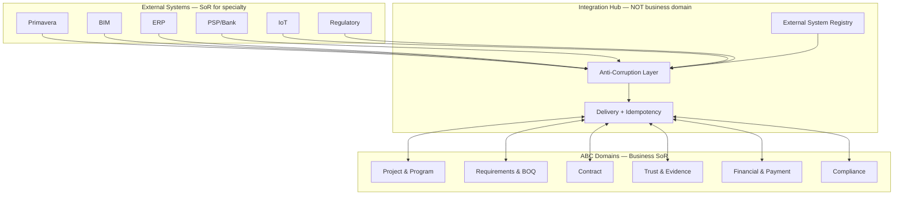

# ADR-029: Integration Hub & External Systems Architecture

## التاريخ
2026-08-22

## آخر تحديث
2026-08-22 — **Gate 7 Final Approval** (OAD-029 closed + baseline rules locked)

## الحالة
**✅ FINAL APPROVED / BASELINE — Gate 7 CLOSED**

OAD-029-001 → OAD-029-008 ✅ Approved.

Prerequisites: ADR-022 ✅ · ADR-023 ✅ · ADR-024 ✅ · ADR-025 ✅ · ADR-026 ✅ · ADR-027 ✅ · ADR-028 ✅ (Gate 6 CLOSED)

## Phase 2 Rule
ADR-029 closed. ❌ No ADR-030 until explicit Gate approval · ❌ No coding · ❌ No migrations · ❌ No UI · ❌ No provider selection · ❌ No production integrations

---

## السياق

ABC = **Construction Intelligence + Coordination + Transaction + Evidence + Owner Control Layer**

ABC **لا تستبدل** الأنظمة المتخصصة — تنسق معها وتحافظ على حدود Source of Record (SoR).

```
Primavera ─┐
BIM/AutoCAD ┤
ERP/GL ─────┤
PSP/Bank ───┤
IoT ────────┤
Regulatory ─┤
             ▼
       Integration Hub          ← NOT a business domain
             │
             ▼
            ABC                 ← Domain SoR for coordination, evidence, transactions
```

**ADR-022 Principle 9:** Integration Hub = anti-corruption layers + sync contracts — **لا** duplicate specialized domain logic.  
**ADR-025 B1:** ABC is NOT bank/custodian — PSP adapter via Integration Hub.  
**ADR-026 C5/C6:** External schedule/BIM refs via Integration Hub — ABC WBS ≠ Primavera CPM.  
**ADR-027:** Design refs, BIM snapshots — Integration sync only.  
**ADR-028 OAD-028-006:** IoT → Integration adapter → Trust Evidence command.

---

## القرار

اعتماد **Integration Hub** كـ **cross-cutting integration layer** — **BASELINE**:

- **External System Registry** — identity, connectors, adapters, mappings
- **Source of Truth Matrix** — definitive SoR per data class + conflict resolution
- **Integration Patterns** — REST, webhook, event, polling, batch, file, SFTP, streaming (design only)
- **Sync Direction taxonomy** — every integration explicitly typed
- **Idempotency** — mandatory deduplication across all inbound/outbound flows
- **External Reference Model** — bidirectional ID mapping without copying external systems
- **Failure & Retry** — delivery state machine + dead-letter + reconciliation
- **Integration Security** — credential references, never secrets in domain models
- **Anti-Corruption Layer (ACL)** — external terminology ≠ ABC domain model
- **Unified Integration Event Envelope**
- **Integration Observability** — health, delivery, latency, audit

**Integration Hub owns:** connectivity metadata, sync jobs, external refs, delivery state, mapping profiles.  
**Integration Hub does NOT own:** Project rules, Contract terms, Payment decisions, Evidence verification, GL entries, CPM logic, BIM geometry.

---

## 1. Integration Hub Boundary

### 1.1 Owns (SoR for integration metadata only)

| Entity | Responsibility |
|--------|----------------|
| **ExternalSystem** | Registered external system identity (Primavera, ERP-X, PSP-Y, BIM platform…) |
| **Connector** | Connection configuration template (protocol, endpoints — no secrets inline) |
| **Adapter** | Implementation binding: Connector + MappingProfile + SyncPolicy |
| **ExternalReference** | Bidirectional ID link: ABC entity ↔ external entity |
| **IntegrationEndpoint** | Concrete URL/topic/queue/path for a connector instance |
| **CredentialReference** | Pointer to secret store — **never** raw credentials |
| **SyncPolicy** | Direction, frequency, retry, conflict resolution ref |
| **MappingProfile** | Field/entity ACL mapping version |
| **IntegrationDelivery** | Outbound/inbound message delivery state |
| **SyncJob** | Scheduled or triggered sync execution record |
| **ReconciliationRecord** | Mismatch detection and resolution audit |

### 1.2 Does NOT own

| Concern | Owner |
|---------|-------|
| Project / Program business rules | Project & Program |
| BOQ / Requirements | Requirements & BOQ |
| Contract / Milestone | Contract & Milestones |
| Evidence / Verification | Trust & Evidence |
| PaymentInstruction / Financial Policy | Financial & Payment |
| CPM schedule logic | Primavera (external) |
| BIM geometry | BIM system (external) |
| GL / journal entries | ERP (external) |
| Client funds / custody | Bank / PSP (external) |
| Authoritative permits | Regulatory Authority (external) |
| IoT raw telemetry archive | IoT platform (external) |

### 1.3 Separation principle

```
System Identity  ≠  Connection  ≠  Mapping  ≠  Business Domain

ExternalSystem     → what system (identity, category)
Connector          → how to connect (protocol, endpoint template)
CredentialReference → where secrets live (vault ref)
MappingProfile     → how to translate (ACL)
Adapter            → runnable binding for a tenant + system
SyncPolicy         → when/which direction/conflict rules
```

Domain commands remain in domain APIs — Integration Hub **orchestrates delivery and translation only**.

### 1.4 Integration Boundary Rule (Gate 7 — Locked)

> **Integration Hub may transport, translate, synchronize and reconcile data — but it may NOT own business decisions belonging to Core Domains.**

| Integration Hub MAY | Integration Hub MAY NOT |
|---------------------|-------------------------|
| Transport payloads | Decide contract approval |
| Translate via ACL (MappingProfile) | Issue VerificationDecision |
| Synchronize snapshots and refs | Create PaymentInstruction |
| Reconcile delivery state | Override Financial Policy |
| Record ExternalReference | Compute CPM / critical path |
| Enforce idempotency at edge | Store GL journals |
| Audit delivery and mapping | Become business SoR |
| Invoke domain command APIs | Write domain tables directly |

**Corollary:** Integration Layer is **never** the source of business truth — only connectivity metadata SoR.

---

## 2. External System Registry

### 2.1 ExternalSystem

```
ExternalSystem {
  id, code                    // e.g. PRIMAVERA_P6, ERP_SAP, PSP_GENERIC, BIM_AUTODESK
  name, category: SCHEDULING | BIM | ERP | PAYMENT | IOT | REGULATORY | DOCUMENT | OTHER
  vendorNeutral: boolean       // ABC abstraction — no provider lock in domain
  supportedPatterns[]         // REST, WEBHOOK, EVENT, POLLING, BATCH, FILE, SFTP, STREAM
  schemaVersion
  status: ACTIVE | DEPRECATED | DISABLED
}
```

### 2.2 Connector

```
Connector {
  id, externalSystemId
  connectorVersion              // semver — Gate 7 versioning
  protocol: REST | WEBHOOK | EVENT_BUS | SFTP | FILE | STREAM | GRPC
  externalApiVersion?           // declared compatible external API version
  baseEndpointTemplate?
  authMethod: OAUTH2 | API_KEY | MTLS | CERT | NONE
  credentialRefId             // CredentialReference — NOT inline secret
  webhookVerificationMethod?  // HMAC, signature header, mTLS
  tenantId
  status: ACTIVE | SUSPENDED
}
```

### 2.3 Adapter

```
Adapter {
  id, connectorId
  mappingProfileId
  syncPolicyId
  directionCapabilities[]     // declared supported directions
  adapterVersion
  status: ACTIVE | TESTING | DISABLED
}
```

### 2.4 ExternalReference

```
ExternalReference {
  id
  externalSystemId
  abcEntityType               // PROJECT, WBS_NODE, BOQ_LINE, CONTRACT, EVIDENCE, PAYMENT_INSTRUCTION…
  abcEntityId
  externalEntityType          // external taxonomy — ACL mapped
  externalEntityId            // UID/GUID/code in external system
  mappingProfileVersion
  linkStatus: ACTIVE | STALE | CONFLICT | BROKEN
  lastSyncedAt?
  idempotencyNamespace        // for dedup scope
}
```

### 2.5 IntegrationEndpoint

```
IntegrationEndpoint {
  id, connectorId
  endpointType: INBOUND | OUTBOUND | BIDIRECTIONAL
  pathOrTopic                 // /webhooks/psp, queue name, SFTP path
  environment: DEV | STAGING | PROD
}
```

### 2.6 CredentialReference

```
CredentialReference {
  id, tenantId
  vaultProvider               // e.g. AWS_SECRETS, AZURE_KV, HASHICORP — design only
  secretPath                  // pointer only
  rotationPolicyRef?
  lastRotatedAt?
  // NO secret values in ABC DB or domain aggregates
}
```

### 2.7 SyncPolicy

```
SyncPolicy {
  id
  direction: ABC_TO_EXTERNAL | EXTERNAL_TO_ABC | BIDIRECTIONAL | READ_ONLY
  mode: COMMAND | EVENT | SNAPSHOT | POLL | BATCH
  frequency: REALTIME | HOURLY | DAILY | ON_DEMAND | CRON
  conflictResolutionPolicyRef
  retryPolicyRef
  idempotencyWindowHours
  enabled: boolean
}
```

### 2.8 MappingProfile

```
MappingProfile {
  id, externalSystemId
  version                     // immutable once published — new version for changes
  entityMappings[] {
    abcEntityType
    externalEntityType
    fieldMappings[]           // ACL transforms
    terminologyAliases[]      // External "Job" → ABC Project
  }
  status: DRAFT | PUBLISHED | DEPRECATED
}
```

---

## 3. Source of Truth Matrix (Final)

| Data | SoR | ABC Role | External Role | Conflict Resolution |
|------|-----|----------|---------------|---------------------|
| **Project / Program** | **ABC** | SoR — coordination view | Reference / schedule link only | ABC wins for project identity; external schedule is snapshot input |
| **Requirements / BOQ** | **ABC** | SoR — live + snapshot | Cost code cross-ref optional | ABC wins for BOQ; ERP cost code = ExternalReference |
| **Sourcing / Award** | **ABC** | SoR | — | ABC only |
| **Contract / Milestone** | **ABC** | SoR | ERP commitment mirror (outbound) | ABC wins for contract terms |
| **Evidence / Verification** | **ABC** | SoR — metadata + provenance | Blob/IoT source platform | ABC wins for verification decision |
| **PaymentInstruction** | **ABC** | SoR — instruction + status | PSP execution + funds | ABC wins for instruction; PSP wins for settlement |
| **CPM Schedule / Critical Path** | **Primavera** | WBS mapping + snapshot + variance read model | SoR | External wins for schedule; ABC stores snapshot only |
| **BIM Geometry / Model** | **BIM system** | Model ref + snapshot + element IDs | SoR | External wins for geometry; ABC stores refs + revision snapshot |
| **GL / Accounting / Journals** | **ERP** | Commitment/payment export + status read model | SoR | ERP wins for GL; ABC never writes journals |
| **Client Funds / Escrow Balance** | **Bank / PSP** | PaymentInstruction + status read | SoR | External wins for balances |
| **Regulatory Permit (authoritative)** | **Authority** | PermitRef + evidence + read model | SoR | Authority wins; ABC integrates + evidences |
| **IoT Raw Telemetry** | **IoT platform** | Evidence create via adapter | SoR | IoT platform wins for raw stream; ABC stores derived Evidence ref |
| **Organization / Party** | **ABC** | SoR | ERP vendor master optional sync | ABC wins for platform identity |
| **Trust Score** | **ABC** (derived) | Computed read model | — | ABC only |
| **Compliance Snapshot** | **ABC** | Point-in-time capture | Authority source docs | Snapshot immutable; refresh via sync |

**Conflict Resolution Policy (default):**

1. Consult SoR matrix — **SoR owner wins** for authoritative field
2. Non-authoritative side → `ExternalReference` + read model update
3. Unresolvable → `ReconciliationRecord` + `IntegrationConflictDetected` event + manual queue
4. Never silently overwrite ABC domain aggregate from external push without ACL + idempotency check

---

## 3b. Integration Is Not SoR — Per-Flow Contract (Gate 7)

**Every integration flow MUST declare explicitly:**

| Dimension | Required declaration |
|-----------|---------------------|
| **ABC SoR** | Which ABC entity is authoritative (or snapshot-only) |
| **External SoR** | Which external system owns authoritative data |
| **Direction** | ABC→Ext · Ext→ABC · Bidirectional · Read-only |
| **Command vs Event** | COMMAND (imperative) · EVENT (notification) · SNAPSHOT (point-in-time) |
| **Read vs Write** | READ (read model update) · WRITE (domain command trigger) |
| **Conflict Resolution** | SoR owner wins · manual queue · stale flag |

### Per-flow matrix (mandatory fields)

| Flow | ABC SoR | External SoR | Direction | Cmd/Event | Read/Write | Conflict |
|------|---------|--------------|-----------|-----------|------------|----------|
| Project identity | Project ✅ | — | ABC→Ext | COMMAND | WRITE (ref push) | ABC wins |
| Schedule snapshot | Snapshot meta ✅ | Primavera ✅ | Ext→ABC | SNAPSHOT | READ (ingest) | External wins schedule |
| WBS mapping | WBSNode ✅ | Activity ref | Bidirectional | COMMAND | WRITE (ref link) | ABC identity; ext activity |
| BOQ | BOQLine ✅ | Cost code ref | Bidirectional | COMMAND | WRITE (ref) | ABC wins BOQ |
| Contract | Contract ✅ | ERP mirror | ABC→Ext | COMMAND | WRITE (export) | ABC wins terms |
| Evidence | Evidence ✅ | Blob/IoT ✅ | Ext→ABC | EVENT | WRITE (Trust cmd) | ABC wins verification |
| PaymentInstruction | PI ✅ | PSP execution ✅ | ABC→Ext | COMMAND | WRITE (dispatch) | ABC wins instruction |
| Payment status | Status read model | PSP ✅ | Ext→ABC | EVENT | READ | PSP wins settlement |
| GL status | Read model | ERP ✅ | Ext→ABC | POLL | READ | ERP wins GL |
| BIM revision | ModelRef ✅ | BIM ✅ | Ext→ABC | SNAPSHOT | READ | External wins geometry |
| Regulatory permit | PermitRef + snapshot | Authority ✅ | Ext→ABC | EVENT | READ+WRITE (Compliance cmd) | Authority wins |
| IoT telemetry | Evidence ✅ | IoT ✅ | Ext→ABC | STREAM | WRITE (Trust cmd) | IoT wins raw; ABC wins Evidence |

**Hard rule:** Integration Layer stores **metadata, refs, delivery state** — never replaces domain SoR columns.

---

## 3c. No Silent Data Mutation (Gate 7 — Mandatory Pipeline)

Any inbound external data **MUST** pass through this pipeline — **no connector may mutate domain state directly**:

```
Receive → Validate → Map → Authorize → Idempotency → Apply → Audit
```

| Step | Owner | Action |
|------|-------|--------|
| **Receive** | Integration Hub | Webhook/poll/stream intake; envelope parse; tenant resolve |
| **Validate** | Integration Hub | Schema, signature, checksum, tenant scope, connector version |
| **Map** | Integration Hub (ACL) | MappingProfile transforms external → ABC vocabulary |
| **Authorize** | Domain Policy | Domain command handler validates business rules + permissions |
| **Idempotency** | Integration Hub | Check IdempotencyRecord — duplicate → return prior result |
| **Apply** | **Domain Command API** | Domain aggregate mutation — **only** via published command |
| **Audit** | Integration Hub + Domain | IntegrationDelivery + domain event + WORM audit trail |

**Violations:** Direct DB write from connector = **architectural breach** — blocked in implementation review.

```
❌ Connector → Domain DB
✅ Connector → Validate → Map → POST /domain/command → Domain Aggregate
```

---

## 4. Integration Patterns (Design Only)

| Pattern | Use case | Direction examples | Notes |
|---------|----------|-------------------|-------|
| **REST API** | Command/query to external system | ABC→PSP, ABC→ERP, External→ABC webhook receiver | Sync/async; idempotency header required |
| **Webhook** | External pushes event to ABC | PSP→ABC payment status, Authority→ABC permit update | Signature verification mandatory |
| **Event subscription** | Subscribe to external event bus | ERP status, IoT alerts | Envelope + idempotencyKey |
| **Polling** | ABC pulls on schedule | ERP GL status, PSP settlement | Cursor/watermark based |
| **Batch** | Bulk export/import | ERP commitments end-of-day | File + reconciliation |
| **File exchange** | Large payloads | BIM metadata export, schedule XER | Object store handoff |
| **SFTP** | Regulated/batch file drop | Bank statements, regulatory filings | Checksum + idempotency file id |
| **Streaming / telemetry** | High-volume IoT | IoT→ABC adapter | Windowed aggregation → Evidence command |

**Rule:** Every integration **must** declare pattern(s) in SyncPolicy — the word "integration" alone is **insufficient**.

---

## 5. Sync Direction Taxonomy

Every Adapter + SyncPolicy **must** specify:

| Dimension | Values |
|-----------|--------|
| **Direction** | `ABC_TO_EXTERNAL` · `EXTERNAL_TO_ABC` · `BIDIRECTIONAL` · `READ_ONLY` |
| **Mode** | `COMMAND` · `EVENT` · `SNAPSHOT` · `POLL` · `BATCH` |
| **Trigger** | Domain event · Cron · Manual · Webhook |

### Examples (declared per integration)

| Integration | Direction | Mode | Trigger |
|-------------|-----------|------|---------|
| Primavera → ABC schedule | EXTERNAL_TO_ABC | SNAPSHOT | POLL daily + ON_DEMAND |
| ABC → Primavera project ref | ABC_TO_EXTERNAL | COMMAND | ProjectCreated event |
| BIM → ABC model revision | EXTERNAL_TO_ABC | SNAPSHOT | EVENT (webhook) |
| ABC → ERP commitment | ABC_TO_EXTERNAL | COMMAND | PaymentInstructionCreated |
| ERP → ABC GL status | EXTERNAL_TO_ABC | READ_ONLY | POLL hourly |
| ABC → PSP payment | ABC_TO_EXTERNAL | COMMAND | PaymentInstructionApproved |
| PSP → ABC status | EXTERNAL_TO_ABC | EVENT | WEBHOOK |
| IoT → ABC telemetry | EXTERNAL_TO_ABC | STREAM | Real-time adapter |
| Authority → ABC permit | EXTERNAL_TO_ABC | EVENT | WEBHOOK or POLL |
| ABC → Bank progress view | ABC_TO_EXTERNAL | SNAPSHOT | BATCH monthly |

---

## 6. Idempotency (Mandatory)

### 6.1 Principle

Re-delivery of the same external or internal event **must not** create duplicate business entities.

### 6.2 Idempotency Key

Every Integration Event Envelope carries `idempotencyKey` — scoped by:

```
idempotencyKey = hash(tenantId + sourceSystem + eventType + externalEntityId + logicalOperation + payloadVersion)
```

### 6.3 Protected entities (non-exhaustive)

| Entity | Dedup scope |
|--------|-------------|
| Project | tenant + external project UID |
| Contract | tenant + external contract ref OR abc contract id + operation |
| PaymentInstruction | tenant + abc instruction id + outbound attempt |
| Evidence | tenant + content hash + claim ref OR external evidence id |
| External event processing | idempotencyKey store (TTL per SyncPolicy) |
| Schedule snapshot | tenant + project + snapshot timestamp + source version |
| Webhook delivery | PSP event id / webhook id |

### 6.4 Idempotency store (Integration Hub SoR)

```
IdempotencyRecord {
  idempotencyKey
  tenantId
  status: PROCESSING | COMPLETED | FAILED
  resultRef?                  // abc entity created/updated
  firstSeenAt, completedAt
  expiresAt                   // per SyncPolicy window
}
```

**On duplicate:** return prior result — **no second domain command**.

---

## 7. External Reference Model

ABC stores **references and snapshots** — not full external system copies.

### 7.1 Examples

```
ABC Project (abc-proj-001)
  ↔ ExternalReference
  ↔ Primavera Project UID (P6-PRJ-8842)

ABC WBSNode (wbs-014)
  ↔ ExternalReference
  ↔ Primavera Activity ID (A1020)

ABC BOQLine (boq-line-442)
  ↔ ExternalReference
  ↔ ERP Cost Code (CC-4401-CONC)

ABC DesignModelRef (dmr-88)
  ↔ ExternalReference
  ↔ BIM Element GUID (guid-{...})
  ↔ Model Revision (rev-12)

ABC PaymentInstruction (pi-991)
  ↔ ExternalReference
  ↔ PSP Payment Intent ID (pi_ext_xxx)

ABC PermitRef (permit-55)
  ↔ ExternalReference
  ↔ Authority Permit Number (DXB-BLD-2026-001)
```

### 7.2 Rules

- ExternalReference is **append/update link** — not embedded external payload in domain aggregate
- Snapshot payloads stored as **Integration Snapshot artifacts** (metadata + ref) — not live SoR
- Mapping version recorded on every ExternalReference for traceability
- External ID collision → `IntegrationConflictDetected` — never silent merge

---

## 8. Failure & Retry State Machine

### 8.1 IntegrationDelivery lifecycle

```
PENDING
  ↓ dispatch
SENT
  ↓
┌─────────────┬──────────────┐
│ ACKNOWLEDGED│ FAILED       │
└─────────────┴──────────────┘
       ↓              ↓
   COMPLETED      RETRYING ← backoff policy
                      ↓
              ┌───────┴────────┐
              │ DEAD_LETTER    │ (max retries exceeded)
              └───────┬────────┘
                      ↓
              RECONCILIATION (manual or scheduled)
                      ↓
              RESOLVED | ESCALATED
```

### 8.2 Retry policy (design)

```
RetryPolicy {
  maxAttempts
  backoffStrategy: FIXED | EXPONENTIAL | LINEAR
  initialDelayMs, maxDelayMs
  retryableErrorCodes[]
  nonRetryableErrorCodes[]    // auth failure, validation — no blind retry
}
```

### 8.3 Dead-letter & replay

- **Dead-letter queue** — Integration Hub SoR; alert + observability
- **Manual replay** — authorized operator; new delivery id; same idempotencyKey → no duplicate entity
- **Reconciliation** — compare ABC state vs external state; `ReconciliationRecord` audit

### 8.4 External System Failure Behavior (Gate 7)

When external system unavailable — behavior **must** be explicit per operation type:

| System | Operation | Failure Mode | ABC Behavior | Domain Impact |
|--------|-----------|--------------|--------------|---------------|
| **Primavera** | Schedule snapshot ingest | **Queue + Retry** | PENDING deliveries; stale flag on read model | Project control uses last snapshot — **no CPM compute** |
| **Primavera** | Project ref push | **Retry + DLQ** | Queue; manual replay | ABC Project SoR unchanged |
| **ERP** | Commitment export | **Retry + DLQ** | Queue; alert ops | ABC Contract/PI SoR unchanged |
| **ERP** | GL status read | **Fail Closed (stale)** | Mark read model STALE; no fake GL data | Financial shows last known + stale badge |
| **BIM** | Revision webhook | **Queue + Retry** | PENDING; stale on DesignModelRef | Requirements use last revision ref |
| **BIM** | Element link | **Retry + Manual** | DLQ after max retries | Manual reconciliation queue |
| **PSP** | Payment dispatch | **Retry + DLQ** | **Never Fail Open** — no duplicate dispatch | PI stays SENT/FAILED; **no auto-release** |
| **PSP** | Status webhook | **Queue + Dedup** | Buffer; idempotency on replay | Read model delayed — safe |
| **Regulatory** | Permit update | **Queue + Retry** | PENDING; alert if > SLA | Compliance snapshot stale — **block new claims if policy requires** |
| **IoT** | Telemetry stream | **Queue + Window dedup** | Buffer; drop only after DLQ threshold | Evidence creation delayed — **no verification skip** |

### Failure mode definitions

| Mode | Meaning | Use when |
|------|---------|----------|
| **Fail Open** | Continue without external data | **Rare** — read-only non-critical displays only; **never payment/verification** |
| **Fail Closed** | Block dependent action | Payment dispatch, regulatory-required permit, auth failure |
| **Queue** | Persist PENDING for retry | Transient outages, webhook backlog |
| **Retry** | Exponential backoff | Network/5xx errors |
| **Manual Reconciliation** | Human workbench | DLQ, ID collision, payment mismatch |

**Universal rule:** External unavailability **never** bypasses INV-T1 (No Evidence → No Release) or Financial Policy gates.

### 8.5 Circuit breaker (design)

- Circuit breaker per Connector (design)
- Degrade to queued PENDING — **never** bypass domain gates
- `ExternalSystemUnavailable` event → Experience/Owner alert read model

---

## 9. Integration Security (Design Only)

| Control | Design |
|---------|--------|
| **OAuth / API keys** | Stored in vault; `CredentialReference` only in ABC |
| **Secret management** | External vault; rotation policy; no secrets in logs |
| **Signing** | Outbound request signing where required (PSP, regulatory) |
| **Encryption** | TLS in transit; optional payload encryption for SFTP/file |
| **Webhook verification** | HMAC/signature/mTLS per Connector config |
| **Tenant isolation** | Every Connector/Adapter scoped by `tenantId`; no cross-tenant credential reuse |
| **Audit** | All credential access, delivery, replay, reconciliation logged — WORM |
| **Least privilege** | Adapter credentials scoped to minimum external permissions |
| **PII / financial data** | Masked in logs; payload refs not inline secrets |

**Hard rule:** Credentials **never** stored inside domain aggregates (Project, Contract, PaymentInstruction, Evidence).

### 9b. Tenant Isolation (Gate 7 — Mandatory)

No cross-tenant leakage in any integration artifact:

| Scope | Isolation rule |
|-------|----------------|
| **Credentials** | CredentialReference.tenantId mandatory; vault path tenant-prefixed |
| **ExternalReference** | Scoped by tenantId; lookup always tenant-filtered |
| **Webhooks** | Endpoint resolves tenant from signed path/token; reject cross-tenant payload |
| **Events** | IntegrationEventEnvelope.tenantId required; bus topics tenant-scoped |
| **PSP connections** | One Connector instance per tenant; no shared merchant credentials |
| **Integration logs / audit** | Tenant-filtered queries; PII masked per tenant policy |
| **IdempotencyRecord** | tenantId in key scope — duplicate in Tenant A ≠ dedup in Tenant B |
| **Object store snapshots** | Tenant-prefixed paths; IAM scoped per tenant where supported |

**Test requirement:** Tenant A connector/webhook/credential **cannot** read or write Tenant B entities — acceptance test #13 + Gate 7 #29.

---

## 9c. Versioning Model (Gate 7)

Four version dimensions — external change must not break ABC canonical model silently:

| Version type | Where stored | Rule |
|--------------|--------------|------|
| **Connector Version** | `Connector.connectorVersion` | Semver; breaking protocol change = new connector |
| **Mapping Version** | `MappingProfile.version` | Immutable once PUBLISHED; new mapping = new version |
| **Schema Version** | `IntegrationEventEnvelope.schemaVersion` | Envelope evolution; consumers reject unknown major |
| **External API Version** | `Connector.externalApiVersion` | Declared compatibility; adapter pins supported range |

**On external API breaking change:**
1. Publish new MappingProfile version + optional new Connector
2. Run parallel adapters during transition window
3. ExternalReference retains `mappingProfileVersion` for audit
4. Never auto-migrate domain aggregates — explicit sync job + reconciliation

---

## 9d. Audit & Traceability (Gate 7 — Bidirectional)

### Forward trace (ABC → External)

```
ABC Entity (entityType, entityId)
  → Domain Event (correlationId)
  → IntegrationDelivery (deliveryId, idempotencyKey)
  → IntegrationEventEnvelope (eventId)
  → ExternalReference (externalEntityId)
  → External Response (ackRef, status)
  → Result (COMPLETED | FAILED | DEAD_LETTER)
```

### Reverse trace (External → ABC)

```
External ID (externalEntityId, sourceSystem)
  → IntegrationEventEnvelope (eventId, receivedAt)
  → IdempotencyRecord (key, resultRef)
  → Domain Command applied (commandType, abcEntityId)
  → Domain Event emitted
  → User/Process (actorUserId, decidedByRole if applicable)
```

### Query APIs (design)

```
GET /api/v1/integration/trace/forward?abcEntityType=&abcEntityId=
GET /api/v1/integration/trace/reverse?externalSystem=&externalEntityId=
GET /api/v1/integration/trace?correlationId=
```

Every trace query emits `IntegrationTraceQueried` audit event. Complements ADR-028 Golden Chain + ADR-027 why-purchased.

---

## 10. Payment Integration (No PSP Selection — Gate 7 Security Baseline)

```
Financial Domain: PaymentInstruction (SoR)
       ↓ domain event (authorized, policy-checked)
Integration Hub: PSP Adapter (transport + ACL only)
       ↓ idempotent dispatch
PSP/Bank (SoR: funds + settlement)
       ↓ webhook/poll
Integration Hub: status ingest (Validate → Map → Idempotency → Apply)
       ↓ domain command
Financial Domain: status read model update (READ only)
```

### Payment security requirements (locked)

| Requirement | Detail |
|-------------|--------|
| **Flow** | Financial PaymentInstruction → Integration Adapter → PSP/Bank **only** |
| **Idempotency** | Same PI + dispatch attempt = same external idempotencyKey; PSP webhook dedup |
| **Authorization** | PI must pass Financial Policy + Contract approval + VerificationDecision ref (ADR-025/028) before dispatch |
| **Audit** | Every dispatch, ack, failure, replay, reconciliation — WORM |
| **Reconciliation** | Daily payment reconciliation; mismatch → DEAD_LETTER + manual queue |
| **No secrets in ABC** | CredentialReference only; vault at infrastructure layer |
| **No custodial balance** | ABC never SoR for client funds (ADR-025 B1) |
| **No PSP logic in Financial** | Financial owns instruction + policy; PSP settlement rules stay in adapter ACL |
| **PSP unavailable** | **Fail Closed** on dispatch; queue retries; **never** mark PAID without PSP ack |
| **Duplicate webhook** | idempotencyKey → single status transition |

| Principle | Detail |
|-----------|--------|
| ABC ≠ Custodian | ADR-025 B1 |
| No provider selection | Deferred to market/phase — `PSP_GENERIC` abstraction only |
| Adapter abstraction | Pluggable Adapter per OAD-029-008 (one active per tenant v1) |
| Failure | RETRYING → DEAD_LETTER; **never** double-pay |

---

## 11. Primavera Integration

**ABC does NOT implement CPM or Critical Path Engine.**

```
Primavera (SoR: schedule)
  → Schedule Snapshot (Integration)
  → WBS Mapping (ExternalReference)
  → Variance read model (Project Control)
  → Future Demand signals (Requirements — ADR-027)
  → Intelligence (delay risk, forecast)
```

| ABC stores | ABC does NOT store |
|------------|-------------------|
| Schedule snapshot + version | Live CPM graph as SoR |
| WBS ↔ Activity ExternalReference | Critical path computation |
| Variance metrics (derived) | Resource leveling logic |
| Last sync timestamp | Primavera business rules |

**Sync:** EXTERNAL_TO_ABC · SNAPSHOT · POLL + ON_DEMAND  
**Reverse ref:** ABC_TO_EXTERNAL · COMMAND · ProjectCreated → push ABC project ref to Primavera

---

## 12. BIM Integration

**ABC is NOT a BIM Authoring Platform.**

```
BIM System (SoR: geometry)
  → Model Reference / Snapshot
  → Element IDs (ExternalReference)
  → Design Revision
  → BOQ / Package linkage (Requirements)
  → Evidence (Trust — BIM_MODEL_REF)
```

| Pattern | Direction | Mode |
|---------|-----------|------|
| Model revision notify | EXTERNAL_TO_ABC | EVENT (webhook) |
| Element ↔ BOQ line link | BIDIRECTIONAL | COMMAND + ref |
| Quantity snapshot | EXTERNAL_TO_ABC | SNAPSHOT |

ABC stores: `DesignModelRef`, revision, element GUID refs — **not** full model geometry SoR.

---

## 13. ERP / Accounting Integration

```
ABC (SoR: commitments, payment instructions)
  → Export commitment / payment instruction
  → ERP (SoR: GL, journals, accounting status)

ERP
  → GL status / payment posted / invoice booked
  → ABC Financial read model (READ_ONLY)
```

| Rule | Detail |
|------|--------|
| No GL in ABC | ABC never owns chart of accounts or journal entries |
| Commitment sync | ABC_TO_EXTERNAL · COMMAND on PaymentInstruction / Contract award |
| Status read | EXTERNAL_TO_ABC · READ_ONLY · POLL |
| Terminology ACL | External "Invoice" ≠ ABC PaymentInstruction; External "Order" ≠ ABC Contract |

---

## 14. Regulatory Integration

```
Authority (SoR: permit, license, inspection outcome)
  → Integration (webhook/poll/file)
  → ABC Compliance: PermitRef + ComplianceSnapshot
  → Trust: Evidence (REGULATORY_RECORD)
  → Project Control read model
```

| Principle | Detail |
|-----------|--------|
| Authority = SoR | ABC never authoritative for permit registry |
| ABC role | Integration + Evidence + Read Model + audit trail |
| Conflict | Authority record wins; ABC snapshot refreshed |

---

## 15. IoT Integration

```
IoT Platform (SoR: raw telemetry)
  → Streaming / batch adapter (Integration Hub)
  → Normalized event envelope
  → Trust: POST /trust/evidence (ADR-028 OAD-028-006)
  → provenance originSystem=IOT
```

- Raw telemetry archive stays on IoT platform
- ABC stores Evidence metadata + contentRef + provenance
- Idempotency: deviceId + readingWindow + sensorType

---

## 16. Anti-Corruption Layer (ACL)

Integration Hub **prevents external terminology from polluting ABC domain model**.

| External Term | ≠ ABC Term | ACL Action |
|---------------|-----------|------------|
| Job | Project | Map → `Project`; never create `Job` aggregate in Project domain |
| Order | Contract | Map → `Contract` |
| Invoice | PaymentInstruction / Invoice (Financial) | Explicit mapping — payment ≠ invoice booked in ERP |
| Activity | WBSNode (control view) | ExternalReference — not 1:1 schema merge |
| Model Element | DesignModelRef + element GUID | Ref only |
| Payment Intent | PaymentInstruction dispatch ref | ExternalReference on Financial aggregate |
| Permit | PermitRef | Compliance domain — not Contract |

**MappingProfile** is the ACL boundary — domains consume **already-translated commands** or **domain events**, not raw external payloads.

```
External Payload
  → Integration Hub ACL (MappingProfile)
  → Domain Command / Domain Event (ABC vocabulary)
  → Domain Aggregate
```

---

## 17. Integration Event Envelope (Unified)

All inbound/outbound integration messages use a unified envelope:

```
IntegrationEventEnvelope {
  eventId                     // unique message id
  eventType                   // e.g. SCHEDULE_SNAPSHOT_RECEIVED, PAYMENT_STATUS_UPDATED
  sourceSystem                // ExternalSystem.code or ABC
  tenantId
  entityType                  // ABC vocabulary after ACL (or external pre-ACL with mappingVersion)
  entityId
  occurredAt
  correlationId               // cross-system trace
  causationId                 // prior eventId
  schemaVersion
  idempotencyKey              // mandatory
  payloadReference            // object store / inline ref — not secrets
  mappingProfileVersion?
  deliveryId?                 // IntegrationDelivery link
}
```

**Publishing:** Integration Hub wraps/unpacks — domains emit/consume **domain events** in ABC vocabulary; Integration Hub translates at the edge.

---

## 18. Integration Observability (Design Only)

| Metric / View | Purpose |
|---------------|---------|
| **Integration health** | Per ExternalSystem + Connector — UP/DEGRADED/DOWN |
| **Delivery status** | PENDING → ACKNOWLEDGED funnel |
| **Latency** | p50/p95 dispatch to ACK |
| **Failure rate** | By adapter, error code |
| **Retry count** | Per delivery / dead-letter depth |
| **Reconciliation status** | Open mismatches, age |
| **Audit trail** | Every dispatch, replay, credential access, mapping change |
| **Cross-system trace** | correlationId from domain event → IntegrationDelivery → external ref |

Read models (Experience / ops — future): `IntegrationHealthDashboard`, `DeadLetterQueueView`, `ReconciliationWorkbench`.

---

## 19. Cross-Domain Flow (Integration Hub position)



**Rule:** Integration Hub calls **domain command APIs** — never writes domain tables directly.

---

## 20. Domain Events (Integration Hub)

| Event | Payload highlights |
|-------|-------------------|
| `ExternalSystemRegistered` | systemId, category |
| `ConnectorActivated` | connectorId, tenantId |
| `ExternalReferenceLinked` | abcEntity, externalEntity |
| `ExternalReferenceConflict` | collision details |
| `IntegrationDeliverySent` | deliveryId, idempotencyKey |
| `IntegrationDeliveryAcknowledged` | deliveryId, externalRef |
| `IntegrationDeliveryFailed` | deliveryId, errorCode, retryable |
| `IntegrationDeliveryDeadLettered` | deliveryId, reason |
| `IntegrationReplayRequested` | deliveryId, operator |
| `ExternalSyncCompleted` | jobId, entityType, count |
| `ReconciliationCompleted` | recordId, outcome |
| `ExternalSystemUnavailable` | systemId, circuitState |
| `MappingProfilePublished` | version |
| `CredentialRotationScheduled` | credentialRefId |
| `PaymentProviderAcknowledged` | paymentInstructionId, externalId |
| `ScheduleSnapshotIngested` | projectId, snapshotVersion |
| `BIMRevisionReceived` | modelRef, revision |
| `RegulatoryUpdateReceived` | permitRef, authorityId |
| `IntegrationTraceQueried` | correlationId, queryType |

---

## 21. API Boundaries (Design Draft)

### Integration Hub Commands

```
POST   /api/v1/integration/external-systems
POST   /api/v1/integration/connectors
POST   /api/v1/integration/adapters
POST   /api/v1/integration/external-references
POST   /api/v1/integration/sync-jobs/trigger
POST   /api/v1/integration/deliveries/{id}/replay      Authorized replay
POST   /api/v1/integration/reconciliation/{id}/resolve
POST   /api/v1/integration/webhooks/{connectorCode}    Inbound — verified
```

### Integration Hub Queries

```
GET    /api/v1/integration/external-systems
GET    /api/v1/integration/external-references?abcEntityType=&abcEntityId=
GET    /api/v1/integration/deliveries?status=DEAD_LETTER
GET    /api/v1/integration/health
GET    /api/v1/integration/sync-jobs/{id}
GET    /api/v1/integration/audit-trail
GET    /api/v1/integration/trace?correlationId=
```

### Domain-facing (Integration invokes — not public external)

```
// Examples — domain owns these; Integration Hub is client
POST   /api/v1/projects/{id}/schedule-snapshot/ingest
POST   /api/v1/trust/evidence                              IoT/BIM adapter
POST   /api/v1/financial/payment-instructions/{id}/dispatch-status
POST   /api/v1/compliance/permit-refs/sync
```

**Golden Chain extension:** Integration segment in traceability — `ExternalReference` + `correlationId` in cross-system trace.

---

## 22. Acceptance Tests (Design-Level)

| # | Scenario | Expected |
|---|----------|----------|
| 1 | Primavera → ABC schedule sync | ✅ Snapshot ingested; WBS ExternalReference linked; no CPM in ABC |
| 2 | ABC → Primavera project reference push | ✅ ExternalReference created; idempotent on retry |
| 3 | BIM revision webhook | ✅ DesignModelRef updated; revision recorded |
| 4 | BIM element ↔ BOQ line linkage | ✅ ExternalReference; no geometry in ABC SoR |
| 5 | ABC → ERP commitment on award | ✅ COMMAND delivery ACKNOWLEDGED |
| 6 | ERP → ABC GL status read | ✅ Financial read model updated; READ_ONLY — no GL in ABC |
| 7 | PaymentInstruction → PSP adapter | ✅ Delivery SENT; ExternalReference on ack |
| 8 | PSP failure → retry → dead-letter | ✅ RETRYING then DEAD_LETTER; no duplicate payment |
| 9 | Duplicate PSP webhook | ✅ idempotencyKey dedup; single status transition |
| 10 | Replay dead-letter event | ✅ Manual replay; same idempotencyKey → no duplicate |
| 11 | Reconciliation mismatch | ✅ ReconciliationRecord; alert |
| 12 | Credential failure | ✅ FAILED non-retryable; no secret in log |
| 13 | Tenant isolation | ✅ Tenant A connector cannot access Tenant B |
| 14 | Regulatory permit update | ✅ PermitRef + ComplianceSnapshot refreshed |
| 15 | IoT telemetry → Evidence | ✅ Evidence command with IOT provenance |
| 16 | External system unavailable | ✅ Circuit open; queue PENDING; domain gates intact |
| 17 | Mapping profile version change | ✅ New version; old refs retain mapping version |
| 18 | External ID collision | ✅ IntegrationConflictDetected; no silent merge |
| 19 | End-to-end cross-system trace | ✅ correlationId: Payment → PSP ref → Instruction → Verification |
| 20 | ACL: external "Job" → ABC Project | ✅ No `Job` aggregate in Project domain |
| 21 | ACL: external "Invoice" ≠ PaymentInstruction | ✅ Explicit mapping; no terminology leak |
| 22 | Idempotency: duplicate Project create | ✅ Second event returns existing project ref |
| 23 | Idempotency: duplicate Contract sync | ✅ No duplicate Contract |
| 24 | Idempotency: duplicate Evidence from IoT | ✅ Dedup by device window + hash |
| 25 | SFTP batch regulatory file | ✅ File idempotency; ComplianceSnapshot |
| 26 | No silent mutation — inbound webhook | ✅ Full pipeline; domain command only |
| 27 | PSP unavailable — payment dispatch | ✅ Fail Closed; queue; no fake PAID |
| 28 | ERP unavailable — GL read | ✅ Stale flag; no synthetic GL |
| 29 | Cross-tenant webhook rejected | ✅ Tenant B payload to Tenant A endpoint blocked |
| 30 | Forward trace ABC Entity → External Response | ✅ trace/forward API |
| 31 | Reverse trace External ID → Domain Event | ✅ trace/reverse API |
| 32 | Connector version mismatch | ✅ Validate rejects; no apply |
| 33 | Integration Hub attempts business decision | ✅ **REJECTED** — boundary rule |

**Result: 33/33 PASS (design-level — Gate 7)**

---

## 23. OAD-029 Architectural Decisions — ✅ CLOSED (Gate 7)

### OAD-029-001 — Vault Provider Abstraction

| | |
|--|--|
| **Decision** | Abstract `CredentialReference` interface; vault provider chosen at **deployment/infrastructure layer** — not in domain ADR or aggregates |
| **Rationale** | Keeps architecture vendor-neutral; secrets never in ABC DB; aligns with ADR-025/028 no-secrets-in-domain rule |
| **Security Impact** | ✅ Centralized rotation, audit, least-privilege IAM; reduces secret sprawl |
| **Scalability Impact** | ✅ Any cloud/on-prem vault via adapter; no code change to swap provider |
| **Operational Impact** | Ops owns vault lifecycle; ABC stores pointer refs only; runbooks for rotation |
| **Migration Impact** | Zero domain migration — CredentialReference records map to vault paths at cutover |
| **Status** | ✅ Approved |

### OAD-029-002 — Message Bus vs REST Hybrid

| | |
|--|--|
| **Decision** | **Hybrid:** internal ABC domain events via async message bus; external integrations via REST/Webhook/SFTP/Stream at connector edge |
| **Rationale** | Decouple domains internally; match heterogeneous external capabilities; avoid forcing externals onto internal bus |
| **Security Impact** | Tenant-scoped bus topics; external TLS + per-connector auth; bus not exposed externally |
| **Scalability Impact** | Bus fan-out for multi-consumer domain events; external rate limits per connector |
| **Operational Impact** | Two monitoring surfaces — bus lag + connector health; unified correlationId across both |
| **Migration Impact** | Strangler: REST-only domain dispatch first; add bus when multi-consumer read models need it |
| **Status** | ✅ Approved |

### OAD-029-003 — Snapshot Storage

| | |
|--|--|
| **Decision** | Large snapshots (XER, BIM metadata, batch files) in **external object store**; Integration Hub stores metadata + `contentRef` + checksum + version |
| **Rationale** | ABC DB not blob SoR (consistent ADR-027/028); scalable file handling |
| **Security Impact** | Encrypted at rest; tenant-prefixed paths; no cross-tenant object ACL |
| **Scalability Impact** | Object store handles GB-scale; ABC metadata remains lightweight |
| **Operational Impact** | Lifecycle/retention policies on object store; Integration Hub tracks snapshot version chain |
| **Migration Impact** | Legacy files → contentRef import; metadata backfill via sync job |
| **Status** | ✅ Approved |

### OAD-029-004 — Idempotency TTL Defaults

| | |
|--|--|
| **Decision** | Default TTL: inbound webhooks **72h**; outbound payment **7d**; schedule snapshots **30d**; IoT stream windows **24h** — overridable per SyncPolicy |
| **Rationale** | Payment PSP retries need longer window; webhooks shorter; prevents unbounded store |
| **Security Impact** | tenantId in key scope prevents cross-tenant replay attacks |
| **Scalability Impact** | TTL cleanup bounds IdempotencyRecord growth |
| **Operational Impact** | Monitor store size; alert on abnormal duplicate rates (possible replay attack) |
| **Migration Impact** | N/A at design phase; defaults applied at implementation |
| **Status** | ✅ Approved |

### OAD-029-005 — Reconciliation Frequency

| | |
|--|--|
| **Decision** | **Daily** batch for payment + ERP; **on-demand** after dead-letter; **weekly** for schedule/BIM snapshot drift |
| **Rationale** | Financial mismatches need daily ops attention; non-financial snapshots lower urgency |
| **Security Impact** | Reconciliation audit trail; payment mismatches require human/policy resolution — no auto-settle |
| **Scalability Impact** | Batch partitioned by tenant; parallel workers per tenant |
| **Operational Impact** | Reconciliation workbench; SLA alert: payment open >24h, other >7d |
| **Migration Impact** | Cutover period: manual reconciliation for legacy integration backlog |
| **Status** | ✅ Approved |

### OAD-029-006 — Primavera XER/XML Strategy

| | |
|--|--|
| **Decision** | **Primary v1:** XER/XML file snapshot (batch/SFTP/API upload); **Secondary:** REST API adapter when vendor exposes stable API — **never assume live CPM API as v1** |
| **Rationale** | Construction Primavera deployments often file-based; reduces live dependency and ABC CPM scope creep |
| **Security Impact** | File checksum + optional signature validation before ingest |
| **Scalability Impact** | Off-peak batch ingest; versioned snapshot chain |
| **Operational Impact** | Daily poll + manual upload fallback when Primavera unavailable |
| **Migration Impact** | Historical XER import as initial snapshot chain + WBS ExternalReference backfill |
| **Status** | ✅ Approved |

### OAD-029-007 — BIM Protocol Strategy

| | |
|--|--|
| **Decision** | **Webhook** for revision notifications + **REST** for metadata/element queries; **no live geometry sync or authoring** in ABC |
| **Rationale** | BIM platforms vary; metadata-first integration is portable; ADR-027 snapshot model |
| **Security Impact** | OAuth scoped tokens; webhook HMAC verification |
| **Scalability Impact** | Event-driven revision sync; metadata cached as snapshot |
| **Operational Impact** | STALE flag when BIM unavailable; manual ON_DEMAND re-sync |
| **Migration Impact** | Import existing model GUIDs via ExternalReference bulk link |
| **Status** | ✅ Approved |

### OAD-029-008 — Multi-PSP per Tenant

| | |
|--|--|
| **Decision** | **One active PSP Adapter per tenant at v1**; architecture permits multiple connectors later via routing policy (future ADR/implementation) |
| **Rationale** | Simplifies credentials, reconciliation, audit at launch; avoids split-settlement complexity |
| **Security Impact** | Single credential scope per tenant; clear audit path per payment |
| **Scalability Impact** | Enterprise multi-region PSP = add second Connector without domain change |
| **Operational Impact** | Tenant onboarding selects one PSP adapter slot; change requires connector swap + reconciliation |
| **Migration Impact** | Tenants with multiple PSPs: designate primary v1; secondary read-only status ingest if needed |
| **Status** | ✅ Approved |

---

## 24. Integration Matrix (Final — Gate 7 Baseline)

| Data / Flow | ABC SoR | Ext SoR | Direction | Pattern | Cmd/Event | Read/Write | Frequency | Failure | Conflict | Security | Audit |
|-------------|:-------:|:-------:|-----------|---------|-----------|------------|-----------|---------|----------|----------|-------|
| Project identity | ✅ | — | ABC→Ext | REST | COMMAND | WRITE | On create | Retry+DLQ | ABC wins | OAuth | ✅ |
| CPM schedule | Snapshot | Primavera | Ext→ABC | FILE SNAPSHOT | SNAPSHOT | READ | Daily | Queue+Stale | Ext wins | Vault ref | ✅ |
| WBS mapping | ✅ | Ref | Bidirectional | REST | COMMAND | WRITE | On change | Conflict queue | ABC+ref | mTLS | ✅ |
| BOQ | ✅ | — | — | — | — | — | — | — | ABC wins | — | ✅ |
| BOQ ↔ cost code | Ref | ERP | Bidirectional | REST | COMMAND | WRITE | On publish | Retry | ABC wins | OAuth | ✅ |
| Contract | ✅ | Mirror | ABC→Ext | REST | COMMAND | WRITE | On sign | Idempotent | ABC wins | OAuth | ✅ |
| Evidence | ✅ | Blob/IoT | Ext→ABC | STREAM | EVENT | WRITE | Realtime | DLQ | ABC wins | Webhook sig | ✅ |
| Verification | ✅ | — | — | — | — | — | — | — | ABC wins | — | ✅ |
| PaymentInstruction | ✅ | PSP exec | ABC→Ext | REST | COMMAND | WRITE | On approve | **Fail Closed** | ABC wins | Vault+sign | ✅ |
| Payment status | Read model | PSP | Ext→ABC | WEBHOOK | EVENT | READ | Realtime | Dedup | PSP wins | HMAC | ✅ |
| GL status | Read model | ERP | Ext→ABC | POLL | READ | READ | Hourly | Stale | ERP wins | OAuth | ✅ |
| Commitment export | ✅ | ERP | ABC→Ext | BATCH | COMMAND | WRITE | On PI | Retry+DLQ | ABC wins | OAuth | ✅ |
| BIM model ref | Ref+snap | BIM | Ext→ABC | WEBHOOK | SNAPSHOT | READ | On revision | Queue+Stale | Ext wins | OAuth | ✅ |
| BIM element link | Ref | BIM | Bidirectional | REST | COMMAND | WRITE | On link | Manual recon | Ref | OAuth | ✅ |
| Regulatory permit | Ref+snap | Authority | Ext→ABC | WEBHOOK/FILE | EVENT | READ+WRITE | Daily+event | Queue | Authority wins | Cert+SFTP | ✅ |
| IoT telemetry | Evidence | IoT | Ext→ABC | STREAM | EVENT | WRITE | Realtime | Window dedup | IoT raw | API ref | ✅ |
| Bank progress view | Read model | Bank | ABC→Ext | BATCH | SNAPSHOT | READ | Monthly | Retry | Compose | SFTP encrypt | ✅ |
| Integration metadata | ✅ | — | Internal | EVENT | EVENT | WRITE | Continuous | DLQ | Hub wins | Tenant iso | ✅ |

---

## 25. What ABC Is NOT (Reconfirmed)

| ABC is | ABC is NOT |
|--------|------------|
| Construction Intelligence + Coordination | ERP / GL system |
| Transaction + Evidence + Owner Control | Primavera / CPM engine |
| Payment Instruction orchestrator | Bank / Custodian |
| Integration + Reference + Snapshot | BIM authoring platform |
| Compliance read + evidence | Regulatory authority registry |
| Trust + Verification SoR | IoT time-series archive |

---

## 26. Consequences

### Positive
- Clear SoR boundaries — no scope creep into specialized systems
- Idempotency + ACL prevent duplicate entities and terminology pollution
- Payment/Primavera/BIM/ERP/regulatory paths defined without provider lock-in
- Golden Chain extendable with ExternalReference + correlationId
- Gate 0 Integration Hub role from ADR-022 formalized

### Negative
- Integration Hub adds operational complexity (connectors, DLQ, reconciliation)
- Snapshot staleness vs live external SoR — acceptable trade-off per ADR-026/027
- Provider selection deferred — implementation phase decision

---

## Gate 7 — ✅ CLOSED

| Item | Status |
|------|--------|
| Integration Hub ≠ Business Domain | ✅ Approved |
| External System Registry | ✅ Approved |
| SoR Matrix + Per-Flow Contract (§3b) | ✅ Approved |
| No Silent Data Mutation pipeline (§3c) | ✅ Approved |
| Integration Boundary Rule (§1.4) | ✅ Approved |
| Idempotency / Retry / Reconciliation first-class | ✅ Approved |
| Payment Security Baseline (§10) | ✅ Approved |
| External Failure Behavior Matrix (§8.4) | ✅ Approved |
| Versioning Model (§9c) | ✅ Approved |
| Tenant Isolation (§9b) | ✅ Approved |
| Bidirectional Audit & Trace (§9d) | ✅ Approved |
| OAD-029-001 → 008 | ✅ Closed |
| Acceptance Tests 33/33 | ✅ Pass (design-level) |
| Integration Matrix (§24) | ✅ Baseline |

**ADR-029 → FINAL APPROVED / BASELINE**

❌ ADR-030 not started · ❌ ADR-031 not started · ❌ Phase 3 not started · ❌ No coding · ❌ No migrations · ❌ No UI · ❌ No provider selection · ❌ No production integrations

---

## References

- ADR-022 ✅ Principle 9 — ABC not SoR for everything; Integration Hub role
- ADR-025 ✅ B1 — Not custodian; PSP via adapter
- ADR-026 ✅ External schedule/BIM refs; C5/C6; OAD-026-004
- ADR-027 ✅ Design refs; BIM snapshot; OAD-027-002/008
- ADR-028 ✅ IoT → Evidence adapter; Golden Chain segment
- Phase 2 Gate 0 ✅ Integration Hub dependency baseline
