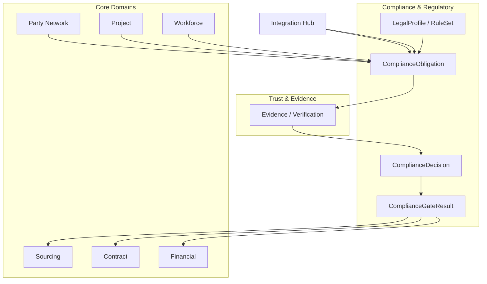

# ADR-030: Compliance & Regulatory + LegalProfile Runtime

## التاريخ
2026-08-22

## آخر تحديث
2026-08-22 — **Gate 8 Final Approval** (OAD-030 closed + Freshness/Conflict/Golden Question)

## الحالة
**✅ FINAL APPROVED / BASELINE — Gate 8 CLOSED**

OAD-030-001 → OAD-030-010 ✅ Approved.

Prerequisites: ADR-022 ✅ · ADR-023 ✅ · ADR-024 ✅ · ADR-025 ✅ · ADR-026 ✅ · ADR-027 ✅ · ADR-028 ✅ · ADR-029 ✅ (Gate 7 CLOSED)

## Phase 2 Rule
ADR-030 closed. ❌ No ADR-031 until explicit Gate 9 approval · ❌ No coding · ❌ No migrations · ❌ No UI · ❌ No production integrations · ❌ No regulatory provider selection

---

## السياق

ABC = **Construction Intelligence + Coordination + Transaction + Evidence + Owner Control Layer**

**المبدأ المعتمد (Gate 8):**

> **Regulatory Authorities remain the external Source of Record.**  
> ABC owns **compliance state, references, evidence links, rules, workflows, gates and auditability** — **not** the authoritative government registry.

```
Regulatory Authority (external SoR)
       ↓
Integration Hub (transport + ACL only — ADR-029)
       ↓
Compliance & Regulatory (ABC SoR: state, refs, rules, decisions, audit)
       ↓
Trust & Evidence (Evidence + Verification — ADR-028)
       ↓
Contract · Sourcing · Financial · Project (gates enforced)
```

**ADR-022:** Compliance & Regulatory domain #10 · Principle 9 — external SoR for permits  
**ADR-023 J2:** Emergency bypasses timeline — **not** regulatory/safety requirements  
**ADR-024 §17:** RegulatoryComplianceReadModel — filtered read; not authoritative  
**ADR-028:** EvidenceWaiver governance — Compliance coordinates; Trust owns Evidence  
**ADR-029 §14:** Authority → PermitRef + ComplianceSnapshot via Integration Hub

---

## القرار

اعتماد **Compliance & Regulatory** bounded context كـ **BASELINE**:

- Aggregates: **`ComplianceObligation`**, **`ComplianceRequirement`**, **`ComplianceDecision`**, **`ComplianceWaiver`**, **`PermitRef`**, **`LicenseRef`**, **`CertificationRef`**, **`ComplianceSnapshot`**, **`LegalProfile`**, **`RuleSet`**, **`ComplianceEvaluation`**
- **LegalProfile Runtime** — jurisdiction-composable rules; **no country-specific hard-code in other domains**
- **Compliance Gate Model** — BLOCKING · WARNING · INFORMATIONAL at lifecycle checkpoints
- **Evidence linkage** — ComplianceRequirement → Trust EvidenceRequirement (Compliance does **not** own Evidence)
- **External Regulatory Integration** — Integration Hub only; Authority = SoR
- **Expiry / Renewal** — tracking, alerts, blocked actions, grace periods, historical versions
- **AI boundary** — Detect · Analyze · Recommend — **never** binding compliance decision alone
- **Audit & Traceability** — "Why allowed?" / "Why blocked?" with Rule Version + LegalProfile + Evidence + Decision

---

## 1. Compliance Domain Boundary

### 1.1 Owns (SoR)

| Entity | Responsibility |
|--------|----------------|
| **ComplianceObligation** | Instance of regulatory/compliance duty on Project/Org/Contract/Event |
| **ComplianceRequirement** | Requirement template or instance (permit, license, cert, safety…) |
| **ComplianceDecision** | Authoritative compliance outcome (SATISFIED / NOT_SATISFIED / WAIVED…) |
| **ComplianceWaiver** | Exception governance for compliance obligations (not routine bypass) |
| **ComplianceEvaluation** | Rule evaluation run record (inputs, RuleSet version, outcome) |
| **ComplianceSnapshot** | Immutable point-in-time compliance state capture |
| **ComplianceGate** | Gate definition (severity, lifecycle checkpoint, rule ref) |
| **ComplianceGateResult** | Evaluation result at checkpoint (pass/block/warn) |
| **LegalProfile** | Jurisdiction profile — composable rules, bodies, effective dates |
| **RuleSet** | Versioned composable rule bundle within LegalProfile |
| **RegulatoryBody** | Registry entry (Dubai Municipality, MOHRE, etc.) — **not** authoritative registry |
| **PermitRef** | Reference to external permit + ABC compliance state |
| **LicenseRef** | Org/party license reference + state |
| **CertificationRef** | Safety/workforce/cert reference + state |
| **ComplianceAuditEntry** | WORM audit chain for compliance actions |

### 1.2 External SoR (Integration only — ADR-029)

| Data | External SoR | ABC Role |
|------|--------------|----------|
| Authoritative permit registry | Regulatory Authority | PermitRef + ComplianceSnapshot |
| License master (government) | Authority / MOHRE / etc. | LicenseRef + sync |
| Inspection outcome (official) | Authority | ComplianceSnapshot + Evidence link |
| Environmental clearance register | Authority | PermitRef |
| Import/export customs registry | Customs Authority | PermitRef |
| Workforce work permit registry | Immigration/Labor Authority | CertificationRef |

### 1.3 Does NOT own

| Concern | Owner |
|---------|-------|
| Evidence artifacts | Trust & Evidence (ADR-028) |
| VerificationDecision | Trust & Evidence |
| EvidenceWaiver | Trust (ComplianceWaiver coordinates — see §12) |
| Contract terms / Milestone | Contract |
| PaymentInstruction | Financial |
| Organization business profile | Party Network |
| Integration delivery | Integration Hub |
| AI models / recommendations | Intelligence |
| Portal presentation | Experience |

### 1.4 Boundary rule (Gate 8)

> **Compliance evaluates and records regulatory/compliance posture — it does not replace government registries, issue official permits, or store authoritative legal records from authorities.**

---

## 2. Core Aggregates & Value Objects

### 2.1 Value Objects

```
JurisdictionCode          // ISO + extension: AE-DXB, AE-AD, SA-RIYADH, INT
RegulatoryCategory        // PERMIT | LICENSE | CERTIFICATION | INSPECTION | SAFETY
                          // ENVIRONMENTAL | WORKFORCE | IMPORT_EXPORT | TRANSPORT
                          // SCRAP | AUCTION | FIRE | HSE | OTHER
GateSeverity              // BLOCKING | WARNING | INFORMATIONAL
ComplianceStatus          // REQUIRED | REQUESTED | SUBMITTED | UNDER_REVIEW
                          // APPROVED | REJECTED | EXPIRED | RENEWAL_REQUIRED | WAIVED
ExpiryWindow              // validFrom, validUntil, gracePeriodDays
RenewalPolicy             // renewalLeadDays[], autoBlockOnExpiry, reminderSchedule
RuleVersionRef            // legalProfileVersion + ruleSetVersion
EvidenceLinkRef           // trust EvidenceRequirementId / EvidencePackageId
ExternalAuthorityRef      // authority system + external ID (via Integration Hub)
FreshnessPolicy           // per Rule/Requirement — TTL, fail-open/closed, grace (§3d)
ConflictResolutionPolicy  // multi-jurisdiction rule interaction (§3c)
```

### 2.2 ComplianceRequirement (catalog + instance)

```
ComplianceRequirement {
  id, requirementCode         // extensible registry — not domain-per-type
  category: RegulatoryCategory
  jurisdictionCode
  legalProfileRef, ruleSetVersion
  regulatoryBodyRef?

  // Scope — what this applies to
  appliesTo: ORGANIZATION | PROJECT | CONTRACT | SOURCING_EVENT
           | MILESTONE | HANDOVER | PACKAGE | WORKFORCE_ASSIGNMENT

  title, description
  mandatory: boolean
  evidenceProfileRef?         // triggers Trust EvidenceRequirement materialization
  verificationWorkflowRef?    // Trust workflow hint
  renewalPolicy: RenewalPolicy
  gateDefinitions[]           // where enforced — see §6

  effectiveFrom, effectiveUntil?
  supersededByRequirementId?
  status: DRAFT | ACTIVE | DEPRECATED
}
```

### 2.3 ComplianceObligation (aggregate root — instance on entity)

```
ComplianceObligation {
  id, obligationNumber
  complianceRequirementId
  jurisdictionCode

  // Subject binding
  subjectType: ORGANIZATION | PROJECT | CONTRACT | SOURCING_EVENT
              | MILESTONE | PARTY | HANDOVER
  subjectId
  tenantId, projectId?, contractId?

  status: ComplianceStatus    // SM §5
  permitRefId?, licenseRefId?, certificationRefId?
  externalAuthorityRef?       // Integration Hub ExternalReference

  evidenceRequirementIds[]    // Trust — materialized refs
  verificationDecisionId?     // Trust — latest ref
  complianceDecisionId?       // Compliance — latest authoritative

  expiryAt?, renewalDueAt?
  gracePeriodEndsAt?
  complianceSnapshotIds[]     // historical captures

  version
}
```

### 2.4 PermitRef / LicenseRef / CertificationRef

```
PermitRef {
  id, permitNumber             // ABC ref
  externalPermitNumber?        // authority number — via Integration
  externalAuthorityRef
  jurisdictionCode, regulatoryBodyRef
  subjectType, subjectId
  permitTypeCode               // BUILDING, DEMOLITION, ENVIRONMENTAL, FIRE…
  status: ACTIVE | EXPIRED | REVOKED | PENDING | SUSPENDED
  issuedAt?, expiryAt?
  complianceObligationId
  lastSyncedAt?, snapshotRef?
}

LicenseRef {
  id, licenseNumber
  orgId                        // Party Network org
  licenseTypeCode            // CONTRACTOR, SUPPLIER, TRADE, PROFESSIONAL…
  jurisdictionCode
  status, issuedAt?, expiryAt?
  complianceObligationId
  externalAuthorityRef?
}

CertificationRef {
  id, certNumber
  orgId?, userId?              // Workforce link optional
  certTypeCode                 // SAFETY, HSE, TRADE_SKILL, CRANE_OPERATOR…
  jurisdictionCode
  status, issuedAt?, expiryAt?
  complianceObligationId
  evidenceId?                  // Trust Evidence ref — not owned
}
```

### 2.5 ComplianceDecision (authoritative — Compliance domain)

```
ComplianceDecision {
  id, decisionNumber
  complianceObligationId
  outcome: SATISFIED | NOT_SATISFIED | PARTIALLY_SATISFIED
         | WAIVED | EXPIRED | RENEWAL_REQUIRED
  decidedByUserId?, decidedByOrgId?, decidedByRole
  decisionType: HUMAN | SYSTEM_POLICY   // never AI alone
  aiRecommendationRef?        // Intelligence — logged only

  verificationDecisionId?   // Trust ref — required when evidence-based
  complianceEvaluationId?   // Rule evaluation ref
  ruleVersionRef            // LegalProfile + RuleSet version at decision time

  conditions[]?, notes?
  decidedAt
  immutable: true
  supersedesDecisionId?
}
```

**Three-way decision separation (Gate 8 — locked):**

| Domain | Question | May NOT |
|--------|----------|---------|
| **Trust** | Is the evidence **verified**? | Replace Compliance or Financial authority |
| **Compliance** | Does the obligation/rule **permit this action**? | Create PaymentInstruction or execute payment |
| **Financial** | Does **Financial Policy** authorize payment amount/release? | Override Compliance BLOCKING without waiver/policy |

Both Trust + Compliance may be required before Financial proceeds.

### 2.6 ComplianceSnapshot (immutable)

```
ComplianceSnapshot {
  id, snapshotNumber
  capturedAt
  subjectType, subjectId
  jurisdictionCode
  legalProfileVersion, ruleSetVersion
  obligationStates[]          // obligation id + status at capture
  permitRefs[], licenseRefs[]
  externalAuthoritySnapshotRef?  // Integration contentRef
  capturedBy: SYNC | MANUAL | GATE_EVAL | REGULATORY_EVENT
  immutable: true
}
```

### 2.7 ComplianceWaiver (exception governance)

```
ComplianceWaiver {
  id
  complianceObligationId
  // Mandatory fields (Gate 8)
  authorityUserId, authorityOrgId, authorityRole   // Authority
  reason                                          // Reason
  scope                                           // Scope
  effectiveFrom, expiryAt                         // Effective period
  amountLimit?, valueLimit?                       // Amount/value where applicable
  supportingEvidenceIds[]                         // Trust Evidence refs — Supporting evidence
  sodCheckPassed: boolean                         // SoD
  postReviewRequired: boolean                     // Post-review requirement
  postReviewCompletedAt?, postReviewOutcome?
  emergencyRefId?                                 // ADR-023 link if applicable
  status: PROPOSED → APPROVED → ACTIVE → EXPIRED | REVOKED
  auditRef

  // MUST NOT bypass (LOCKED — OAD-030-005)
  cannotBypass: SAFETY_MANDATORY | REGULATORY_MANDATORY
              | FINANCIAL_LIMITS | SOD | LEGAL_PROHIBITION
}
```

**ComplianceWaiver ≠ EvidenceWaiver** (Trust — ADR-028) — separate aggregates; coordinated via events only.

### 2.8 LegalProfile (aggregate root — jurisdiction runtime)

```
LegalProfile {
  id, profileCode              // e.g. AE-DXB-CONSTRUCTION-v3
  jurisdictionCode
  name, description
  version                      // semver — immutable once PUBLISHED
  effectiveFrom, effectiveTo?  // effectiveTo = effectiveUntil
  sourceAuthority              // regulatory/legal source reference
  publishedBy, publishedAt
  regulatoryBodies[]
  ruleSetIds[]
  complianceRequirementTemplateIds[]
  gateCatalogRef
  conflictResolutionPolicyRef  // §3c — multi-jurisdiction
  status: DRAFT → REVIEW → APPROVED → PUBLISHED → SUPERSEDED | RETIRED
  supersededByProfileId?
}
```

**Governance (OAD-030-001 — locked):** LegalProfile **cannot** be edited by ordinary users. Publish workflow mandatory; each version immutable once PUBLISHED.

### 2.9 RuleSet (composable rules within LegalProfile)

```
RuleSet {
  id, ruleSetCode
  legalProfileId
  version
  category: RegulatoryCategory | GATE | ELIGIBILITY | DOCUMENT
  rules[] {
    ruleId, ruleVersion         // RuleID + Version (OAD-030-009)
    condition                   // JSON Rule DSL v1 — sandboxed
    severity: GateSeverity?
    action: BLOCK | WARN | INFORM | REQUIRE_EVIDENCE | REQUIRE_DECISION
    appliesToLifecycle: SOURCING | AWARD | CONTRACT | MOBILIZATION
                      | MILESTONE | PAYMENT | HANDOVER
    evidenceRequirementCode?
    effectiveFrom, effectiveTo?
    source                      // legal/regulatory source ref
    jurisdictionCode
    testCases[]                 // mandatory for publish
    freshnessPolicy: FreshnessPolicy   // per-rule (OAD-030-007)
    gracePeriodDays?            // rule-specific; default 0 SAFETY/REGULATORY_MANDATORY
  }
  status: DRAFT → TEST → REVIEW → APPROVED → PUBLISHED → SUPERSEDED
}
```

### 2.10 ComplianceEvaluation (evaluation run)

```
ComplianceEvaluation {
  id
  complianceObligationId?, gateCheckpoint?
  subjectType, subjectId
  legalProfileVersion, ruleSetVersion
  inputSnapshot              // refs to Project, Org, Contract state at eval time
  ruleResults[] { ruleCode, passed, severity, message }
  overallResult: PASS | BLOCK | WARN | INFORM
  evaluatedAt
  evaluatedBy: SYSTEM | USER
  aiRecommendationRef?
}
```

### 2.11 RegulatoryBody (registry — not authoritative)

```
RegulatoryBody {
  id, code                     // AE-DXB-MUNICIPALITY, SA-MOMRAH, AE-MOHRE…
  name, jurisdictionCode
  category: MUNICIPALITY | CIVIL_DEFENSE | ENVIRONMENT | LABOR
          | CUSTOMS | TRANSPORT | PROFESSIONAL | OTHER
  integrationSystemRef?        // ExternalSystem via Integration Hub
  contactRef?
}
```

---

## 3. LegalProfile Runtime Architecture

### 3.1 Runtime flow (no hard-coded country rules in domains)

```
Jurisdiction (tenant + project + contract context)
       ↓
LegalProfile (versioned, PUBLISHED)
       ↓
RuleSet[] (composable — permit, safety, scrap, transport…)
       ↓
Compliance Evaluation (ComplianceEvaluation aggregate)
       ↓
ComplianceDecision + ComplianceGateResult
```

**Rule:** Contract, Sourcing, Financial, Project domains **invoke** Compliance evaluation APIs — they **never** embed `if (country == UAE)` logic.

### 3.2 Jurisdiction resolution

```
resolveJurisdiction(context) {
  primary: project.jurisdictionCode ?? contract.jurisdictionCode
  secondary: org.registeredJurisdictionCodes[]
  tenantDefault: tenant.legalProfileRef
  → effective LegalProfile chain (OAD-030-006)
}
```

### 3.3 UAE / KSA starter profiles (design — not hard-code)

| Profile Code | Jurisdiction | Scope (examples) |
|--------------|--------------|------------------|
| `AE-DXB-CONSTRUCTION-v1` | AE-DXB | Building permit, DM approvals, fire, environmental |
| `AE-UAE-FEDERAL-v1` | AE | MOHRE workforce, federal import |
| `SA-KSA-CONSTRUCTION-v1` | SA | MOMRAH building, municipality, GOSI workforce refs |
| `INT-GCC-TRADE-v1` | INT-GCC | Cross-border procurement baseline |
| `AE-DXB-SCRAP-AUCTION-v1` | AE-DXB | Scrap sale, auction, waste transport rules |

New jurisdictions = **new LegalProfile + RuleSet** — not domain code change.

### 3c. Multi-Jurisdiction Conflict Resolution (OAD-030-006 — locked)

**Not** a global "most restrictive wins" rule. Runtime flow:

```
Applicable Rules (primary + secondary LegalProfiles + activity context)
       ↓
Conflict Detection (cumulative · mutually exclusive · jurisdiction-specific · location-specific · activity-specific)
       ↓
Jurisdiction Priority / Applicability Policy (ConflictResolutionPolicy in LegalProfile)
       ↓
Final Compliance Decision + ComplianceGateResult
```

```
ConflictResolutionPolicy {
  id, legalProfileId
  ruleInteractionModes[] {
    mode: CUMULATIVE | MUTUALLY_EXCLUSIVE | JURISDICTION_SPECIFIC
        | PROJECT_LOCATION | ACTIVITY_SPECIFIC
    priorityOrder[]              // jurisdiction codes or profile refs
    resolutionStrategy: ALL_MUST_PASS | ANY_BLOCK_BLOCKS | HIGHEST_SEVERITY_WINS
                       | EXPLICIT_RULE_PRECEDENCE
    explicitPrecedenceRules[]?   // ruleId overrides
  }
}
```

Examples:
- **Cumulative:** UAE import permit **AND** KSA site permit both required
- **Mutually exclusive:** one transport rule set per haul type
- **Location-specific:** project site jurisdiction overrides procurement origin for mobilization gates

### 3d. FreshnessPolicy (OAD-030-007 — locked)

**No global "24h expired → BLOCK".** Freshness is **per Rule / Requirement**:

```
FreshnessPolicy {
  ttlHours?                    // snapshot/ref freshness window
  failMode: FAIL_OPEN | FAIL_CLOSED | USE_LAST_KNOWN_VALID
  gracePeriodHours?
  authorityUnavailableBehavior: QUEUE | STALE_FLAG | BLOCK
  lastKnownValidAllowed: boolean
  mandatoryCategory?: SAFETY_MANDATORY | REGULATORY_MANDATORY | OTHER
}
```

| Category | Default failMode | Override |
|----------|------------------|----------|
| **SAFETY_MANDATORY** | **FAIL_CLOSED** | Only if LegalProfile rule explicitly allows otherwise |
| **REGULATORY_MANDATORY** | **FAIL_CLOSED** | Only if LegalProfile rule explicitly allows otherwise |
| **OTHER** | Per rule FreshnessPolicy | Rule/Profile-specific |

When authority unavailable: apply `authorityUnavailableBehavior` from the rule's FreshnessPolicy — not a platform-wide default.

### 3e. Rule Change Impact (Gate 8 — Historical Immutability)

> **New Rule Version ≠ retroactive change to history.**

| Principle | Detail |
|-----------|--------|
| **ComplianceDecision immutable** | Records `ruleVersionRef` at decision time |
| **Historical decisions preserved** | Supersession creates new decision — old decision unchanged |
| **Gate re-eval uses current published rules** | New actions evaluated against current PUBLISHED profile |
| **Past actions auditable** | "Why allowed on date X?" → decision + rule version active on date X |
| **No silent retroactive block** | Rule change does not auto-invalidate past APPROVED obligations without eval event |

---

## 4. Regulatory Requirements Registry (Extensible)

Registry entry — **not** a domain per requirement type:

| Category | Examples | Typical Gate |
|----------|----------|--------------|
| **PERMIT** | Building, demolition, occupancy, road cut | Mobilization, Milestone |
| **LICENSE** | Contractor trade, supplier, professional | Sourcing, Award, Contract |
| **CERTIFICATION** | Safety, HSE, ISO, trade skill | Mobilization, Workforce |
| **INSPECTION** | Authority inspection, third-party | Milestone, Handover |
| **SAFETY** | Method statement, RAMS, hot work | Mobilization |
| **ENVIRONMENTAL** | EIA, waste disposal, emissions | Package, Handover |
| **WORKFORCE** | Work permit, visa, GOSI/MOHRE | Workforce assignment |
| **IMPORT_EXPORT** | Customs, material import | Procurement, Sourcing |
| **TRANSPORT** | Heavy haul, oversize, waste transport | Procurement, Scrap |
| **SCRAP / AUCTION** | Waste handler license, auction compliance | Sourcing (SCRAP/AUCTION event) |

Extensibility: new `requirementCode` + RuleSet entry — **no new bounded context**.

---

## 5. Compliance State Machine

### 5.1 ComplianceObligation lifecycle

```
REQUIRED
  ↓ (obligation materialized from LegalProfile / gate eval)
REQUESTED
  ↓ (party notified / external application initiated)
SUBMITTED
  ↓ (evidence package / authority application ref submitted)
UNDER_REVIEW
  ↓
┌──────────┬──────────┬─────────┬──────────────────┐
│ APPROVED │ REJECTED │ EXPIRED │ RENEWAL_REQUIRED │
└──────────┴──────────┴─────────┴──────────────────┘
  ↓ (creates ComplianceDecision)
WAIVED (only via ComplianceWaiver governance — not default path)
```

### 5.2 Expiry / Renewal sub-states

```
APPROVED
  ↓ (approaching expiry — renewalLeadDays)
RENEWAL_REQUIRED
  ↓ (renewal submitted)
SUBMITTED → UNDER_REVIEW → APPROVED (new period)

APPROVED
  ↓ (past expiryAt)
EXPIRED
  ↓ (gracePeriodDays if policy allows)
GRACE_ACTIVE → then BLOCKING gates fire
```

### 5.3 Renewal & alerts

| Mechanism | Detail |
|-----------|--------|
| **expiry tracking** | `expiryAt`, `renewalDueAt` on Obligation + Ref aggregates |
| **renewal windows** | `RenewalPolicy.renewalLeadDays[]` — 90/30/7 day alerts |
| **alerts** | `ComplianceRenewalDue`, `ComplianceExpired` domain events → Experience |
| **blocked actions** | Gate eval returns BLOCK when EXPIRED (post-grace) |
| **grace periods** | Rule/Profile-specific `gracePeriodDays`; **default 0** for SAFETY/REGULATORY_MANDATORY (OAD-030-010) |
| **historical versions** | ComplianceSnapshot chain + immutable ComplianceDecision supersession |

---

## 6. Compliance Gate Model

### 6.1 Gate severity

| Severity | Behavior |
|----------|----------|
| **BLOCKING** | Action **cannot proceed** — API returns 403/422 `COMPLIANCE_BLOCKED` |
| **WARNING** | Action proceeds with **visible warning** + audit — owner/PMC notified |
| **INFORMATIONAL** | Display only — no block; logged for audit/read models |

### 6.2 Lifecycle checkpoints (mandatory evaluation points)

```
Sourcing Publish/Invite
  → Award
  → Contract Sign / Mobilization
  → Milestone Claim / Payment Instruction
  → Handover / Completion
```

| Checkpoint | Domain invoking eval | Typical BLOCKING examples |
|------------|------------------------|---------------------------|
| **SOURCING_PUBLISH** | Sourcing | Org license expired; scrap handler license missing |
| **SOURCING_AWARD** | Sourcing | Contractor qualification; safety cert |
| **CONTRACT_SIGN** | Contract | Trade license; permit ref required |
| **MOBILIZATION** | Project / Contract | Building permit; RAMS; fire approval |
| **MILESTONE_CLAIM** | Contract | Inspection clearance; partial permit |
| **PAYMENT_INSTRUCTION** | Financial | Compliance gate pass (reads Compliance — **Financial owns payment**) |
| **HANDOVER** | Contract | Occupancy permit; as-built regulatory refs |

### 6.3 ComplianceGateResult

```
ComplianceGateResult {
  id
  gateCheckpoint
  subjectType, subjectId
  severity: GateSeverity
  result: PASS | BLOCK | WARN | INFORM
  blockingObligationIds[]?
  complianceEvaluationId
  evaluatedAt
  ruleVersionRef
}
```

**Financial Payment (ADR-025/028):** Financial reads `ComplianceGateResult` at PAYMENT_INSTRUCTION checkpoint — Compliance **does not** authorize payment amount.

---

## 7. Regulatory Evidence Chain (ADR-028 linkage)

Compliance **does not own Evidence** — coordinates materialization and consumes Trust outcomes:

```
ComplianceRequirement (Compliance)
       ↓ event: ComplianceEvidenceRequired
Trust: EvidenceRequirement materialized
       ↓ parties submit
Trust: Evidence + EvidencePackage
       ↓
Trust: VerificationRequest → VerificationDecision
       ↓ event: VerificationCompleted
Compliance: ComplianceEvaluation (rules + verification ref)
       ↓
Compliance: ComplianceDecision (SATISFIED / NOT_SATISFIED)
       ↓
ComplianceGateResult updated
```

| Step | Owner |
|------|-------|
| What evidence is required for compliance | Compliance (via `evidenceProfileRef`) |
| Evidence artifact + verification | Trust |
| Whether compliance obligation is met | Compliance (ComplianceDecision) |
| Whether payment may proceed | Financial (after Compliance gate PASS + Trust + Contract) |

---

## 8. External Regulatory Integrations (ADR-029)

```
Regulatory Authority (SoR)
       ↓ webhook / poll / SFTP / file
Integration Hub (Receive → Validate → Map → Idempotency → Apply)
       ↓ domain command
Compliance: PermitRef sync / ComplianceSnapshot / Obligation status update
       ↓ optional
Trust: Evidence create (REGULATORY_RECORD) if documentary evidence ingested
```

| Flow | ABC SoR | Ext SoR | Direction | Pattern |
|------|---------|---------|-----------|---------|
| Permit status update | PermitRef + Snapshot | Authority | Ext→ABC | WEBHOOK/FILE |
| License verification | LicenseRef | Authority | Ext→ABC | POLL |
| Inspection outcome | ComplianceSnapshot | Authority | Ext→ABC | EVENT |
| Compliance submission | Submission ref | Authority | ABC→Ext | COMMAND (future) |

**Authority wins** on conflict — ABC refreshes refs + snapshot (ADR-029 SoR matrix).

**Regulatory unavailable:** Apply rule-level `FreshnessPolicy` — not global TTL (§3d).

---

## 9. Compliance Decision Authority & AI Boundary (Gate 8 — Locked)

> **AI may identify potential regulatory issues and recommend actions, but only the Compliance policy/runtime and authorized human governance may produce an authoritative ComplianceDecision.**

| Actor | MAY | MAY NOT |
|-------|-----|---------|
| **AI (Intelligence)** | Detect, analyze, recommend satisfy/waive/escalate | Issue or override ComplianceDecision; modify evaluation result |
| **Compliance Runtime** | Authoritative evaluation per published LegalProfile + RuleSet | Bypass human governance where policy requires HUMAN |
| **Authorized Compliance Officer** | ComplianceDecision (HUMAN) | Waive SAFETY/REGULATORY_MANDATORY without escalation |
| **Owner / PMC (delegated)** | ComplianceWaiver per DelegationMatrix | Bypass SoD or legal prohibitions |
| **System Policy** | Auto SATISFIED for pre-cataloged low-risk + valid sync ref | Default for safety/regulatory-mandatory |
| **Regulatory Authority (external)** | Authoritative permit/license state | — |

Intelligence **cannot modify or override** compliance evaluation results — recommendations attached as `aiRecommendationRef` only.

---

## 10. Emergency / Waiver / Delegation (ADR-023 alignment)

### 10.1 Emergency ≠ regulatory bypass (OAD-030-005 — LOCKED)

Emergency **MAY** shorten operational time and procedures — **MUST NOT** bypass:

| Always enforced | Detail |
|-----------------|--------|
| **Safety mandatory** | SAFETY_MANDATORY — BLOCKING |
| **Regulatory mandatory** | REGULATORY_MANDATORY — BLOCKING without ComplianceWaiver |
| **Financial authority** | Financial Policy — Compliance does not pay |
| **Segregation of Duties** | Initiator ≠ sole approver |
| **Legal prohibitions** | Explicit LEGAL_PROHIBITION in rule |

**Every emergency action:** Audit Trail + Post-Review (mandatory).

### 10.2 Relationship model

```
Emergency (Sourcing/Project — ADR-023)
  ↓ may link
ComplianceWaiver (Compliance — explicit, authorized, audited)
  ↓ may coordinate
EvidenceWaiver (Trust — ADR-028) — separate aggregate
  ↓ post-review mandatory
PostReviewOutcome → Audit + possible ESCALATED
```

**Emergency without ComplianceWaiver:** gates remain BLOCKING for regulatory/safety-mandatory.

**ComplianceWaiver without EvidenceWaiver:** compliance may be WAIVED per policy — Trust evidence still required if Financial/Contract gates need verification (orthogonal concerns).

---

## 11. Multi-Jurisdiction / Multi-Tenant Isolation

| Isolation scope | Rule |
|-----------------|------|
| **LegalProfile** | Published profiles global catalog; **tenant activation** selects allowed profiles |
| **Rule evaluation** | Always scoped: `tenantId` + `jurisdictionCode` + subject context |
| **ComplianceObligation** | tenantId mandatory; no cross-tenant obligation lookup |
| **ComplianceWaiver** | tenant-scoped; authority role validated per tenant DelegationMatrix |
| **RegulatoryBody integration** | Connector per tenant per authority (ADR-029 tenant isolation) |
| **Audit / read models** | Regulator read model filtered by project jurisdiction + role |

**Multi-jurisdiction project:** Applicable Rules → Conflict Detection → ConflictResolutionPolicy → Final Decision (§3c) — **not** simple "most restrictive wins."

---

## 12. Golden Question, Regulatory Traceability & Audit

### 12.1 Golden Compliance Questions (first-class)

> **"Why was this action allowed?"**  
> **"Why was this action blocked?"**

**Answer chain (mandatory reconstructability):**

```
Jurisdiction
  → LegalProfile (version)
  → RuleVersion (RuleSet + ruleId)
  → Input snapshot (subject state at eval)
  → Evidence refs (Trust)
  → ComplianceEvaluation
  → ComplianceDecision
  → Authority (decidedBy / externalAuthorityRef)
  → Timestamp
```

### 12.2 Regulatory Traceability — Forward

```
Regulation / sourceAuthority
  → Rule (ruleId + version)
  → ComplianceRequirement / ComplianceObligation
  → Project / SourcingEvent / Contract (subject)
  → ComplianceDecision
  → ComplianceGateResult → Action permitted or blocked
```

### 12.3 Regulatory Traceability — Reverse

```
Action / PaymentInstruction attempt
  → ComplianceGateResult (BLOCK/PASS)
  → ComplianceDecision
  → Rule (ruleId + version) + LegalProfile
  → Regulatory sourceAuthority
  → (optional) PermitRef → External Authority ID
```

Complements ADR-028 Golden Chain — Compliance segment for regulatory "why."

### 12.4 Query APIs (design)

```
GET /api/v1/compliance/trace/why-allowed?gateResultId=
GET /api/v1/compliance/trace/why-blocked?subjectType=&subjectId=&checkpoint=
GET /api/v1/compliance/trace/forward?ruleId=
GET /api/v1/compliance/trace/reverse?paymentInstructionId=
GET /api/v1/compliance/obligations/{id}/audit-trail
```

Every query emits `ComplianceTraceQueried` audit event.

---

## 12b. Payment Boundary (Gate 8 — Locked)

Compliance **does not** create PaymentInstruction or execute payment.

```
ComplianceGateResult (PASS at PAYMENT_INSTRUCTION checkpoint)
       ↓
ComplianceDecision(s) satisfied (refs only)
       ↓
Contract approval (if required)
       ↓
Financial Policy (Financial domain — owns amount/release decision)
       ↓
PaymentInstruction (Financial SoR)
       ↓
Integration Hub → PSP / Bank
```

| Layer | Owns payment? |
|-------|---------------|
| Compliance | **No** — gate + obligation decision only |
| Trust | **No** — verification only |
| Financial | **Yes** — PaymentInstruction + policy |
| PSP/Bank | **Yes** — funds execution SoR |

---

## 13. Cross-Domain Integration



| Domain | Relationship |
|--------|--------------|
| **Party Network** | Org license refs; qualification reads LicenseRef status |
| **Project & Program** | Project jurisdiction; materialize obligations on ProjectCreated |
| **Requirements/BOQ** | Package environmental rules via LegalProfile |
| **Sourcing** | Gate eval at publish/award; scrap/auction/transport rules |
| **Contract** | Gate at sign/mobilization/milestone/handover |
| **Trust & Evidence** | EvidenceRequirement materialization; VerificationDecision ref |
| **Workforce** | Workforce cert obligations; MOHRE/GOSI refs |
| **Financial** | Reads gate at PAYMENT_INSTRUCTION — no compliance payment logic |
| **Integration Hub** | Regulatory sync only — no business decisions |
| **Intelligence** | Risk detect, expiry predict, recommend — no ComplianceDecision |
| **Experience** | RegulatoryComplianceReadModel, Bank read model, alerts |

---

## 14. Ownership Matrix

| Data | SoR | Consumers |
|------|-----|-----------|
| LegalProfile / RuleSet | Compliance | All domains (eval API) |
| ComplianceObligation | Compliance | Sourcing, Contract, Financial, Experience |
| ComplianceDecision | Compliance | Gates, Audit, Experience |
| ComplianceSnapshot | Compliance | Regulator read model, Bank read model |
| PermitRef / LicenseRef | Compliance | Project, Contract, Sourcing, Integration |
| Evidence | Trust | Compliance (read ref) |
| VerificationDecision | Trust | Compliance, Financial |
| Authoritative permit registry | **Authority (external)** | Integration → Compliance |
| Emergency record | Sourcing/Project | Compliance (waiver link) |
| PaymentInstruction | Financial | Reads compliance gate |

---

## 15. External SoR Matrix (Compliance segment)

| Data | External SoR | ABC Compliance SoR | Sync |
|------|--------------|-------------------|------|
| Building permit register | Municipality | PermitRef + state + snapshot | Ext→ABC |
| Trade license register | Authority | LicenseRef | Ext→ABC |
| Fire approval | Civil Defense | PermitRef | Ext→ABC |
| Environmental clearance | Environment Authority | PermitRef | Ext→ABC |
| Work permit | MOHRE / Labor | CertificationRef | Ext→ABC |
| Customs import | Customs | PermitRef | Ext→ABC |
| Official inspection outcome | Authority | ComplianceSnapshot | Ext→ABC |
| Compliance rule content (law text) | **Not cloned** | LegalProfile rules (configured) | Manual/legal ops |

---

## 16. Authorization Model

| Action | Roles |
|--------|-------|
| Publish LegalProfile / RuleSet | Platform Legal Ops / Admin |
| Activate LegalProfile for tenant | Tenant Admin |
| Create ComplianceWaiver | Owner / PMC per DelegationMatrix |
| Approve ComplianceWaiver | Higher authority than proposer (SoD) |
| Record ComplianceDecision | Compliance Officer / delegated verifier |
| Manual ComplianceSnapshot | Compliance Officer / Auditor |
| View RegulatoryComplianceReadModel | Regulator role (scoped) |
| View Bank compliance slice | Bank role (ADR-026 — verified + compliance summary) |
| Override BLOCKING gate | **None** without ComplianceWaiver or new ADR |

---

## 17. Failure Scenarios

| Scenario | Behavior | Gate impact |
|----------|----------|-------------|
| Regulatory API unavailable | Apply rule FreshnessPolicy | Per rule: FAIL_CLOSED default for SAFETY/REGULATORY_MANDATORY |
| Expired license mid-contract | `ComplianceExpired` event; renewal workflow | BLOCK milestone/payment post-grace |
| Regulatory rejection | ComplianceDecision NOT_SATISFIED | BLOCK until resubmit |
| Wrong jurisdiction profile | Eval error — no silent default | BLOCK + alert |
| AI false positive | Human review required | No auto ComplianceDecision |
| Emergency without waiver | Timeline bypass only (ADR-023) | Regulatory BLOCKING remains |
| Cross-tenant profile leak | **Rejected** at eval API | Security audit |
| Mapping version mismatch (Integration) | Validate rejects apply | Queue + manual |
| Permit ref conflict (Integration) | IntegrationConflictDetected | Manual reconciliation |

---

## 18. Domain Events

| Event | Payload highlights |
|-------|-------------------|
| `LegalProfilePublished` | profileCode, version, publishedBy, publishedAt |
| `RulePublished` | ruleId, ruleVersion, testCasesPassed |
| `ComplianceRuleConflictDetected` | conflictPolicy, ruleIds[] |
| `ComplianceObligationCreated` | obligationId, subject, requirement |
| `ComplianceStatusChanged` | obligationId, old/new status |
| `ComplianceEvidenceRequired` | obligationId → Trust materializes |
| `ComplianceRenewalDue` | obligationId, daysRemaining |
| `ComplianceExpired` | obligationId, expiryAt |
| `ComplianceEvaluationCompleted` | evalId, result, checkpoint |
| `ComplianceGateBlocked` | checkpoint, subject, obligationIds |
| `ComplianceGatePassed` | checkpoint, subject |
| `ComplianceDecisionRecorded` | decisionId, outcome, ruleVersionRef |
| `ComplianceWaiverProposed` / `Approved` / `Revoked` | waiverId, authority |
| `ComplianceSnapshotCaptured` | snapshotId, subject |
| `PermitRefSynced` | permitRefId, externalId, status |
| `LicenseRefExpired` | licenseRefId, orgId |
| `RegulatoryUpdateIngested` | via Integration → obligation update |
| `ComplianceTraceQueried` | audit |

---

## 19. API Boundaries (Design Draft)

### Compliance Commands

```
POST   /api/v1/compliance/obligations
POST   /api/v1/compliance/obligations/{id}/submit
POST   /api/v1/compliance/evaluations/run              Gate checkpoint eval
POST   /api/v1/compliance/decisions                    Human authoritative
POST   /api/v1/compliance/waivers
POST   /api/v1/compliance/waivers/{id}/approve
POST   /api/v1/compliance/snapshots/capture
POST   /api/v1/compliance/legal-profiles               Admin publish
POST   /api/v1/compliance/rule-sets
POST   /api/v1/compliance/permit-refs/sync             From Integration apply
```

### Compliance Queries

```
GET    /api/v1/compliance/obligations?subjectType=&subjectId=
GET    /api/v1/compliance/gates/evaluate?checkpoint=&subjectId=
GET    /api/v1/compliance/obligations/{id}/status
GET    /api/v1/compliance/legal-profiles?jurisdictionCode=
GET    /api/v1/compliance/trace/why-blocked
GET    /api/v1/compliance/trace/why-allowed
GET    /api/v1/compliance/audit-trail?projectId=
GET    /api/v1/projects/{id}/regulatory-read-model     Regulator auth
GET    /api/v1/projects/{id}/bank-compliance-view    Bank auth
```

### Intelligence (assist only)

```
POST   /api/v1/intelligence/compliance/analyze         Recommend only
```

---

## 20. Read Models

### RegulatoryComplianceReadModel (extends ADR-024 §17)

```
RegulatoryComplianceReadModel {
  projectId, jurisdictionCode, legalProfileVersion
  visiblePerRegulatorRole: {
    permits[], licenses[], inspections[]
    complianceSnapshots[], safetyEvidence[]   // Trust refs — filtered
    obligationSummary[], gateStatus[]
    completionStatus, handoverComplianceStatus
  }
  lastSyncedAt, staleFlag?
}
```

### BankComplianceView (slice — not full compliance SoR)

```
BankComplianceView {
  projectId
  complianceSummary: { blockingCount, expiredCount, lastGatePassAt }
  verifiedProgressRef          // Trust/Financial — ADR-026
  permitRefsSummary[]          // status only — no sensitive regulator detail
}
```

---

## 21. Scale Scenarios (Villa → Mega Program)

| Scale | Compliance behavior | New domain? |
|-------|---------------------|-------------|
| **Villa** | Single jurisdiction; few obligations; LegalProfile AE-DXB | ❌ |
| **Tower** | Multi-permit; phased mobilization gates | ❌ |
| **District** | Program-level obligation rollup; multiple projects share RuleSet | ❌ |
| **Mega Program** | Portfolio jurisdiction mix; secondary profiles; bulk eval | ❌ |

**Proof:** Same aggregates — scope via `subjectType` + `projectId` + LegalProfile composition.

---

## 22. Acceptance Tests (Design-Level)

| # | Scenario | Expected |
|---|----------|----------|
| 1 | Villa project — AE-DXB building permit | ✅ Obligation REQUIRED→APPROVED; gate MOBILIZATION PASS |
| 2 | Tower — phased fire + building permit | ✅ Multiple obligations; milestone gate checks correct phase |
| 3 | District program — rollup compliance status | ✅ Program read model; per-project obligations |
| 4 | Mega program — multi-jurisdiction (UAE + KSA) | ✅ ConflictResolutionPolicy; cumulative rules both required |
| 5 | Contractor qualification — valid trade license | ✅ LicenseRef ACTIVE; SOURCING_AWARD PASS |
| 6 | Contractor — expired trade license | ✅ BLOCK at award; `ComplianceGateBlocked` |
| 7 | Supplier license — procurement | ✅ Gate at SOURCING_PUBLISH |
| 8 | Building permit — mobilization | ✅ BLOCK without APPROVED permit |
| 9 | Safety certificate — RAMS | ✅ CERTIFICATION obligation; Trust evidence linked |
| 10 | Environmental requirement — package | ✅ ENVIRONMENTAL category; handover gate |
| 11 | Scrap sale event — waste handler license | ✅ SCRAP category RuleSet; no new domain |
| 12 | Auction event — auction compliance rules | ✅ AUCTION rules via LegalProfile |
| 13 | Transport — oversize permit | ✅ TRANSPORT category; procurement gate |
| 14 | Workforce — MOHRE work permit | ✅ WORKFORCE cert; Workforce domain ref |
| 15 | International procurement — import permit | ✅ IMPORT_EXPORT; INT-GCC profile |
| 16 | UAE jurisdiction — AE-DXB profile | ✅ Correct RuleSet applied |
| 17 | KSA jurisdiction — SA-KSA profile | ✅ No UAE hard-code in Sourcing |
| 18 | Expired license — mid-contract | ✅ EXPIRED; payment BLOCK post-grace |
| 19 | Renewal — 30-day alert | ✅ `ComplianceRenewalDue`; renewal workflow |
| 20 | Regulatory rejection | ✅ NOT_SATISFIED; BLOCK |
| 21 | Emergency — no ComplianceWaiver | ✅ Regulatory/safety BLOCKING remains (ADR-023) |
| 22 | ComplianceWaiver — authorized | ✅ WAIVED; audit + post-review queued |
| 23 | ComplianceWaiver — cannot bypass SAFETY_MANDATORY | ✅ **REJECTED** |
| 24 | Owner view — compliance dashboard | ✅ via Experience read model |
| 25 | PMC delegated waiver | ✅ per DelegationMatrix |
| 26 | Bank read model — compliance summary | ✅ BankComplianceView; no raw regulator secrets |
| 27 | Regulatory read model — scoped | ✅ Regulator sees only permitted fields |
| 28 | AI recommends waive — human decides | ✅ aiRecommendationRef; human ComplianceDecision |
| 29 | AI cannot auto ComplianceDecision | ✅ **REJECTED** |
| 30 | Trust Evidence chain — Compliance does not own Evidence | ✅ EvidenceRequirement in Trust |
| 31 | Payment blocked — compliance gate | ✅ Financial reads BLOCK; no payment |
| 32 | Regulatory sync via Integration Hub | ✅ PermitRef updated; Authority wins |
| 33 | Tenant isolation — cross-tenant obligation | ✅ **REJECTED** |
| 34 | Why blocked trace | ✅ Full chain: gate → rule → decision → evidence |
| 35 | Why allowed trace | ✅ Jurisdiction → LegalProfile → RuleVersion → Decision → Timestamp |
| 36 | FreshnessPolicy — SAFETY_MANDATORY authority down | ✅ FAIL_CLOSED per rule; not global 24h |
| 37 | FreshnessPolicy — non-mandatory USE_LAST_KNOWN_VALID | ✅ Per rule config |
| 38 | Rule version change — historical decision preserved | ✅ Old decision + ruleVersionRef immutable |
| 39 | Payment — Compliance does not create PI | ✅ Financial owns PaymentInstruction |
| 40 | ComplianceWaiver all mandatory fields | ✅ Authority, reason, scope, period, SoD, post-review |
| 41 | LegalProfile publish workflow | ✅ DRAFT→REVIEW→APPROVED→PUBLISHED; ordinary user cannot edit |
| 42 | Rule DSL publish workflow | ✅ DRAFT→TEST→REVIEW→APPROVED→PUBLISHED with testCases |
| 43 | Reverse trace Payment → ComplianceDecision → Rule | ✅ trace/reverse API |
| 44 | AI cannot override evaluation result | ✅ **REJECTED** |

**Result: 44/44 PASS (design-level — Gate 8)**

---

## 23. OAD-030 Architectural Decisions — ✅ CLOSED (Gate 8)

### OAD-030-001 — LegalProfile Governance

| | |
|--|--|
| **Decision** | Compliance domain SoR; workflow **DRAFT → REVIEW → APPROVED → PUBLISHED → SUPERSEDED/RETIRED**; ordinary users **cannot** edit published profiles |
| **Rationale** | Regulatory rules require legal ops governance; prevent ad-hoc rule mutation |
| **Required version fields** | version, jurisdiction, effectiveFrom, effectiveTo, sourceAuthority, publishedBy, publishedAt |
| **Status** | ✅ Approved |

### OAD-030-002 — Rule Evaluation Ownership

| | |
|--|--|
| **Decision** | **Compliance owns authoritative evaluation**; Intelligence recommend/analyze only — cannot modify or override result |
| **Rationale** | Clear authority boundary; AI assist not AI decide |
| **Status** | ✅ Approved |

### OAD-030-003 — ComplianceDecision vs VerificationDecision vs Financial

| | |
|--|--|
| **Decision** | **Trust:** "Is evidence verified?" · **Compliance:** "Does obligation/rule permit action?" · **Financial:** payment authority — neither Trust nor Compliance replaces Financial |
| **Rationale** | Three-layer separation aligned ADR-028/025 |
| **Status** | ✅ Approved |

### OAD-030-004 — ComplianceWaiver vs EvidenceWaiver

| | |
|--|--|
| **Decision** | **Separate aggregates**; ComplianceWaiver must include: Authority, Reason, Scope, Effective period, Amount/value (if applicable), Supporting evidence, SoD, Expiry, Post-review |
| **Rationale** | Orthogonal concerns; coordinated via events only |
| **Status** | ✅ Approved |

### OAD-030-005 — Emergency (LOCKED)

| | |
|--|--|
| **Decision** | Emergency may shorten operational time — **cannot** bypass: Safety mandatory, Regulatory mandatory, Financial authority, SoD, Legal prohibitions; Audit + Post-Review mandatory |
| **Rationale** | ADR-023 J2 alignment; no regulatory escape hatch |
| **Status** | ✅ Approved — LOCKED |

### OAD-030-006 — Multi-Jurisdiction Conflict Resolution

| | |
|--|--|
| **Decision** | **Applicable Rules → Conflict Detection → Jurisdiction Priority/Applicability Policy → Final Decision**; ConflictResolutionPolicy part of LegalProfile runtime |
| **Rationale** | Rules may be cumulative, mutually exclusive, location/activity-specific — not simple "most restrictive wins" |
| **Status** | ✅ Approved |

### OAD-030-007 — FreshnessPolicy (not global TTL)

| | |
|--|--|
| **Decision** | **FreshnessPolicy per Rule/Requirement**: TTL, fail-open/fail-closed, grace, authority-unavailable behavior, last-known-valid; SAFETY/REGULATORY_MANDATORY default **FAIL_CLOSED** unless LegalProfile explicitly allows otherwise |
| **Rationale** | No universal "24h → BLOCK"; context-specific regulatory posture |
| **Status** | ✅ Approved |

### OAD-030-008 — Scrap / Auction / Transport

| | |
|--|--|
| **Decision** | **RegulatoryCategory + LegalProfile + RuleSet** — no new domains |
| **Rationale** | Extensibility without domain proliferation |
| **Status** | ✅ Approved |

### OAD-030-009 — JSON Rule DSL v1 Governance

| | |
|--|--|
| **Decision** | Sandboxed, deterministic, versioned, schema-validated, testable, auditable — **no arbitrary code**; each Rule: RuleID + Version + EffectiveDate + Source + Jurisdiction + TestCases; workflow **DRAFT → TEST → REVIEW → APPROVE → PUBLISH** |
| **Rationale** | Safe rule evolution with legal/ops control |
| **Status** | ✅ Approved |

### OAD-030-010 — Grace Period

| | |
|--|--|
| **Decision** | **Rule/Profile-specific** grace period; **default 0** for SAFETY and REGULATORY_MANDATORY — not global |
| **Rationale** | Some permits allow grace; safety/regulatory default strict |
| **Status** | ✅ Approved |

---

## 24. Consequences

### Positive
- Compliance as Core Domain with clear external SoR boundary
- LegalProfile Runtime eliminates country hard-code in Sourcing/Contract/Financial
- Evidence chain preserves ADR-028 ownership
- Gates enforce compliance before award, mobilization, payment, handover
- Villa → Mega Program without new domains
- UAE/KSA/INT extensible via profiles

### Negative
- LegalProfile + RuleSet governance adds operational/legal ops overhead
- Multi-jurisdiction eval complexity
- Regulatory sync staleness requires careful TTL policy (OAD-030-007)

---

## Gate 8 — ✅ CLOSED

| Item | Status |
|------|--------|
| Compliance Domain Boundary | ✅ Approved |
| LegalProfile Runtime + governance workflow | ✅ Approved |
| FreshnessPolicy per Rule (not global TTL) | ✅ Approved |
| ConflictResolutionPolicy (multi-jurisdiction) | ✅ Approved |
| Golden Question + Regulatory Traceability | ✅ Approved |
| Rule Change Impact / historical immutability | ✅ Approved |
| Payment Boundary (Compliance ≠ Financial) | ✅ Approved |
| AI Boundary (locked statement) | ✅ Approved |
| Emergency LOCKED (OAD-030-005) | ✅ Approved |
| OAD-030-001 → 010 | ✅ Closed |
| Acceptance Tests 44/44 | ✅ Pass (design-level) |

**ADR-030 → FINAL APPROVED / BASELINE**

❌ ADR-031 not started · ❌ Phase 3 not started · ❌ No coding · ❌ No migrations · ❌ No UI · ❌ No production integrations · ❌ No regulatory provider selection

---

## References

- ADR-022 ✅ Domain #10 Compliance · Principle 9 external SoR
- ADR-023 ✅ J2 Emergency — regulatory/safety not bypassed
- ADR-024 ✅ RegulatoryComplianceReadModel · contractProfileRef jurisdiction
- ADR-026 ✅ Regulator/Bank read models · permit refs
- ADR-028 ✅ Evidence chain · EvidenceWaiver governance
- ADR-029 ✅ Regulatory integration flows · tenant isolation · no silent mutation
