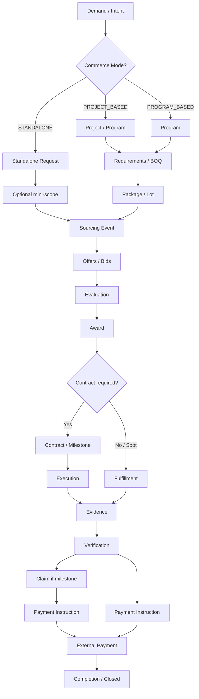

# Phase 2 — Gate 0: Domain Dependency & Design Baseline

## التاريخ
2026-08-22

## الحالة
**Design Baseline — بانتظار اعتماد قبل ADR-023 Final**

## الغرض

تحويل Core Domain Map (ADR-022) إلى **baseline معماري** يحدد:
- ترتيب اعتماديات الـDomains
- دورة الحياة الموحدة (Canonical Lifecycle)
- حدود Package / Lot / Scope

**Gate 0 = prerequisite لـ ADR-023.**  
لا coding / migrations / UI.

---

## 1. Domain Dependency Order

### 1.1 طبقات الاعتماد (Dependency Layers)

```
Layer 0 — Foundation (no domain dependencies)
  └── Identity & Access

Layer 1 — Party & Reference Data
  └── Party Network          ← depends on: Identity & Access

Layer 2 — Control & Demand
  ├── Project & Program      ← depends on: Identity, Party Network
  └── Requirements & BOQ     ← depends on: Identity, Party Network, Project (optional)

Layer 3 — Market & Execution
  ├── Sourcing & Commercial Exchange  ← depends on: Identity, Party, Requirements (optional), Project (optional)
  └── Procurement & Fulfillment       ← depends on: Identity, Party, Sourcing (award ref), Project (optional)

Layer 4 — Contract & Trust
  ├── Contract & Milestones  ← depends on: Party, Project (optional), Sourcing (award)
  ├── Trust & Evidence       ← depends on: Contract, Procurement, Party
  └── Financial & Payment    ← depends on: Contract, Trust, Party

Layer 5 — Oversight & Workforce
  ├── Compliance & Regulatory ← depends on: Project, Contract, Trust (read)
  └── Workforce & Training    ← depends on: Identity, Party Network

Layer 6 — Cross-Cutting (depends on all via interfaces — never owns business aggregates)
  ├── Integration Hub         ← adapters only; reads/writes via domain APIs
  ├── Experience              ← reads all via query APIs; commands via domain services
  └── Intelligence            ← reads all; writes via domain commands only
```

### 1.2 جدول الاعتماديات التفصيلي

| Domain | يعتمد على | يُعتمد عليه من |
|--------|-----------|----------------|
| **Identity & Access** | — | All domains |
| **Party Network** | Identity | Project, Requirements, Sourcing, Procurement, Contract, Trust, Financial, Workforce, Compliance |
| **Project & Program** | Identity, Party | Requirements, Sourcing, Procurement, Contract, Compliance, Experience |
| **Requirements & BOQ** | Identity, Party, Project *(optional)* | Sourcing, Procurement, Intelligence |
| **Sourcing & Commercial Exchange** | Identity, Party, Requirements *(optional)*, Project *(optional)* | Procurement, Contract, Experience, Intelligence |
| **Procurement & Fulfillment** | Identity, Party, Sourcing *(award)*, Project *(optional)* | Trust, Financial, Contract |
| **Contract & Milestones** | Party, Sourcing *(award)*, Project *(optional)* | Trust, Financial, Compliance |
| **Trust & Evidence** | Contract, Procurement, Party | Financial, Compliance, Sourcing *(read signals)* |
| **Financial & Payment** | Contract, Trust, Party | Integration Hub, Compliance |
| **Compliance & Regulatory** | Project, Contract, Trust *(read)* | Experience, Integration Hub |
| **Workforce & Training** | Identity, Party | Sourcing *(workforce requests)*, Intelligence |
| **Integration Hub** | Domain event contracts | All domains (external sync) |
| **Experience** | All domains *(query/command APIs)* | — |
| **Intelligence** | All domains *(read + command dispatch)* | — |

### 1.3 ملكية البيانات vs القراءة فقط

| Domain | System of Record (SoR) | Read-only consumers |
|--------|------------------------|---------------------|
| Identity & Access | User, Role, PermissionGrant, Session | Experience, all domains (auth context) |
| Party Network | Organization, PartyProfile, Qualification, CapabilityGrant | Sourcing, Contract, Trust, Matching |
| Project & Program | Project, Program, Phase, WBSNode | Sourcing, Requirements, Compliance, Experience |
| Requirements & BOQ | Requirement, BOQLine, Package, PlannedRequirement | Sourcing, Intelligence, Procurement |
| Sourcing & Commercial Exchange | SourcingEvent, Listing, Offer, Bid, Award | Procurement, Contract, Experience, Intelligence |
| Procurement & Fulfillment | PR, PO, GRN, Shipment | Trust, Financial, Contract |
| Contract & Milestones | Contract, ContractParty, Milestone, Claim | Trust, Financial, Compliance |
| Trust & Evidence | Evidence, Inspection, VerificationDecision | Financial, Sourcing *(trust score ref)*, Compliance |
| Financial & Payment | Invoice, PaymentInstruction, Reservation | Integration Hub, Compliance |
| Compliance & Regulatory | ComplianceSnapshot, PermitRef, AuditEntry | Experience, Integration Hub |
| Workforce & Training | Job, Course, Skill, Certification | Sourcing, Intelligence |
| Integration Hub | Connector, ExternalRef, SyncJob | — *(not business SoR)* |
| Experience | PortalConfig, CMSBlock | — |
| Intelligence | AIJob, RecommendationRecord | — *(no business SoR)* |

**قاعدة:** أي domain يقرأ بيانات domain آخر عبر **ID reference + query API / read model / domain event** — لا cross-domain Prisma.

### 1.4 أين توجد الأحداث (Domain Events)

| Domain | أحداث رئيسية (examples) |
|--------|-------------------------|
| Identity & Access | `UserRegistered`, `OrganizationCreated`, `PermissionGranted` |
| Party Network | `OrganizationVerified`, `QualificationUpdated`, `CapabilityGranted` |
| Project & Program | `ProjectCreated`, `PhaseStarted`, `WBSNodeAdded` |
| Requirements & BOQ | `BOQPublished`, `PackageDefined`, `FutureDemandSignalCreated` |
| **Sourcing** | `SourcingEventPublished`, `OfferSubmitted`, `EvaluationCompleted`, `AwardIssued` |
| Procurement | `PurchaseRequestApproved`, `POIssued`, `GoodsReceived`, `DeliveryCompleted` |
| Contract | `ContractSigned`, `MilestoneDue`, `ProgressClaimSubmitted` |
| Trust | `EvidenceSubmitted`, `InspectionCompleted`, `VerificationApproved/Rejected` |
| Financial | `PaymentInstructionCreated`, `ReleaseRequested`, `InvoiceIssued` |
| Compliance | `ComplianceSnapshotTaken`, `PermitRefLinked` |
| Workforce | `JobPosted`, `CertificationIssued`, `SkillAssessed` |
| Integration Hub | `ExternalSyncCompleted`, `PaymentProviderAcknowledged` |
| Intelligence | `RecommendationGenerated`, `AnomalyDetected` *(metadata only)* |

**Event bus:** ADR-004 / ADR-011 — events owned by publishing domain; consumers build read models.

### 1.5 أين توجد Read Models

| Read Model | Owner (builder) | Source domains | Consumers |
|------------|-----------------|----------------|-----------|
| `ProjectControlDashboard` | Project & Program | Project, Contract, Trust, Financial | Experience, Owner/PMC |
| `SourcingEventSummary` | Sourcing | Sourcing, Party | Experience, Intelligence |
| `SupplierTrustScore` | Trust *(SoR for score calc inputs)* | Trust, Procurement, Party | Sourcing Matching |
| `FutureDemandBoard` | Requirements | Requirements, Project, Sourcing | Sourcing, Suppliers |
| `AwardToContractPipeline` | Contract | Sourcing, Contract | Procurement |
| `MilestonePaymentStatus` | Financial | Contract, Trust, Financial | Experience, Bank integration |
| `ComplianceReadView` | Compliance | Project, Trust, Contract | Regulators, Experience |
| `MatchingCandidateList` | Sourcing *(ephemeral/query)* | Party, Catalog, Trust, Intelligence | Sourcing UI |
| `ProgramPortfolioView` | Project & Program | Project, Contract, Financial | Owner, Government |
| `BankProjectProgressView` | Project + Trust *(composed)* | Project, Trust, Financial | Integration Hub → Bank |

**قاعدة:** Read models **لا** تُكتب مباشرة من domain آخر — تُبنى من events أو query APIs.

### 1.6 ترتيب التصميم والتنفيذ المستقبلي (Implementation Order)

```
1. Identity & Access + Party Network        (foundation)
2. Project & Program + Requirements & BOQ     (demand side)
3. Sourcing & Commercial Exchange           (ADR-023 — Gate 1)
4. Procurement & Fulfillment                (fulfillment path)
5. Contract & Milestones                    (ADR-024)
6. Trust & Evidence + Financial & Payment     (trust chain)
7. Compliance + Workforce                   (parallel tracks)
8. Integration Hub + Intelligence hooks     (adapters)
9. Experience                               (presentation last)
```

---

## 2. Canonical Lifecycle

### 2.1 المسار الكامل (Project-based)

```
Demand
  ↓
Project / Program                    [Project & Program — optional anchor]
  ↓
Requirements / BOQ                   [Requirements & BOQ]
  ↓
Package / Lot / Scope                [Requirements — aggregate Package]
  ↓
Sourcing Event                       [Sourcing — SourcingEvent]
  ↓
Offer / Bid                          [Sourcing — Offer/Bid]
  ↓
Evaluation                           [Sourcing — EvaluationRun]
  ↓
Award                                [Sourcing — Award]
  ↓
Contract                             [Contract & Milestones]
  ↓
Milestone                            [Contract]
  ↓
Execution                            [Procurement & Fulfillment / Contract execution]
  ↓
Evidence                             [Trust & Evidence]
  ↓
Verification                         [Trust — VerificationDecision]
  ↓
Claim                                [Contract — ProgressClaim]
  ↓
Payment Instruction                  [Financial & Payment]
  ↓
External Payment / Escrow            [Integration Hub → PSP/Bank]
  ↓
Completion                           [Contract + Project status]
```

### 2.2 المسار المختصر (Standalone commerce — no full Project)

```
Demand / Intent
  ↓
Standalone Request                   [Sourcing — StandaloneDemand ref, no ProjectId]
  ↓
Sourcing Event                       [same SourcingEvent aggregate — CommerceMode=STANDALONE]
  ↓
Offer / Bid / Direct Match
  ↓
Award (or instant match)
  ↓
Contract (optional — simplified / spot contract)
  ↓
Fulfillment                          [Procurement PO or direct delivery]
  ↓
Evidence + Verification (as required by event type & urgency)
  ↓
Payment Instruction → External Payment
  ↓
Closed
```

### 2.3 Commerce Mode (unifying both paths)

| Mode | Anchor | Examples |
|------|--------|----------|
| **PROJECT_BASED** | `projectId` + optional `packageId` | Tower build, 1000t steel, 6-month future demand |
| **PROGRAM_BASED** | `programId` | Government program, neighborhood redevelopment |
| **STANDALONE** | `standaloneRequestId` only | Single chandelier, scrap sale, crane rental, urgent 2hr material |

**قرار Gate 0:** `SourcingEvent.commerceMode` + optional refs — **نفس aggregate، workflows مختلفة.**

### 2.4 مسارات Standalone by scenario

| Scenario | Commerce Mode | Event Type (indicative) | Skips |
|----------|---------------|-------------------------|-------|
| Owner → one chandelier | STANDALONE | DIRECT_PURCHASE / RFQ | Project, Contract (optional spot) |
| Owner → Jacuzzi from abroad | STANDALONE | RFQ + compliance flags | Full WBS |
| Plants/seedlings cross-border | STANDALONE | RFQ/RFP + regulatory | Full Project |
| Contractor → 2hr urgent material | STANDALONE | URGENT_PURCHASE | Tender, long evaluation |
| Contractor → material in 6 months | PROJECT_BASED or STANDALONE | FUTURE_DEMAND → RFQ | — |
| Contractor → 1000t steel | PROJECT_BASED | TENDER / RFQ | — |
| Contractor → sell scrap | STANDALONE | SCRAP_SALE / AUCTION | Project, Milestone |
| Supplier → surplus stock | STANDALONE | SURPLUS_SALE | Project |
| Supplier → clearance | STANDALONE | INVENTORY_CLEARANCE | Project |
| Company → crane rental | STANDALONE | EQUIPMENT_RENTAL | Full contract (short-term) |
| Company → waste transport | STANDALONE | TRANSPORT_REQUEST | — |

### 2.5 Lifecycle fork diagram



---

## 3. Package Boundary

### 3.1 التعريف المعماري

| Concept | Definition | Owner | Aggregate |
|---------|------------|-------|-----------|
| **Project** | Container for control, budget, schedule ref, stakeholders | Project & Program | `Project` |
| **Package** | Divisible scope of work or procurement within a project | Requirements & BOQ | `Package` |
| **Lot** | Subdivision of a package for sourcing (may map 1:1 to SourcingEvent) | Requirements & BOQ | `Package.lots[]` or child `Lot` |
| **Scope** | Technical/specification boundary (BOQ lines, specs, quantities) | Requirements & BOQ | `BOQLine`, `Requirement` |

```
Project
 ├── Package A — Civil          → SourcingEvent(s)
 │     └── Lot A1 — Foundation
 │     └── Lot A2 — Structure
 ├── Package B — HVAC           → SourcingEvent(s)
 ├── Package C — Electrical
 ├── Package D — Windows
 ├── Package E — Kitchen
 └── Package F — Landscaping
```

### 3.2 Package attributes (design)

| Field | Purpose |
|-------|---------|
| `projectId` | Required for PROJECT_BASED |
| `code`, `name`, `discipline` | Identity (Civil, HVAC, …) |
| `boqRef` | Link to BOQ lines |
| `budgetEnvelopeRef` | Financial control (read from Financial) |
| `scheduleWindowRef` | Link to schedule / Future Demand |
| `status` | PLANNED → SOURCING → AWARDED → IN_EXECUTION → CLOSED |
| `sourcingEventIds[]` | Refs to Sourcing domain (not owned) |

### 3.3 Standalone Request (no Project)

| Concept | Definition | Owner |
|---------|------------|-------|
| **StandaloneRequest** | Minimal demand record without Project | Sourcing *(or Requirements — see OAD-001)* |

```
StandaloneRequest
  ├── requesterOrgId
  ├── intentSummary          (natural language / structured)
  ├── categoryRef
  ├── urgencyLevel
  ├── quantity / spec (optional)
  └── → spawns SourcingEvent (commerceMode=STANDALONE)
```

**Gate 0 recommendation:** `StandaloneRequest` owned by **Sourcing** as lightweight entry aggregate; Requirements BOQ optional attach later.

### 3.4 Package ↔ Sourcing relationship rules

| Rule | Detail |
|------|--------|
| P1 | One Package may spawn **multiple** SourcingEvents (by Lot or phase) |
| P2 | One SourcingEvent references **at most one** Package (or none if STANDALONE) |
| P3 | BOQ lines are **copied/snapshot** into SourcingEvent scope at publish time (not live join) |
| P4 | Award on SourcingEvent updates Package status via event `AwardIssued` |
| P5 | Standalone SourcingEvent has `packageId = null`, `projectId = null` |

### 3.5 Lot vs Package vs SourcingEvent

| Granularity | When to use |
|-------------|-------------|
| **Package** | Logical division of project scope (Civil, HVAC…) |
| **Lot** | Competitive boundary — e.g. tender one lot at a time |
| **SourcingEvent** | Actual market transaction instance |

Example: Package B (HVAC) → Lot B1 (Chillers) → `SourcingEvent` type=TENDER  
Example: Standalone → no Package → `SourcingEvent` type=URGENT_PURCHASE

---

## Gate 0 — Open Points (for ADR-023)

| ID | Question | Gate 0 Recommendation |
|----|----------|----------------------|
| OAD-G0-001 | StandaloneRequest owner: Sourcing vs Requirements? | **Sourcing** (closer to event creation) |
| OAD-G0-002 | Lot as separate aggregate vs Package child? | **Child entity** under Package unless cross-package lots needed |
| OAD-G0-003 | Program hierarchy depth | Defer to ADR-024/R9 — Gate 0 accepts Program → Project → Package |

---

## Gate 0 Acceptance

- [x] Domain dependency order documented
- [x] SoR vs read-only clarified
- [x] Events and read models placement defined
- [x] Canonical lifecycle (project + standalone)
- [x] Package / Lot / Scope / StandaloneRequest boundaries defined

**Next:** ADR-023 — Unified Sourcing Engine (requires Gate 0 approval)

## References

- ADR-022 (Core Domain Map — Approved)
- ADR-004 (Event Bus), ADR-011 (Event Catalog)
- ADR-012 (Workflow Engine)
