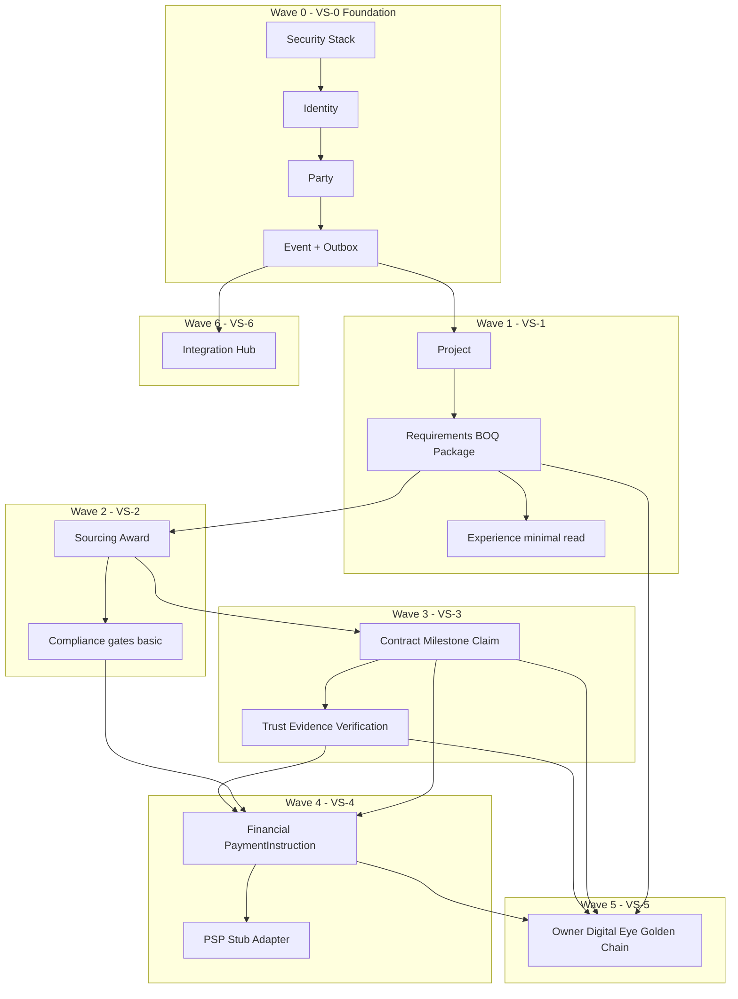

# Phase 3 — Implementation Architecture & Roadmap

## التاريخ
2026-08-22

## آخر تحديث
2026-08-22 — **G3-0 FINAL APPROVED / CLOSED** — Wave 0 / VS-0 implementation started

## الحالة
**✅ FINAL APPROVED / BASELINE — G3-0 CLOSED**

| Item | Status |
|------|--------|
| Phase 2 ADR-022 → ADR-031 | ✅ COMPLETE |
| Phase 3 Roadmap | ✅ **APPROVED / BASELINE** |
| **G3-0** | **✅ CLOSED** |
| Wave 0 / VS-0 | 🟢 **IN PROGRESS** |
| VS-1+ business features | ❌ (blocked until G3-1) |
| Payment / PSP production | ❌ |
| Production deployment | ❌ |

Prerequisites: **Phase 2 Design Spine complete** — ADR-022 → ADR-031 ✅ (Gates 0–9 CLOSED)

## Phase 3 Rule
**G3-0 approved 2026-08-22** — Wave 0 / VS-0 coding **permitted**. VS-1+ business code blocked until **G3-1** (security items 1–7 passing). ❌ No payment · ❌ No PSP production · ❌ No production deployment · ❌ No ADR-022→031 changes · ❌ No cross-domain FK / direct writes / transactions

---

## 0. Core Implementation Philosophy (Locked for Review)

**We do NOT:**

```
Build Domain 1 → Domain 2 → Domain 3 → … → integrate at the end
```

**We DO:**

```
Thin End-to-End Slice
        ↓
Validate (E2E tests + demo)
        ↓
Harden (security, replay, audit)
        ↓
Expand (next slice adds depth)
        ↓
Next Slice
```

Every wave delivers a **deployable + testable + demonstrable** vertical slice — not isolated domain completion.

---

## 1. Executive Summary

Phase 3 implements the Phase 2 baseline as a **Modular Monolith** with real domain boundaries, event-driven projections, and strangler migration from Phase 1 legacy.

**MVP definition:** One **complete business journey** end-to-end — not "all domains built separately."

**Mandatory MVP journey:**

```
Owner Requirement
  → BOQ Snapshot → Package → Sourcing → Offer/Bid → Award
  → Contract → Milestone → Progress Claim → Evidence
  → Verification → Approval → Payment Instruction → PSP Stub
  → Owner Digital Eye → Golden Chain
```

If this journey cannot run E2E, **MVP is not complete** — regardless of per-domain implementation status.

---

## 2. Phase 2 Design Spine (Locked — unchanged)

ADR-022 → ADR-031 ✅ · Non-negotiables: INV-T1 · Trust≠Financial≠Compliance · Experience never SoR · Integration Hub not business domain · AI assist only.

---

## 3. Implementation Dependency Matrix

### 3.1 Legend

| Symbol | Meaning |
|--------|---------|
| **H** | Hard dependency — blocker; cannot proceed without |
| **S** | Soft dependency — design/read-only parallel OK; runtime needs H satisfied |

### 3.2 Domain matrix

| Domain | Depends On (H/S) | Must Exist Before (Hard) | Can Develop Parallel (Soft) | First Vertical Slice | Hard / Soft notes |
|--------|------------------|--------------------------|----------------------------|----------------------|-------------------|
| **Identity** | — | — | All (auth interface only) | **VS-0** | Foundation H for all |
| **Party** | Identity **(H)** | Identity | Project, Compliance design | **VS-1** | Org SoR |
| **Project** | Identity **(H)** + Party **(H)** | Party | Requirements design | **VS-1** | projectId anchor |
| **Requirements/BOQ** | Project **(H)** | Project | Sourcing design **(S)** | **VS-1** | BOQ Snapshot before Sourcing **(H)** |
| **Sourcing** | Party **(H)** + Requirements **(H)** (BOQ Snapshot) | BOQ Snapshot published | Contract design **(S)** | **VS-2** | Award before Contract **(H)** |
| **Contract** | Sourcing **(H)** (Award) | Award issued | Trust design **(S)** | **VS-3** | Milestone before Claim **(H)** |
| **Trust/Evidence** | Contract **(H)** (Milestone/Claim) | Milestone + Claim path | Integration design **(S)** | **VS-3** | Verification before Payment **(H)** |
| **Compliance** | Party **(H)** + Project **(H)** + LegalProfile **(H)** | LegalProfile v1 seeded | Trust **(S)** parallel build | **VS-2/3** | Gate at Award/Mobilization/Payment **(H)** for MVP |
| **Financial** | Contract **(H)** + Trust **(H)** + Compliance **(H)** (gate) | VerificationDecision + Approval | Integration **(S)** | **VS-4** | PaymentInstruction **(H)** needs full chain |
| **Integration** | Domain contracts **(H)** (APIs + events) | Stable command/event schemas | All domains **(S)** | **VS-6** | Adapters never own business rules |
| **Experience** | Domain events **(H)** + projections **(H)** | Outbox + minimal event stream | Most domains **(S)** read-side | **VS-1** (minimal) → **VS-5** (full) | Never SoR **(H)** |

### 3.3 Hard dependency chain (critical path)

```
Identity → Party → Project → BOQ Snapshot → Sourcing → Award
  → Contract → Milestone → Claim → Evidence → Verification
  → Compliance Gate → Approval → PaymentInstruction → PSP Adapter
  → Experience projection → Golden Chain
```

### 3.4 Soft parallel tracks (safe before hard deps satisfied)

| Track | Parallel with | Condition |
|-------|---------------|-----------|
| Compliance LegalProfile seed | Project + Requirements | No runtime gate until profile PUBLISHED |
| Contract schema/API design | Sourcing build | No Award consumption until Sourcing live |
| Trust schema design | Contract build | No Evidence until Claim exists |
| Integration Hub registry design | All | No apply until domain commands exist |
| Experience DashboardDefinition | VS-1 | Widgets light until events flow |
| Intelligence recommend stub | Trust/Compliance | No decisions |

---

## 4. Final Dependency Graph



---

## 5. Final Implementation Waves (Slice-First)

| Wave | Vertical Slice | Delivers (E2E demonstrable) | Hard deps required |
|------|----------------|----------------------------|-------------------|
| **0** | **VS-0** Foundation | Tenant · Auth · RBAC · Audit · Outbox · Architecture tests CI | — |
| **1** | **VS-1** Owner + Villa | Requirement → BOQ → Package → **Owner view** (thin; stub downstream IDs) | VS-0 |
| **2** | **VS-2** Sourcing | Package → Sourcing → Offers → Award + compliance gate at award | VS-1 BOQ Snapshot |
| **3** | **VS-3** Contract + Trust | Award → Contract → Milestone → Claim → Evidence → Verification | VS-2 Award |
| **4** | **VS-4** Protected Payment | Verification → Approval → PaymentInstruction → **PSP Stub** + INV-T1 | VS-3 Verification |
| **5** | **VS-5** Golden Chain + Owner Eye | Full journey read · drill-down · why-purchased/why-paid/why-blocked | VS-4 payment event |
| **6** | **VS-6** Integration | ABC ↔ External stub (PermitRef / schedule snapshot) | Domain APIs stable |

**Expand/harden** within each wave before advancing — not "move on with failing E2E."

---

## 6. Vertical Slices (Business Journeys)

Each slice: **deployable + testable + demonstrable**.

### VS-0 — Platform & Security Foundation

```
Tenant provisioning → Auth → RBAC → Audit log → Outbox relay → Architecture test gate
```

**Demo:** Authenticated user in tenant A cannot read tenant B.

---

### VS-1 — Owner + Villa

```
Owner Requirement → BOQ Snapshot → Package → Project created
  → Experience: Owner sees Project + Package + BOQ (minimal Control view)
```

**Demo:** Owner creates villa project requirement and sees it in Owner view.  
**Not yet:** Sourcing/Contract/Payment.

---

### VS-2 — Sourcing

```
Package → SourcingEvent → Offers/Bids → Evaluation → Award
  + Compliance gate (license check at AWARD)
```

**Demo:** Award issued; blocked if supplier license expired (test case).

---

### VS-3 — Contract + Trust

```
Award → Contract → Milestone → Progress Claim
  → Evidence upload → VerificationDecision (human)
```

**Demo:** Verified milestone; claim without evidence **blocked**.

---

### VS-4 — Protected Payment

```
VerificationDecision + Contract Approval + Compliance gate
  → PaymentInstruction → PSP Adapter Interface → PSP Stub
  → status callback → Financial read model
```

**Demo:** Payment without verification **rejected** (INV-T1).  
**PSP path:** Financial → PaymentInstruction → **PSP Adapter** → PSP Stub — **not** fake logic inside Financial.

---

### VS-5 — Golden Chain + Owner Digital Eye

```
Full journey trace:
  Requirement ↔ BOQ ↔ Package ↔ Sourcing ↔ Award ↔ Contract
  ↔ Milestone ↔ Claim ↔ Evidence ↔ Verification ↔ Payment
```

**Demo:** Owner drill-down + Golden Chain APIs proxied through Experience; FreshnessMeta visible.

---

### VS-6 — Integration

```
External stub → Integration Hub → Compliance PermitRef / Project schedule snapshot
  → Experience integration health widget
```

**Demo:** Permit sync updates Compliance read view; failure shows stale flag.

---

## 7. MVP Definition (E2E — Non-Negotiable)

### 7.1 Complete MVP journey (single path must pass)

| Step | Domain | MVP requirement |
|------|--------|-----------------|
| 1 | Requirements | Owner Requirement + BOQ Snapshot + Package |
| 2 | Sourcing | SourcingEvent + Offer + Award |
| 3 | Contract | Contract + Milestone |
| 4 | Contract | Progress Claim |
| 5 | Trust | Evidence + VerificationDecision |
| 6 | Contract | Approval |
| 7 | Compliance | Gate PASS at payment checkpoint |
| 8 | Financial | PaymentInstruction created |
| 9 | Integration | PSP Stub ACK |
| 10 | Experience | Owner Digital Eye shows Paid + layers |
| 11 | Traceability | Golden Chain answers why-paid |

### 7.2 MVP scale

- **One** Villa project, **one** contract, **one** milestone payment cycle
- Single pilot tenant; multi-tenant code enforced
- AE-DXB LegalProfile v1 (seeded)
- ar + en UI; RTL flag
- PSP Stub only — no production PSP

### 7.3 MVP is NOT complete if

- Any step in §7.1 fails E2E
- Domains work in isolation but journey does not connect
- Payment bypasses verification or compliance gate
- Experience stores authoritative business state

---

## 8. MVP Acceptance Criteria (Measurable)

| Criterion | Target | Rationale |
|-----------|--------|-----------|
| **End-to-end scenarios** | **≥ 12 pass** | 1 full §7.1 journey + VS-1..6 slice demos (6) + 5 edge cases (block payment, expired license, missing evidence, tenant leak attempt, stale read) |
| **Automated test coverage (domain logic)** | **≥ 80%** lines/branches on domain packages | Balance pragmatism vs confidence; exclude generated UI |
| **Architecture tests** | **100% pass** | Zero tolerance — boundary violations are systemic |
| **Critical security tests** | **100% pass** | Tenant isolation, authZ deny-default, audit on sensitive ops |
| **No Evidence → No Payment (INV-T1)** | **100% blocked** in test matrix | Core invariant ADR-022/028/025 — every bypass attempt must fail |
| **SoD violations** | **100% blocked** | Financial + waiver flows ADR-024/030 |
| **Tenant isolation** | **100% pass** | No cross-tenant read/write in automated suite |
| **Projection replay parity** | **100%** on MVP read models | OwnerFinancialControl, EvidenceStatus, ComplianceReadView rebuild match |
| **Golden Chain traceability** | **100%** of §7.1 steps linked | Each step returns non-empty trace segment |
| **API contract tests** | **100%** of MVP v1 endpoints | OpenAPI contract tests for all MVP routes |
| **Critical path E2E** | **100% pass** | Playwright/API E2E of full §7.1 journey on staging |
| **Projection lag p95** | **< 60s** Owner Control Tower | ADR-031 NEAR_REALTIME SLA |
| **Outbox unpublished max age** | **< 30s** p95 | Event pipeline health |

---

## 9. Modular Monolith Decision (OAD-P3-003 — Proposed Lock)

### 9.1 Decision

**Phase 3 starts as Modular Monolith — NOT Microservices.**

| Aspect | Choice |
|--------|--------|
| Deployment unit | Single Next.js application + worker process(es) for outbox relay |
| Domain boundaries | Module folders · separate Prisma schema files · domain services · no cross-domain imports |
| Communication | In-process command bus + transactional outbox · external bus later |
| Data | **One PostgreSQL cluster** · **schema isolation per domain** · **no cross-domain TX/FK/writes** (see §10) |

### 9.2 Boundary enforcement

- ESLint / architecture tests: **no cross-domain Prisma client usage**
- Domain A → Domain B: **IDs + events + query APIs only**
- Shared kernel: `platform` (outbox, audit, tenant) only

### 9.3 When service extraction is allowed (not "domain = service")

Extract **only** when measurable need in **≥2** categories:

| Criterion | Example |
|-----------|---------|
| **Scale** | Projection workers CPU-saturated independently |
| **Isolation** | Integration Hub connector sandbox requirements |
| **Security** | PCI scope reduction for PSP adapter (future) |
| **Deployment independence** | Regulator-mandated separate audit service |
| **External integration** | High-volume IoT ingest |
| **Regulatory requirement** | Data residency mandate |

**Default:** stay monolith through MVP + pilot.

---

## 10. Database Strategy (Detailed)

### 10.1 Architecture stack

```
Domain schema ownership (per bounded context)
        ↓
No cross-domain FK
        ↓
Domain APIs / Events (reference by UUID)
        ↓
Outbox (same TX as aggregate)
        ↓
Read Models (experience_read schema — projections)
```

### 10.2 FAQ (decisions for review)

| Question | Decision | Rationale |
|----------|----------|-----------|
| **One PostgreSQL or several?** | **One PostgreSQL cluster** (single database `abc`) for MVP/pilot | Ops simplicity; modular monolith; sufficient for pilot scale — **does not relax domain boundaries** (see §10.4) |
| **When schema isolation?** | **Always** — each domain writes only its PostgreSQL schema | Enforces boundary at DB layer; prep for future split |
| **Who owns migrations?** | **Domain owner** per schema; `platform` team owns `platform` + outbox | PR review by domain + architecture test |
| **Transaction boundaries?** | **Single domain aggregate per transaction** | Cross-domain = saga via events — no distributed TX in MVP |
| **Eventual consistency?** | **Accepted** between domains; **FreshnessMeta** on reads | ADR-031; outbox at-least-once |
| **Replay?** | Outbox archive + event log → projector cursor reset → rebuild read models | ADR-031 OAD-031-002 |
| **Recovery?** | Unpublished outbox retry · poison → DLQ · manual replay admin tool | See §11 event architecture |
| **Prevent cross-domain writes?** | Architecture tests + schema permissions (app role per domain) + code review | CI blocks merge on violation |

### 10.3 Schema map

| PostgreSQL schema | Owner | Contains |
|-------------------|-------|----------|
| `platform` | Platform | tenant, outbox, idempotency, audit |
| `identity` | Identity | user, session, role, permission |
| `party` | Party Network | organization, qualification |
| `project` | Project & Program | program, project, phase, wbs |
| `requirements` | Requirements & BOQ | requirement, boq, package, snapshot |
| `sourcing` | Sourcing | sourcing_event, offer, award |
| `contract` | Contract | contract, milestone, claim |
| `trust` | Trust | evidence, verification |
| `financial` | Financial | payment_instruction, reservation |
| `compliance` | Compliance | obligation, legal_profile, permit_ref |
| `integration` | Integration Hub | connector, external_ref, delivery |
| `experience_read` | Experience | projections, dashboard_def, alert_presentation |
| `legacy` | Strangler | existing Phase 1 tables until retirement |

### 10.4 One cluster ≠ one transaction (explicit boundary rule)

**One PostgreSQL cluster is a deployment/ops choice — not a domain coupling permission.**

| Rule | Requirement |
|------|-------------|
| **No cross-domain transactions** | A single database transaction **must not** span more than **one domain schema / one aggregate write** |
| **No cross-domain FK** | Foreign keys **only** within the same domain schema — references to other domains are **UUID only** (no FK) |
| **No cross-domain direct writes** | Domain A **must not** INSERT/UPDATE/DELETE in Domain B's schema — even though both live on the same cluster |
| **Cross-domain coordination** | **Domain APIs + events + outbox + saga** — never `BEGIN … schema_a … schema_b … COMMIT` |
| **Enforcement** | Per-domain DB roles · architecture tests (100%) · CI merge block on violation |

> **Anti-pattern (forbidden):** "We share one Postgres, so we can FK `contract.milestone` → `trust.evidence` and update both in one TX."  
> **Correct pattern:** Contract emits `Contract.Milestone.Approved` → Trust consumes → creates Evidence in `trust` schema in a **separate** transaction.

### 10.5 Cross-domain reference rule

```sql
-- ✅ Allowed in domain schema
contract.milestone.contract_id  -- same aggregate

-- ✅ Allowed as opaque UUID — NO FK constraint
financial.payment_instruction.contract_id UUID NOT NULL  -- no FK to contract.contract

-- ❌ Forbidden
FOREIGN KEY (contract_id) REFERENCES contract.contract(id)
```

### 10.6 Legacy coexistence

Existing Prisma models map to `legacy` schema until strangler retirement (§14).

---

## 11. Event Architecture (Detailed)

### 11.1 Flow (mandatory)

```
Command (HTTP/API)
  → Domain Transaction (aggregate + outbox insert — same TX)
  → Outbox Event (committed)
  → Outbox Relay Worker
  → Event Bus (in-process MVP → RabbitMQ later)
  → Consumers (projectors, integration adapters, notifications)
  → Projection update / Integration dispatch / Alert feed
```

### 11.2 Event naming

Format: `{domain}.{aggregate}.{action}` (ADR-004)

Examples:
- `contract.milestone.claim_submitted`
- `trust.verification.decision_recorded`
- `financial.payment_instruction.created`

### 11.3 Schema versioning

- `schemaVersion` integer on every envelope
- **Backward compatible** changes only within major version
- Breaking change → new event type suffix `_v2` or new major — projectors register both during migration

### 11.4 Idempotency

- Consumer stores `eventId` processed table
- Integration uses `idempotencyKey` (ADR-029)
- Handlers must be **idempotent** — safe retry

### 11.5 Ordering

- **Per aggregate:** strict order guaranteed (same aggregateId partition)
- **Cross-aggregate:** eventual order — consumers must not assume global order

### 11.6 Retry & DLQ

| Stage | Policy |
|-------|--------|
| Outbox relay | Exponential backoff; max 10 attempts |
| Consumer | 3 retries → DLQ table `platform.event_dlq` |
| Poison message | No infinite retry; alert ops; manual replay after fix |

### 11.7 correlationId & causationId

- **correlationId:** generated at user command entry — flows through all events in journey
- **causationId:** prior `eventId` — enables chain debug

### 11.8 Replay

1. Stop projector (or run on shadow table)
2. Reset cursor to timestamp / eventId
3. Reconsume from outbox archive
4. Parity diff vs current projection
5. Swap or merge on pass

### 11.9 Consumer versioning

- Projector declares `supportedSchemaVersions[]`
- Unknown version → DLQ + alert (not silent drop)

---

## 12. Security Implementation Order (Before Business Features)

Security **Wave 0** completes **before** VS-1 business code merges to main.

| Order | Capability | Blocks |
|-------|------------|--------|
| 1 | **Tenant isolation** | All domains — middleware + row filter |
| 2 | **Authentication** | next-auth session/JWT |
| 3 | **Authorization (deny default)** | Domain handlers |
| 4 | **RBAC** | Role → permission map |
| 5 | **ABAC / Scope** | Project/Contract stakeholder scope |
| 6 | **SoD checks** | Financial + Compliance waiver paths |
| 7 | **Audit (WORM)** | Sensitive read/write |
| 8 | **Secrets** | CredentialReference pattern — no secrets in DB |
| 9 | **Encryption** | TLS; at-rest Postgres; optional field-level for PII |
| 10 | **Rate limits** | Auth endpoints + public APIs |

**Gate:** G3-1 requires items 1–7 **passing tests** before VS-1 feature PRs merge.

---

## 13. PSP Stub (ADR-025 Compatible)

### 13.1 Architecture (not fake payment in Financial)

```
Financial Domain
  → PaymentInstruction aggregate (SoR)
  → PaymentDispatchRequested event
Integration Hub
  → PSP Adapter Interface (port)
  → PSP_STUB implementation
  → ExternalReference (instruction id ↔ stub payment id)
  → PaymentStatusReceived webhook/event
Financial Domain
  → ApplyPaymentStatus command (read model / status transition)
```

### 13.2 Adapter interface (design)

```typescript
interface PspAdapter {
  dispatch(instruction: PaymentInstructionDto, idempotencyKey: string): Promise<PspDispatchResult>
  parseWebhook(payload: unknown): PspStatusUpdate
}
```

### 13.3 Swap rule

Replacing PSP Stub with real PSP = **new Adapter implementation + Connector config** — **zero** Financial domain code change.

### 13.4 MVP stub behaviors

- ACK / PENDING / FAILED states
- Idempotent dispatch by instruction id
- Simulated delay + failure injection for tests
- No custodial balance in ABC

---

## 14. Legacy Strangler Matrix

Retirement only after: **Parity → Reconciliation → Acceptance → Cutover → Monitoring → Retirement**

| Legacy | Canonical target | Adapter | Dual run | Cutover trigger | Retirement |
|--------|------------------|---------|----------|-----------------|------------|
| **RFQ / Tender** | SourcingEvent (ADR-023) | `LegacyRfqAdapter` → publish SourcingEvent | Read both; write legacy until parity | VS-2 E2E pass + parity ≥ 99% | Stop legacy RFQ write G3-9 |
| **Procurement (module)** | **Per capability/entity** — see §14.2 (not blanket → Contract) | `LegacyProcurementAdapter` (capability-specific) | Dual run **per entity type** | Per-entity cutover gates | Per-entity retirement (G3-9) |
| **Marketplace listings** | Sourcing Listing profile | Listing type mapping | Marketplace browse unchanged | Auction/RFQ unified read | Deprecate duplicate tender UI |
| **Quality / MaterialInspection** | Trust Evidence (OAD-028-008) | Inspection → Evidence create | Parallel display | VS-3 evidence E2E | Retire inspection write |
| **Financial legacy records** | PaymentInstruction | Status mirror only — no fund migration | Read legacy history | VS-4 stub pass | No new legacy payment writes |
| **Project data (legacy)** | Project aggregate (ADR-026) | ExternalReference old project id | Dual read project list | VS-1 parity | Migrate or archive |

### 14.1 Cutover checklist (per legacy module)

| # | Stage | Requirement |
|---|-------|-------------|
| 1 | **Parity** | Automated diff canonical vs legacy read ≥ 99% |
| 2 | **Reconciliation** | Manual sign-off on mismatches |
| 3 | **Acceptance** | Domain acceptance tests pass on canonical path |
| 4 | **Cutover** | Feature flag flip; legacy write disabled |
| 5 | **Monitoring** | 14-day error rate ≤ baseline |
| 6 | **Retirement** | Legacy code path removed — G3-9 gate |

### 14.2 Procurement — per capability / entity mapping

Legacy **Procurement** is a **Phase 1 module bundle** — not a single canonical domain.  
**No blanket mapping** (e.g. "Procurement → Contract") is allowed. Each capability/entity migrates on its own strangler path.

| Legacy capability / entity | Canonical target | Adapter / bridge | Dual run | Cutover trigger | Retirement |
|----------------------------|------------------|------------------|----------|-----------------|------------|
| **PurchaseRequest (PR)** | Requirements internal demand (ADR-027) *or* `legacy` until VS-1 | `LegacyPrAdapter` → Requirement draft / external ref | Read both; write legacy until parity | VS-1 Requirement E2E | Stop PR write when canonical PR path ≥ 99% parity |
| **RFQ / Tender** | SourcingEvent (ADR-023) | `LegacyRfqAdapter` | See RFQ row §14 | VS-2 E2E | G3-9 |
| **Quotation** | Sourcing **Offer** | Map quotation → offer + price lines | Parallel read | VS-2 offer parity | Retire quotation write |
| **Evaluation / Approval** | Sourcing evaluation workflow | Score/approval → canonical evaluation steps | Parallel | VS-2 award gate tests | Retire legacy evaluation write |
| **Award** | Sourcing **Award** | Award accept/decline → canonical award | New awards canonical-only | VS-2 E2E pass | Retire legacy award write |
| **PurchaseOrder (PO)** | **Conditional:** award-backed PO → **Contract execution ref** (`contractId` / `awardId`); standalone/catalog PO → **`legacy.procurement`** until explicit rule | PO adapter sets refs **only when** sourced from canonical Award | Mixed: new awards → canonical; old POs read-only | VS-4: payment path uses canonical Contract/Milestone when linked | Optional legacy PO fields; no forced Contract migration |
| **Delivery / GR** | Logistics doc in `legacy` *or* Integration Hub external ref (ADR-029) | Delivery events → Integration `ExternalReference` | Parallel display | Integration VS-6 *or* explicit logistics ADR | **Not** mapped to Contract |
| **Procurement workflow history** | `platform.audit` + domain events | Transition → audit + `Procurement.Workflow.*` events | Append-only mirror | VS-0 audit green | Remove legacy-only history UI |
| **Invoicing (procurement-adjacent)** | Financial **PaymentInstruction** path (ADR-025) | Invoice status mirror — no fund migration | Read legacy history | VS-4 stub pass | No new legacy invoice payment writes |

**Principle:** If a legacy Procurement capability has **no canonical owner yet**, it **stays in `legacy`** with adapter + dual-run — it is **not** pushed into Contract (or any domain) by default.

---

## 15. Testing Pyramid

```
                    ┌─────────────┐
                    │  E2E (12+)  │  Playwright — full §7.1 journey
                   ┌┴─────────────┴┐
                   │ Acceptance ADR │  adr-022..031 scenarios
                  ┌┴─────────────────┴┐
                  │  Contract / API    │  100% MVP endpoints
                 ┌┴───────────────────┴┐
                 │ Integration per domain│  ≥80% critical paths
                ┌┴───────────────────────┴┐
                │ Architecture (100%)      │  no cross-domain FK
               ┌┴─────────────────────────┴┐
               │ Unit (domain logic ≥80%)     │
               └─────────────────────────────┘
```

| Layer | MVP target | CI gate |
|-------|------------|---------|
| Unit | ≥ 80% domain packages | PR merge |
| Integration | Critical paths per slice | PR merge |
| Architecture | 100% | **Block merge** |
| Security | 100% critical suite | **Block merge** |
| Contract | 100% MVP v1 routes | PR merge |
| Acceptance | ≥ 12 E2E scenarios | Release |
| E2E critical path | 100% §7.1 journey | Release |

---

## 16. Definition of Done (Per Vertical Slice)

| # | Criterion |
|---|-----------|
| 1 | Slice E2E demo script passes on staging |
| 2 | Slice automated tests green |
| 3 | Security items 1–7 enforced for touched routes |
| 4 | Domain events flow through outbox |
| 5 | Projections updated (if read side affected) |
| 6 | Architecture tests pass |
| 7 | No cross-domain FK introduced |
| 8 | Audit events on sensitive operations |
| 9 | OpenAPI updated for new endpoints |
| 10 | Runbook entry for slice |
| 11 | Legacy strangler impact assessed |
| 12 | Go/No-Go for next wave documented |

**Domain-only PR without slice E2E impact** must still pass architecture + unit tests but **does not alone satisfy** wave completion.

---

## 17. G3-0 Go / No-Go Checklist

| # | Item | Required for G3-0 APPROVED |
|---|------|---------------------------|
| 1 | Implementation Dependency Matrix accepted | ✅ in this doc |
| 2 | MVP = full §7.1 E2E journey accepted | ✅ |
| 3 | MVP Acceptance Criteria numbers accepted | ✅ §8 |
| 4 | Modular Monolith decision accepted | ✅ §9 |
| 5 | Database strategy FAQ accepted | ✅ §10 |
| 6 | Event architecture accepted | ✅ §11 |
| 7 | Security before features order accepted | ✅ §12 |
| 8 | PSP Stub via Adapter accepted | ✅ §13 |
| 9 | Legacy strangler matrix accepted | ✅ §14 |
| 10 | VS-0..6 business slices accepted | ✅ §6 |
| 11 | Slice-first philosophy accepted | ✅ §0 |
| 12 | OAD-P3-001..008 resolved or accepted as proposed | 🟡 |
| 13 | First 30-day plan accepted | ✅ §19 |
| 14 | Stakeholder sign-off | ✅ G3-0 FINAL APPROVAL 2026-08-22 |

**G3-0 ✅ CLOSED (2026-08-22) → Wave 0 / VS-0 coding in progress.** VS-1 blocked until **G3-1 ⏳ PENDING** (§17.1).

---

## 17.1 G3-1 Exit Criteria (VS-0 → VS-1 Gate)

**Status:** ⏳ **PENDING** — VS-1 **must not start** until all rows PASS with evidence.

| G3-1 Criterion | Required | Test suite | Evidence artifact |
|----------------|----------|------------|-------------------|
| Tenant isolation | 100% | `TEST-TI-*` | `tests/platform/g3-1-security-gate.test.ts` |
| Authorization boundaries | 100% | `TEST-AZ-*` | `platform-authorization.ts` + guard |
| RBAC / Scope enforcement | 100% | `TEST-RBAC-*` | `TenantMembership.roleKeys` + deny-default |
| SoD enforcement | 100% | `TEST-SOD-*` | `sod-policy.ts` |
| Audit trail | 100% | `TEST-AUDIT-*` | `PlatformAuditService` append-only |
| Cross-domain FK violations | **0** | `TEST-FK-*` | `prisma/platform/migrations/` |
| Cross-domain direct writes | **0** | `TEST-CDW-*` | `platform-boundaries.test.ts` |
| Outbox reliability | PASS | `TEST-OUT-*` | `outbox-reliability.test.ts` |
| Idempotency | PASS | `TEST-IDEM-*` | `IdempotencyService` |
| Architecture tests | 100% | `TEST-ARCH-*` | `npm run test:architecture` |
| CI/CD gates | PASS | CI job | `.github/workflows/ci.yml` → `test:g3-1` |
| Critical security tests | 100% | `TEST-SEC-*` | `security-regression.test.ts` |

**Command:** `npm run test:g3-1` — must pass before G3-1 review request (includes full `tests/architecture/` → **315/315**).

### 17.1.1 Architecture Gate Remediation (CRM — 2026-08-22)

| Item | Detail |
|------|--------|
| **Failure** | `crm` module → `CrmBridgeService.ts` accessed `prisma.userOrganization` + `prisma.organization` (owned by `core`) |
| **Root cause** | **Pre-existing** since commit `d3b5889` (Entity Registry CRM bridge) — **not** VS-0 regression |
| **VS-0 trigger** | Architecture gate enforcement already in CI; failure surfaced during G3-1 remediation, not introduced by platform module |
| **Fix (Phase 3 compliant)** | CRM bridge now uses `orgService` public API from `@/modules/core` — domain boundary via API, not cross-domain Prisma |
| **Result** | Architecture tests **315/315 PASS** |

**G3-1 review deliverable:** per-criterion report → Test · Result · Evidence · PASS/FAIL.

---

## 18. OAD-P3 (Updated — Pending G3-0)

| ID | Decision | Status |
|----|----------|--------|
| **OAD-P3-001** | Outbox + in-process bus MVP; RabbitMQ at pilot+ | 🟢 VS-0 outbox + relay started |
| **OAD-P3-002** | PostgreSQL `experience_read` schema; Redis cache optional later | 🟡 |
| **OAD-P3-003** | **Modular Monolith** — see §9 | ✅ Locked G3-0 |
| **OAD-P3-004** | Prisma: one `.prisma` file per schema/domain | 🟢 `prisma/platform/schema.prisma` |
| **OAD-P3-005** | Multi-tenant code day 1; one pilot tenant prod | 🟡 |
| **OAD-P3-006** | PSP_STUB via Integration adapter interface §13 | 🟡 |
| **OAD-P3-007** | LegalProfile JSON seed + manual publish | 🟡 |
| **OAD-P3-008** | Full §7.1 E2E on every main merge (post VS-4) | 🟡 |

---

## 19. First 30-Day Implementation Plan (Post G3-0 Only)

*Design target — execution starts only after G3-0 approval.*

### Week 1 — VS-0 Security + Platform

| Day | Deliverable |
|-----|-------------|
| 1–2 | `platform` schema: tenant, outbox, audit · architecture test scaffold |
| 3–4 | Tenant middleware + isolation tests (100% suite skeleton) |
| 5 | Auth + RBAC deny-default · correlationId middleware |

### Week 2 — VS-0 Event + CI

| Day | Deliverable |
|-----|-------------|
| 6–7 | Outbox relay worker · event envelope · in-process bus |
| 8–9 | CI pipeline: lint · unit · **architecture 100%** · integration Postgres |
| 10 | G3-1 gate review: security 1–7 green |

### Week 3 — VS-1 Thin Slice Start

| Day | Deliverable |
|-----|-------------|
| 11–12 | `party` + `project` schemas · create villa project command |
| 13–14 | `requirements`: Requirement + BOQ Snapshot + Package |
| 15 | E2E test stub: Requirement → Package (partial journey) |

### Week 4 — VS-1 Demo + VS-2 Prep

| Day | Deliverable |
|-----|-------------|
| 16–17 | Minimal Experience projection: Owner project view |
| 18–19 | VS-1 demonstrable on staging · FreshnessMeta on view |
| 20 | VS-2 design spike: SourcingEvent schema + award gate · retrospective |

**Day 30 exit criteria:** VS-0 complete · VS-1 demonstrable · VS-2 ready to start · **no** full payment yet.

---

## 22. Future Product Requirements (Preserved — Not VS-0 Scope)

*Locked for later Waves / ADRs. Do not lose during VS-0 implementation.*

### 22.1 Administration & Staff (Experience read-side + Identity RBAC)

Future admin consoles by permission scope:

Platform Admin · Super Admin · Finance · Operations · Compliance · Trust/Verification · Support · Sales · Procurement/Sourcing Operations · Integration Operations · Audit

**Rule:** Admin UI = Experience composition · authority stays in domains (ADR-031).

### 22.2 User Dashboards (ADR-031)

Future persona dashboards: Owner · PMC · Contractor · Supplier · Consultant · Bank · Regulator · others by Role/Scope.

**Experience = Read Models / Composition — never SoR or Business Authority.**

### 22.3 Commercial Model (Future ADR)

Platform monetization (separate from Financial payment domain):

Subscriptions · Transaction Commissions · Premium Services · Enterprise

### 22.4 Escrow / Protected Payments (ADR-025 — preserve)

Reservation → Hold → Release → Partial Release → Refund → Reconciliation

**ABC is not custodian** — licensed PSP holds and executes funds.

### 22.5 Billing & Monetization (Future ADR — not VS-0)

Plans · Subscriptions · Entitlements · Billing · Invoices · Commissions · Transaction Fees · Escrow/Protected Payment Fees · Refunds · Failed Payments · Multi-currency · VAT/Tax · Reconciliation · PSP/Gateway · Enterprise pricing

### 22.6 Market Validation / Survey

Before Commercial MVP lock: review Market Validation / Survey results → map proven requirements to Product Backlog + MVP scope. Architecture must not diverge from validated market needs.

---

## 23. Legacy & Existing Platform Protection (Reaffirmed)

Before any migration or retirement:

```
Baseline → Compatibility tests → Migration → Regression → Parity → Retirement
```

- **Do not break** existing Phase 1 functionality during VS-0 / strangler work.
- **Legacy mapping remains per capability/entity** (§14.2) — never `Legacy module → Single Canonical Domain`.
- No legacy capability removed because it "looks similar" to a canonical domain.

---

## 24. Backup & Disaster Recovery (Production Readiness)

Required before production (not VS-0):

| Requirement | Acceptance |
|-------------|------------|
| Automated backups | Scheduled + monitored |
| Database backup verification | Restore test passes |
| Point-in-time recovery | Documented + tested |
| Restore testing | Quarterly minimum |
| Object storage backup/versioning | Evidence + attachments |
| Outbox/event recovery | Replay runbook tested |
| Disaster Recovery plan | RPO/RTO defined |
| Backup retention | Policy documented |
| Encryption | At-rest + in-transit |
| Off-site / independent backup | Separate failure domain |
| Recovery runbook | Ops-approved |

**Backup without proven restore = not compliant.**

---

## 25. Observability & CI/CD (Summary)

Unchanged intent from prior revision — correlationId logging · projection lag metrics · OpenTelemetry · staging → E2E smoke → Go/No-Go.

Post VS-4: **full §7.1 journey** required on every main branch merge (OAD-P3-008).

---

## 26. Risk Register

| Risk | Mitigation |
|------|------------|
| Domain-first drift | Slice-first waves §5; DoD requires E2E demo |
| Integration at end | VS-1 starts immediately after VS-0; chain grows each wave |
| Legacy blocks canonical | Strangler matrix §14; dual-run until parity |
| Security bolted on late | §12 order; G3-1 blocks features |
| Fake PSP in Financial | Adapter interface §13 |

---

## References

- ADR-022 → ADR-031 ✅
- ADR-004 ✅ Event Bus + outbox extension §11
- ADR-025 ✅ PSP adapter §13
- ADR-031 ✅ Experience projections §10
- Phase 2 Gate 0 ✅ Domain dependencies §3

---

## Appendix A — Review Summary (For G3-0 Decision)

| Deliverable | Section |
|-------------|---------|
| Final dependency graph | §4 |
| Final implementation waves | §5 |
| Final vertical slices VS-0..6 | §6 |
| MVP definition | §7 |
| Database strategy | §10 |
| Event strategy | §11 |
| Security implementation order | §12 |
| Legacy strangler matrix | §14 |
| Testing pyramid | §15 |
| Definition of Done | §16 |
| G3-0 Go/No-Go checklist | §17 |
| G3-1 exit criteria | §17.1 |
| Future product requirements | §22–24 |
| First 30-day plan | §19 |

**Status:** ✅ **G3-0 CLOSED / BASELINE** · 🟢 Wave 0 / VS-0 in progress · **G3-1 ⏳ PENDING** · VS-1 blocked
