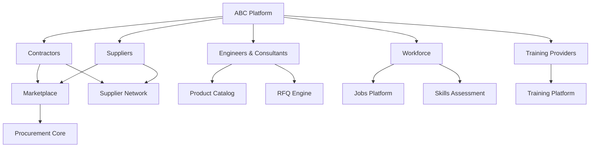

# ABC Market Validation Report

## تقرير التحقق من السوق

---

**الإصدار:** 1.0  
**التاريخ:** [تاريخ الإصدار]  
**المُعد:** [اسم الفريق]  
**الحالة:** [مسودة / نهائي / محدث]

---

## جدول المحتويات

1. [Executive Summary](#1-executive-summary)
2. [Methodology](#2-methodology)
3. [Market Insights & Ecosystem Analysis](#3-market-insights--ecosystem-analysis)
4. [Ecosystem Map](#4-ecosystem-map)
5. [Customer Personas](#5-customer-personas)
6. [Pain Points Analysis](#6-pain-points-analysis)
7. [Feature Prioritization & MVP Scope](#7-feature-prioritization--mvp-scope)
8. [Business Opportunities](#8-business-opportunities)
9. [Revenue Model Recommendations](#9-revenue-model-recommendations)
10. [Recommendations & Next Steps](#10-recommendations--next-steps)

---

## 1. Executive Summary

### ملخص تنفيذي

| البند | المحتوى |
|-------|---------|
| **المنتج** | ABC – Construction Ecosystem |
| **الهدف من التقرير** | عرض نتائج دراسة السوق والتحقق من صحة الفرضيات |
| **الفترة** | [تاريخ البداية] – [تاريخ النهاية] |
| **حجم العينة** | [العدد الإجمالي للردود الصالحة] |
| **عدد الشرائح** | 5 شرائح رئيسية |

### النتائج الرئيسية

- **[النتيجة 1]** – [وصف مختصر]
- **[النتيجة 2]** – [وصف مختصر]
- **[النتيجة 3]** – [وصف مختصر]

### التوصيات الأساسية

- **MVP Scope:** [الميزات المقترحة للمرحلة الأولى]
- **السوق المستهدف:** [الأسواق والشرائح ذات الأولوية]
- **نموذج الإيرادات:** [نموذج التسعير المقترح]

---

## 2. Methodology

### المنهجية

- **نوع الدراسة:** كمية (استبيانات) + نوعية (مقابلات)
- **أدوات الجمع:** [Google Forms / Typeform / مقابلات]
- **مدة الجمع:** [عدد الأسابيع]
- **طريقة العينة:** طبقية + كرة ثلج + هادفة

### توزيع العينة

| الشريحة | المستهدف | تم جمعه | نسبة الإنجاز | نسبة الردود الصالحة |
|---------|---------|---------|-------------|-------------------|
| مقاولون | 100 | [ ] | [ ]% | [ ]% |
| موردون | 150 | [ ] | [ ]% | [ ]% |
| مهندسون واستشاريون | 80 | [ ] | [ ]% | [ ]% |
| كفاءات وقوى عاملة | 200 | [ ] | [ ]% | [ ]% |
| مقدمي تدريب | 40 | [ ] | [ ]% | [ ]% |
| **الإجمالي** | **570** | **[ ]** | **[ ]%** | **[ ]%** |

### التوزيع الجغرافي

| المدينة / المنطقة | العدد | النسبة |
|------------------|-------|-------|
| الرياض | [ ] | [ ]% |
| جدة | [ ] | [ ]% |
| الدمام / الخبر | [ ] | [ ]% |
| أخرى | [ ] | [ ]% |

---

## 3. Market Insights & Ecosystem Analysis

### تحليل السوق ورؤى المنظومة

#### 3.1 نظرة عامة على سوق البناء

[تحليل حجم سوق البناء، النمو، الاتجاهات الرئيسية]

#### 3.2 التحول الرقمي في قطاع البناء

[مستوى التبني الرقمي، الفجوات، الفرص]

#### 3.3 تحليل المنافسين

| المنافس | الخدمات | نقاط القوة | نقاط الضعف |
|---------|---------|-----------|-----------|
| | | | |
| | | | |

#### 3.4 تحليل SWOT لـ ABC

| نقاط القوة (Strengths) | نقاط الضعف (Weaknesses) |
|------------------------|------------------------|
| • | • |
| • | • |

| الفرص (Opportunities) | التهديدات (Threats) |
|----------------------|--------------------|
| • | • |
| • | • |

---

## 4. Ecosystem Map

### خريطة المنظومة

### علاقات الأطراف

| العلاقة | الوصف | القيمة المضافة من ABC |
|---------|-------|---------------------|
| مقاول ← مورد | شراء مواد | Marketplace, RFQ, مقارنة أسعار |
| مورد ← مقاول | بيع منتجات | وصول لعملاء جدد، إدارة طلبات |
| مهندس ← مقاول | تحديد مواصفات | مكتبة منتجات، TDS |
| كفاءات ← مقاول | توظيف | Job Matching, Skills Verification |
| تدريب ← كفاءات | تطوير مهني | Training Marketplace |
| تدريب ← مقاول | تدريب مؤسسي | Corporate Training Plans |

---

## 5. Customer Personas

### شخصيات العملاء

#### الشخصية 1: [الاسم]

| البند | الوصف |
|-------|-------|
| **الاسم** | [اسم الشخصية] |
| **الشريحة** | مقاولون |
| **الدور** | [مثال: مدير مشاريع في شركة مقاولات متوسطة] |
| **العمر** | [مثال: 35-45] |
| **الخبرة** | [مثال: 10-15 سنة] |
| **الأهداف** | • [هدف 1] • [هدف 2] |
| **التحديات** | • [تحدي 1] • [تحدي 2] |
| **الاحتياجات من ABC** | • [احتياج 1] • [احتياج 2] |
| **اقتباس** | "[اقتباس من الاستبيان]" |

#### الشخصية 2: [الاسم]

[نفس الهيكل]

#### الشخصية 3: [الاسم]

[نفس الهيكل]

#### الشخصية 4: [الاسم]

[نفس الهيكل]

---

## 6. Pain Points Analysis

### تحليل نقاط الألم

#### ترتيب نقاط الألم (لكل شريحة)

| الرتبة | Pain Point | الشريحة | % | Severity |
|--------|-----------|---------|---|----------|
| 1 | [Pain Point] | [شريحة] | [ ]% | Critical |
| 2 | [Pain Point] | [شريحة] | [ ]% | High |
| 3 | [Pain Point] | [شريحة] | [ ]% | High |
| ... | ... | ... | ... | ... |

#### خريطة حرارة Pain Points عبر الشرائح

| Pain Point | مقاولون | موردون | مهندسون | كفاءات | تدريب |
|-----------|---------|--------|---------|--------|-------|
| [PP 1] | High | - | - | Low | - |
| [PP 2] | Critical | High | - | - | - |
| ... | ... | ... | ... | ... | ... |

---

## 7. Feature Prioritization & MVP Scope

### تحديد أولويات الميزات

#### مصفوفة الأولويات

| الرتبة | الميزة | الشريحة المستهدفة | Importance | Effort | القرار |
|-------|-------|-------------------|-----------|--------|--------|
| 1 | [Feature] | [شريحة] | [ ]% | [S/M/L/XL] | **MVP** |
| 2 | [Feature] | [شريحة] | [ ]% | [S/M/L/XL] | **MVP** |
| 3 | [Feature] | [شريحة] | [ ]% | [S/M/L/XL] | **Phase 2** |
| ... | ... | ... | ... | ... | ... |

#### نطاق MVP المقترح

| المنتج | الميزات الأساسية (MVP) | الميزات الثانوية (Phase 2) |
|--------|----------------------|---------------------------|
| **Supplier Network** | • [Feature] • [Feature] | • [Feature] |
| **Marketplace** | • [Feature] • [Feature] | • [Feature] |
| **Jobs** | • [Feature] | • [Feature] • [Feature] |
| **Training** | • [Feature] | • [Feature] • [Feature] |
| **Skills** | • [Feature] | • [Feature] |

---

## 8. Business Opportunities

### الفرص التجارية

#### 8.1 الفرص المباشرة

| الفرصة | الوصف | الإيرادات المتوقعة | الأولوية |
|--------|-------|-------------------|---------|
| [فرصة 1] | [وصف] | [SR/month] | عالية |
| [فرصة 2] | [وصف] | [SR/month] | متوسطة |

#### 8.2 الشراكات الاستراتيجية

| الشريك المحتمل | نوع الشراكة | القيمة |
|----------------|------------|--------|
| [شريك] | [توزيع / تقني / تدريب] | [قيمة] |

#### 8.3 فرص التوسع

- [فرصة توسع 1]
- [فرصة توسع 2]

---

## 9. Revenue Model Recommendations

### توصيات نموذج الإيرادات

#### النموذج المقترح

| الشريحة | النموذج | التفاصيل |
|---------|--------|---------|
| مقاولون | [Freemium / اشتراك] | [تفاصيل الباقات والأسعار] |
| موردون | [اشتراك + عمولة] | [تفاصيل] |
| مهندسون | [مجاني (محتوى)] | [تفاصيل] |
| كفاءات | [مجاني] | [تفاصيل] |
| تدريب | [عمولة] | [تفاصيل] |

#### هيكل التسعير المقترح

| الباقة | السعر | الميزات | الشريحة المستهدفة |
|-------|-------|---------|-------------------|
| **Free** | 0 ريال | [ميزات محدودة] | مهندسون، كفاءات |
| **Starter** | [X] ريال/شهر | [ميزات] | مقاولون صغار، موردون صغار |
| **Professional** | [Y] ريال/شهر | [ميزات] | مقاولون متوسطون |
| **Enterprise** | [Z] ريال/شهر | [ميزات مخصصة] | شركات كبرى |
| **Commission** | [A]% لكل صفقة | [ميزات] | موردون (اختياري) |

#### توقعات الإيرادات (المرحلة الأولى)

| المصدر | الإيراد المتوقع/شهر | ملاحظات |
|--------|-------------------|---------|
| اشتراكات المقاولين | [SR] | [ملاحظة] |
| اشتراكات الموردين | [SR] | [ملاحظة] |
| عمولات Marketplace | [SR] | [ملاحظة] |
| تدريب | [SR] | [ملاحظة] |
| إعلانات | [SR] | [ملاحظة] |
| **الإجمالي** | **[SR]** | |

---

## 10. Recommendations & Next Steps

### التوصيات والخطوات التالية

#### التوصيات

1. **[توصية 1]** – [شرح]
2. **[توصية 2]** – [شرح]
3. **[توصية 3]** – [شرح]

#### الخطوات التالية

| الخطوة | المسؤول | الإطار الزمني |
|--------|---------|--------------|
| [خطوة 1] | [فريق/شخص] | [أسبوع 1-2] |
| [خطوة 2] | [فريق/شخص] | [أسبوع 3-4] |
| [خطوة 3] | [فريق/شخص] | [شهر 2] |
| [خطوة 4] | [فريق/شخص] | [شهر 3] |

#### المخاطر المتبقية

| الخطر | الاحتمالية | التأثير | خطة التخفيف |
|-------|-----------|---------|-------------|
| [خطر 1] | [عالي/متوسط/منخفض] | [عالي/متوسط/منخفض] | [خطة] |
| [خطر 2] | [عالي/متوسط/منخفض] | [عالي/متوسط/منخفض] | [خطة] |

---

## الملاحق

| الملحق | المحتوى |
|--------|---------|
| A | نموذج الاستبيان – مقاولون |
| B | نموذج الاستبيان – موردون |
| C | نموذج الاستبيان – مهندسون واستشاريون |
| D | نموذج الاستبيان – كفاءات وقوى عاملة |
| E | نموذج الاستبيان – مقدمي تدريب |
| F | البيانات الخام (رابط) |
| G | تحليل إحصائي إضافي |

---

**نهاية التقرير**
